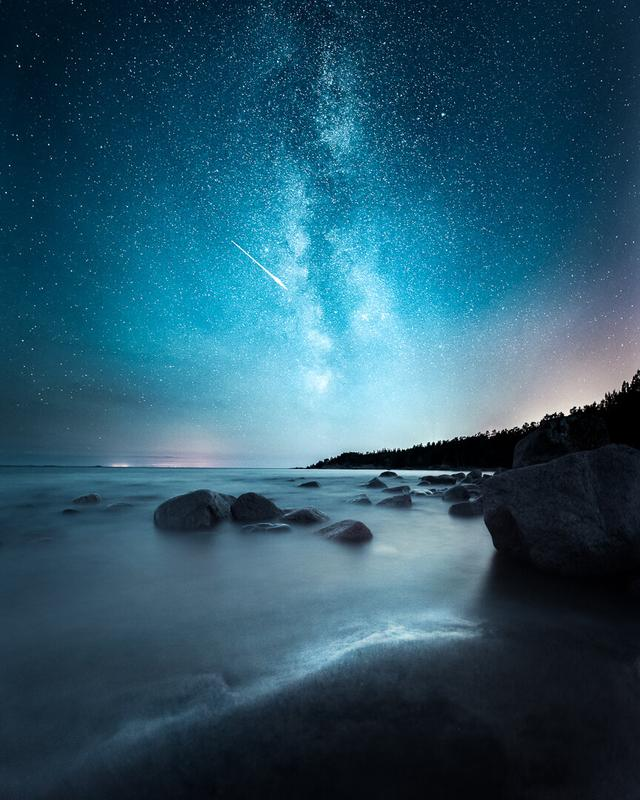

Capturing Perseid Meteor Shower is one of the things I try to shoot each year. This year we had luck with the weather and we headed to the coast with Konsta and Juuso. I set my time-lapse rail to a place I thought might work and set it to shoot for four hours. While my other camera was capturing the time-lapse, I took a bunch of different still images of the location. We were amazed at how bright some of the meteors were.

For this photograph, I ended up using three horizontal images.

### Equipment & Exif

Nikon D810, Nikkor 14 - 24 mm f/2.8, Manfrotto Tripod  
Three Exposures ISO 4000, 14 mm, f/2.8, 30 sec.

### Post-processing

I used Lightroom CC to stitch the panorama together. First I edited the basic settings and added light to the detail with one of my [Saga Presets](/saga-presets): FG & Stars - Smooth. For colors, I used a [Phase Preset](/presets): Color - Oldie.

View fullsize

Glow - Emäsalo, Finland - 2016