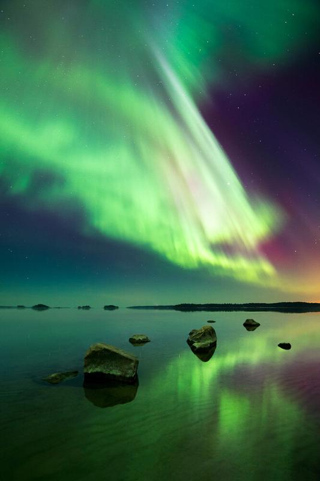

I captured this on the same night as my previous photograph. The Northern Lights were the strongest on this night when I captured this one. The silence and reflected green light made this an extraordinary moment. Sometimes you are in awe of nature, and this was one of those moments. I hope you enjoy the photograph, as much as I enjoyed being there.

### Equipment & Exif

Nikon D800, Samyang 14 mm f/2.8 & Sirui Tripod R-4203L and K-40X  
ISO 3200, 14 mm, f/3.5, 13 sec.  
Basic editing in Lightroom with my [Phase Presets Collection](/phase-presets).

View fullsize

Glowing Light - 2015 - Porvoo, Finland