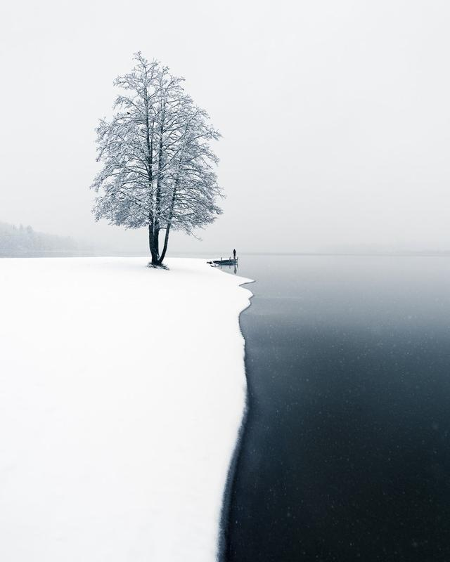

This week I wanted to write about something different. For the past few weeks, I have thought about this topic and talked with friends and other photographers about it. I'm not by any means saying that I'm successful. I just find the whole conversation fascinating about success in different art forms.

## What is success?

Success comes in different forms, depending on what you value the most. Financial success is not the only measurement. And for those who are early in their photography journey, it shouldn't be the primary goal. Of course, if photography is your profession, you need to make enough so you don't feel stressed out about money. If a particular lifestyle is what you want in life, you need to value money as one of the top indicators of success.

Likes and followers are also a way to talk about success, but I don't think having a significant following on social media is necessary. Having a decent following might help you gain financial success, but often likes don’t transfer to money.

**My definition of success** in photography and, to be honest, in life in general, is when you wake up in the morning and feel proud of yourself and your work.

The only person you should worry about in life when it comes to happiness is you. I'm not saying that you should be selfish; on the contrary, many people find joy when they can help others. But you have to be in tune with what you like to do. Not what society says you should value. When you are alone by yourself, how do you feel?

Cold Mist - Mikko Lagerstedt, 2021

## HOW TO ACHIEVE SUCCESS?

If you want to be successful, you have to keep on creating. So, let's talk about creating and making sure you don't quit because of other people. Like in every creative outlet, you will eventually plateau and feel that you can't keep learning. I'm certainly not different, and I find myself in this situation time and time again. But what do I do when I'm not feeling motivated? I take breaks, of course, but I try to be strict on how long I take a break. If you feel uncomfortable, don't mistake that as a time to take a break; instead, you have to push through those uncomfy times.

If you genuinely want to create something unique, you have to find one thing that inspires you in photography at that moment. Maybe you have always wanted to try urban photography, but somehow you haven't tried it. Now is the perfect time to take that first step and go out! You need to look in rather than out and search for one thing that will move you forward in those challenging moments of your photography journey.

I was talking to my friend, who is an experienced hunter. The way he talks about hunting reminds me of the whole process of taking photographs. In fact, I think hunting is the perfect analogy for photography. You must practice your shots by going out and taking pictures. You have to keep your skills up for the task at hand. For example, if you are hunting with a rifle, you can't rely on hitting your target if you don't practice shooting. Otherwise, you will miss the reward.

If you don't go through the process of taking hundreds of photographs, you won't get that beautiful shot you want to capture. You must spend time waiting and being ready to take your picture. It's as simple as that. If you're trying to capture beautiful work, you must show up and take your shots. Many people tell me how lucky I was to capture that scenery, but they don't realize that we, as photographers, make our luck.

If I feel tired or think this was a waste of time, the mantra I have is, "This moment is preparing me for the extraordinary moment I will achieve."

**My advice to achieve success:**Do what you enjoy. Show up consistently and enjoy the process, and create your own luck.

Lately, my biggest task has been to open my mind to more possibilities in photography. I don't want to take the safest and easiest route and narrow my vision to a premade photograph. Instead, I want to find something new that excites me and use my vision to make the most out of it.

**Let me know what do you struggle with at the moment? And what do you think it means to be successful in photography?**

Until next time my fellow photographers, take care and keep on creating!

[First Snow](https://www.mikkolagerstedt.com/trees/first-snow) - Mikko Lagerstedt, 2017

## Subscribe

If you enjoy this post. **Subscribe** to be the first to receive   
**fresh new tutorials** straight to your inbox!

First Name

Last Name

Email Address

Subscribe

We respect your privacy.

Thank you!