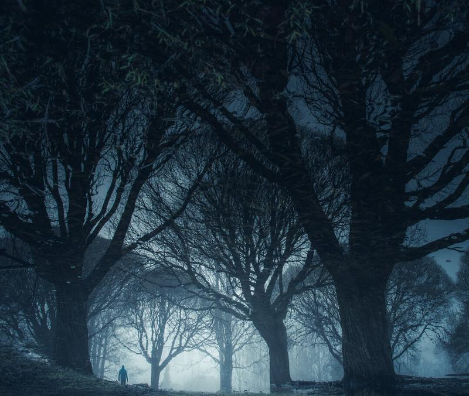

Last week I promised a tutorial to show you how to create an atmospheric photograph in post-processing. The editing will be done mostly in Lightroom, but there are a couple of steps that I decided to do in Photoshop. The processing decisions are made from the notes I captured in the scenery. My goal is to show you how I felt. In this tutorial I'm not using the same image I shared last week, because I wanted to create a new view from my notes.

For the photograph, I wrote down a couple of words: *A mirror, a world reflected, a second look reveals it, a dream. Cold and mysterious.*

When I was capturing the scenery, I imagined that the reflection would be flipped so that it would look like a kind of dreamy World.

## Editing

Let's start the editing by flipping the scenery in Lightroom go to *Photo > Rotate* (either one works, do this step twice)

View fullsize

### 

### BASIC SETTINGS

Let's make it slightly darker and desaturate it so we can add the blue tonality from the Split Toning panel. Also pull detail from the shadows and blacks.

*Temp 4976  
Tint 0  
Exposure –0,12  
Highlights –19  
Shadows +26  
Whites –5  
Clarity –7  
Dehaze –2  
Saturation –33*

View fullsize

### 

### Tone Curve

As I want to make the overall look a bit darker, let's use the curves to darken and pull some of the blacks to make it hazier.

View fullsize

### 

### Split Toning

Now we just need to add blue tonality to make it look colder and more like I saw the scenery.

*Highlights Hue 55, Saturation 10  
Balance –100  
Shadows Hue 223, Saturation 36*

View fullsize

### Effects

For this image, I want to add darkness around the edges, so let's add some vignetting.

*Highlight-Priority  
Amount –14  
Midpoint 0  
Feather 100  
Highlights 17*

View fullsize

### Graduated filter

Next step is to add some light to the bottom part of the frame, and the easiest way to do it is with the Graduated Filter. Pull one filter from the bottom portion of the frame towards the top.

*Contrast 33  
Whites 26  
Clarity 7  
Dehaze –13*

View fullsize

### Crop

Usually, I leave the cropping for the final thing to do, but it was hard to visualize the outcome without doing the crop, so cut out the right and bottom part of the frame.

View fullsize

### 

### Radial Filter

I want to emphasize the darkness around the frame, so let's add a Radial Filter to darken the image except for the lower part.

*Exposure –0,44  
Highlights –50  
Shadows 26  
Whites –37  
Clarity –26*

### 

### RADIAL FILTER II

As I want to boost the lower part of the frame, add another Radial Filter and this time with the following settings.

*Temp –8  
Exposure 0,88  
Clarity –7  
Dehaze –11*

View fullsize

### Editing in Photoshop

I want to remove some of those branches in the water, and I believe it's easier to eliminate distractions in Photoshop so right-click on top of the image and select: *Edit In > Edit In Photoshop CC 2018*

### Removing Distractions

For this type of editing I prefer to use Photoshop and the spot-healing brush tool. It works magically well most of the time. I recommend that you first create a new blank layer above the image and use the Spot Healing brush tool so it applies to all of the layers.

View fullsize

### Warp

This is not a necessary step but as the I wanted to straighten the middle tree and make the view more balanced so I used the free transform box and warp to fix it.

### Final adjustments in Lightroom

Finally, save the image and head back to Lightroom to make the final adjustments. I tend to use the temperature slider to make the final color adjustments and basic settings to edit how the final image looks like.

*Temp –5  
Exposure –0,10  
Contrast +10  
Whites +30  
Clarity –5  
Dehaze –5  
Saturation –10*

Here is the before and after with the same crop.

View fullsize

View fullsize

And that's it. Quite an easy tutorial on what you can accomplish by having notes and how to use them to edit your photographs. Let me know if you find this two-part tutorial helpful! Next week I will be releasing the new [**Day & Night**](/day-to-night) fine art photography course, so stay tuned!

Would you like to see ***post-processing*** or ***capturing tutorial*** next week? Or perhaps something completely different? Let me know!

## GET THE LATEST CONTENT FIRST

If you like this post. Subscribe to be the first to receive fresh new tutorials straight to your inbox!

First Name

Last Name

Email Address

Subscribe

We respect your privacy.

Thank you!