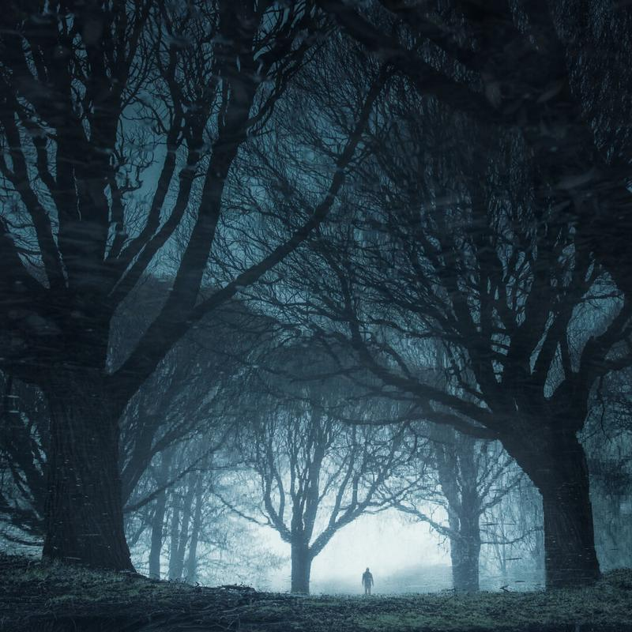

The goal of this tutorial is to make you more aware of the process behind your photographs. I'm going to tell you the process I use to create work that inspires me. I talk about how to capture and edit atmospheric photographs. The thing about photography I find so fascinating is that you can always learn new ways to develop your vision. It is more about what happens behind the camera. Because photographers rarely speak about their thought process I wanted to share mine. Next week I will release the second part of this tutorial which shows you an example of the following techniques.

I believe that the next steps will help you in any photography genre, but when you want to capture landscape photographs with atmosphere, I find these steps to be essential. It's about the different viewpoints we have.

I know many of us have a problem keeping our work consistent when we are on the road traveling or just spending a whole lot of time photographing. After a shoot or a trip we head back to home after a long day, we might forget to import the photos, or we are just too tired to check the images. As the next day comes, we still haven't reviewed the pictures and didn't even feel the need to do so, and by the time you import the photographs, you might have some thoughts about the captures, but you have lost the ideas for those photos. Maybe not all of the ideas you had, but some were forgotten. Then you find yourself staring at the screen and looking at the pictures like, what was I thinking? Why did I capture the scenery like this? When we are in these situations wouldn't it be amazing to have a place we could go and learn about the photographs? I think so!

## Take notes

There is quite a simple method store your ideas for your photographs, take notes! Blah, I said to myself when I first thought about it. I don't want to take notes. But then I remembered how many times I had forgotten ideas behind my images, so I thought that why not try it. And I did, and I think it helped me to be more aware of my work.

Here is how you can do it: After you have done a shoot and it's still fresh in your memory, write down the feelings, ideas or just a few words about the photographs you were capturing. Use a small notepad that you keep in your camera bag. I find it much more rewarding to write down the ideas with a pen and paper than with a smartphone. Sometimes I might even do a small sketch on the same page to visualize it further. I also take a photo with my phone of the page where I wrote down the experience and put it to my Evernote so I can access it on my computer while I'm working on the images. Try it out! It might take you a couple of exercises before it sticks, but if it does, I'm sure you will get most out of your shoot and from the photos.

For the example photograph, I wrote down a couple of words: *The other side - a mirror, a world reflected, a second look reveals it.*

## What is your intention?

When you have your notes, use them as the starting point for your editing. Beginning with a plan keeps your focus on the photos much longer than when you only fool around with settings in Lightroom and don't have a clear vision.

Ask yourself these questions when you don't have ideas on how to go forward: What kind of emotions you want to draw with your photograph? What is the story behind the image and how did you feel when you were photographing the scenery? Asking questions about your photos can help to guide your post-processing. In this picture, I wanted to convey a feeling of*mystery and a look into a different World*.

As you now have an idea for your photo, it's time to start to edit the photograph.

## Editing

### BASIC SETTINGS

First, I recommend focussing on the global adjustments. Do you feel that the picture looks the way you experienced the moment? If not, maybe you need to make changes to the light and contrast. It may be underexposed, and you need to tweak the exposure. It all depends on your vision of the scenery.

### COLORS

Select a color palette that recreates the vision you had when you captured the photos. You can start the color editing with color temperature and tint. Play with the colors and choose if you want more or less intensity.  Or maybe you want the image to be black and white so convert it.

Color is a huge topic on its own, so let's not dive into it in this tutorial. If you are interested in an article about colors, please let me know in the comments.

### SELECTIVE ADJUSTMENTS

Now you need to pinpoint what is the "hero" or the main subject in the photograph. What was your vision for the picture? Where do you want the viewer's eye to go? What was the reason you captured this view? The eye tends to look at the brightest areas in the photo, so maybe you need to darken other parts of the photograph to tell the story.

### EFFECTS

Use the effects to create final adjustments for your photo. Vignetting can help to draw keep the eye in the frame. Noise is also a way to emphasize mood; a grainy look can create a sense of drama.

View fullsize

The Other Side - Mikko Lagerstedt - 2018, Finland

And that's it. A quick tutorial on what happens beneath the capturing and editing process. As I said, next week I will follow up on a tutorial with these processing steps. Let me know if this was something you enjoyed reading.

## GET THE LATEST CONTENT FIRST

If you like this post. Subscribe to be the first to receive fresh new tutorials straight to your inbox!

First Name

Last Name

Email Address

Subscribe

We respect your privacy.

Thank you!