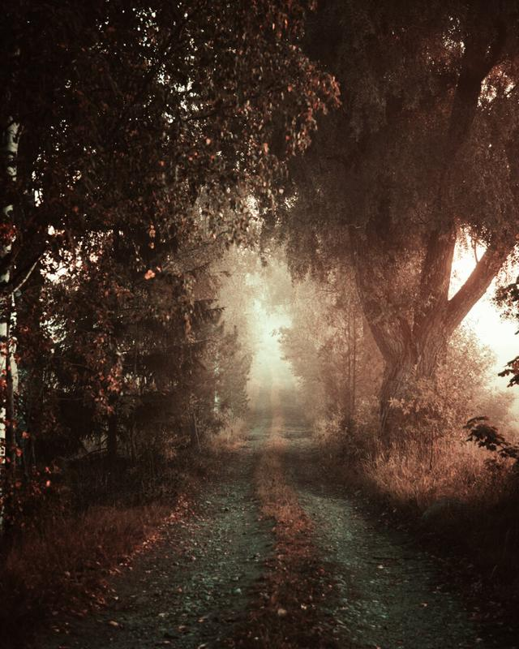

Happy weekend everyone! I released the [EPIC Preset System](/epic-presets) last week, and I’m so happy how people have responded to the release. I originally edited this image with the preset system but I wanted in this week’s tutorial, show you how you can achieve the following color transformation inside Lightroom without the EPIC Preset System. The only thing you will be missing is the [Color Profile](/epic-presets) (Control) added to the final image.

You can follow along with the video, or use the text version below to recreate the effects! Enjoy.

View fullsize

### Basic Settings

Exposure + 0,20  
Contrast + 15  
Highlights – 45  
Shadows – 16  
Whites + 31  
Blacks – 13

Dehaze + 9

Vibrance – 5  
Saturation – 40

View fullsize

### TONE CURVE

S-curve to darken the image with the following points.

Input 0 || Output 2  
Input 104 || Output 62  
Input 192 || Output 182  
Input 255 || Output 245

View fullsize

### Color Settings

**Red**   
Hue + 18  
Saturation + 22  
Luminance – 11

**Orange**   
Hue - 19  
Saturation – 25  
Luminance + 15

**Yellow**  
Hue – 32  
Saturation – 26  
Luminance +15

**Green**Hue 0  
Saturation – 24  
Luminance – 11

**Aqua**   
Hue 0  
Saturation – 25  
Luminance +11

**Blue**Hue – 36  
Saturation – 25  
Luminance – 42

**Purple**Hue 0  
Saturation – 28  
Luminance – 17

**Magenta**Hue 0  
Saturation – 25  
Luminance 0

View fullsize

### Radial Filter

Before color grading, add a big Radial Filter with shortcut Shift+M and use the following settings.

Exposure + 0,90  
Contrast – 3  
Highlights + 22  
Whites + 9  
Clarity – 5  
Dehaze – 8

View fullsize

### Color Grading

**Highlights**  
H:36 S:34 L:0

**Shadows**H:97 S:27 L:0

Blending 81  
Balance – 65

View fullsize

### EFFECTS

**Post-Crop Vignetting**Amount – 21  
Midpoin 0  
Roundness + 60  
Feather 100  
Highlights 100

**Grain**Amount 27  
Size 15  
Roughness 17

View fullsize

### Calibration

Not many understand the power of the Calibration panel that’s why I have included calibration presets in the [EPIC Preset System](/epic-presets).

**Red Primary**Hue + 40  
Saturation – 19

**Green Primary**  
Hue + 72  
Saturation – 59

**Blue Primary**Hue – 100  
Saturation + 22

View fullsize

### Color Profile

To finalize the edit, I used an [EPIC Color Profile – Control](/epic-presets). I love to use these Color Profiles to create final adjustments. They are so versatile and effective; I just love them.

And finally, here are the before and after photographs.

View fullsize

View fullsize

## subscribe

If you enjoy this post. **Subscribe** to be the first to   
receive **fresh new tutorials** straight to your inbox!

First Name

Last Name

Email Address

Subscribe

We respect your privacy.

Thank you and enjoy the tutorials!