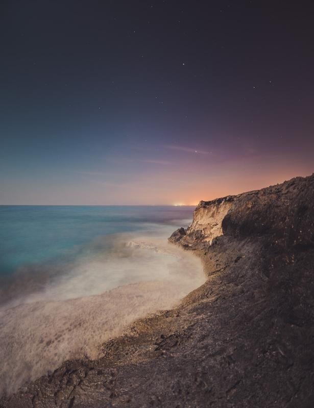

Adobe released the new Lightroom CC couple of weeks ago and I wanted to write what are the new features it includes. Lightroom 5 had some great features and new updates like advanced healing brush, spot removal and radial gradient tools. In Lightroom CC, there are some new features as well. The new Lightroom CC includes faster performance and it does, in fact, feel faster in the daily use.

The new Panorama and HDR -features are great for combining multiple photos without opening the images in Photoshop. This addition is a great feature for those who don't have Photoshop or are lazy like me creating panoramas in Photoshop.

* Panorama
* HDR
* Faster Performance
* Precise control of Filters (*I will do a follow-up tutorial on how to use these)*

You can view all of the new improvements here: <http://www.adobe.com/products/photoshop-lightroom/versions.html?PID=2159997>

Select the photographs you want to create a panorama. While you are shooting, you should consider capturing the photographs overlapping each other quite a bit. This will help Lightroom to analyze the panorama more efficiently.  
  
Right-click on the images and select Photo Merge -> Panorama.

View fullsize

First select two or more photographs you want to create the Panorama

Once the Panorama preview has been processed, you can see the outcome. Panorama processing takes some time depending on how many images you are trying to convert to a panorama. Click on the Merge button to process the image.

View fullsize

The preview shows how the panorama will look, once it has been processed

After the picture has been processed Lightroom creates a dng (raw) file on which you can add lens correction and other adjustments. You can also use Presets to add unique look to your panoramas.

View fullsize

After the panorama has been processed you can apply Lens correction and [Presets](/phase-presets) to it

For this image I used Hazy - Surreal Lightroom Preset from my [Preset Collection](/phase-presets) to add atmospheric look to the image.

If you are one that enjoys creating panoramas or HDR-images, I highly recommend grabbing the new Lightroom. However, if you rarely do panoramas and don't like the look of HDR, this update is not as major as the jump from Lightroom 4 to 5, which included some of my favorite updates such as the radial filter.

You can purchase the Photographer plan via [Adobe](http://www.adobe.com/creativecloud/photography.html), it includes both Lightroom and Photoshop. All of my [Fine Art Presets](/phase-presets) work perfectly also in the new Lightroom CC.