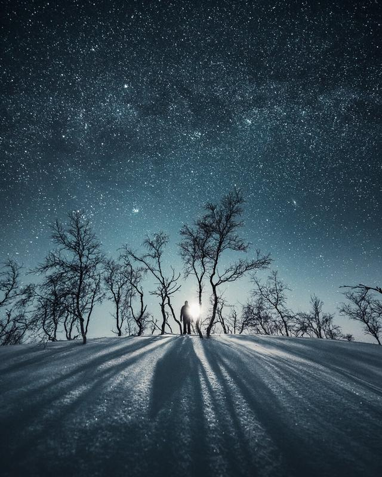

In this weeks tutorial, I’m going to talk about the forever relevant subject: inspiration. Have you ever been uninspired to take photographs? I sure have been. And as I was talking with my photography friends yesterday, it’s quite common to lose interest and inspiration to take pictures. When you are in that place, you need to decide if it’s time to take a break or push through it. I think that the lack of inspiration comes every now and then, but when it happens, you need to take a step back and examine why is it that you find yourself lacking inspiration? I also wrote about [motivation](https://www.mikkolagerstedt.com/blog/2018/4/25/how-to-keep-yourself-motivated) a few weeks ago so check that out as well.

These are the four tools I use to find my inspiration.

## 1. TAKE A BREAK

If you feel so uninspired that you don't even want to think about photography, it might be time to take a break. I recommend starting with a short break so you won't drift along too long. Schedule a date for examples a week from now and put it into your calendar. When I'm in this situation, I schedule at least two hours and focus on the next following tools to figure out if I can find inspiration.

## 2. FIRST INSPIRATION

The second advice I want to give to you is to go back all the way when you first started photography. What was the first inspiration you got before you took photography as a hobby? Write down a couple of sentences and reasons. It will help you to get into a state of inspiration and you might just want to grab your camera and head out!

For example, my very first inspiration to start photography came to me over ten years ago. I saw a striking autumn landscape view of a sunset. The field was covered with mist. I stopped my car and was thinking to myself that these type of moments in time I want to start to capture.

## 3. DON'T SHARE YOUR PHOTOS

It is somewhat counter-intuitive, but sometimes you need to photograph only for yourself. If you wish to find your true inspiration, there is no better way than photographing for yourself.

It can be paralyzing when you shoot only to share the photographs. I have found myself in situations that I'm just photographing because I want to share something with my audience. It takes away the whole experience of pressing the shutter and enjoying the moment if you are already thinking about how people will react to your work. Create for the sake of creating!

## 4. ANALYZE YOUR PAST WORK

If you still don't find the inspiration, go to your catalog of photographs and go through them. See if there are photographs you just love. Write down why you find the images inspiring and if you know how you got encouraged to capture the pictures, write it down as well. Focus on the uplifting moments of your photography journey, and you will inspire yourself to create more of those experiences.

Mikko Lagerstedt – Long Shadows II – Kilpisjärvi, Finland 2018

I hope you enjoyed this weeks tutorial. Next week I will talk about how I create a catalog of inspiration. I use it now and then when I feel uninspired with my work. Have an inspiring week!

I would love to hear from you. How do you find inspiration? What was the first inspiration you got to start photography?

## GET THE LATEST CONTENT FIRST

If you like this post. Subscribe to be the first to receive fresh new tutorials straight to your inbox!

First Name

Last Name

Email Address

Subscribe

We respect your privacy.

Thank you!