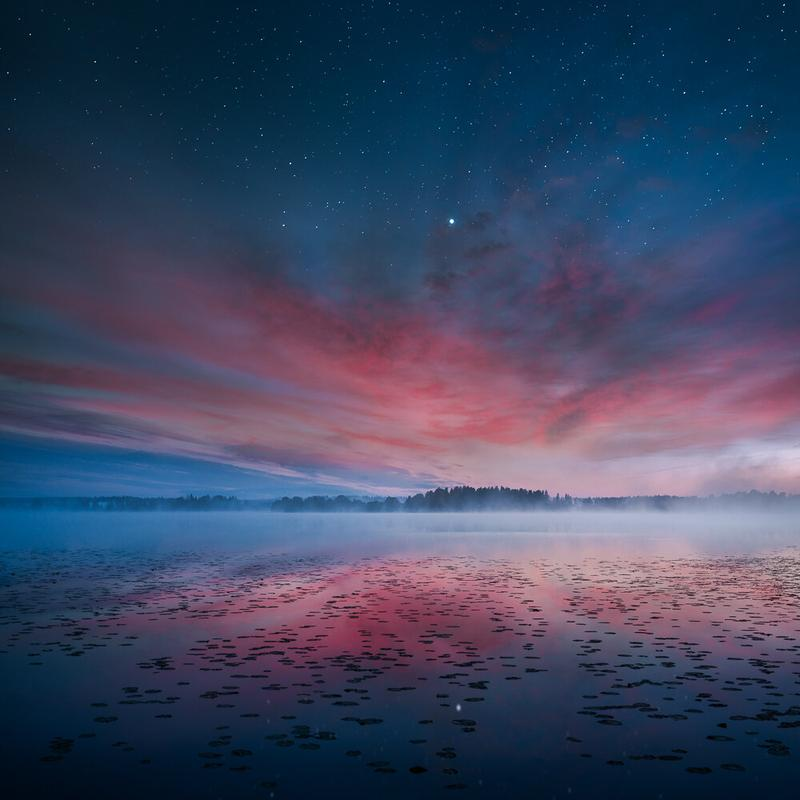

How to find your vision in photography, art, and life? One of the most common questions I get from people is: What should I do to find my vision as I'm just starting in photography? In this guide, I have gathered some tools you can start to use straight away. Without further ado, let's cut to the chase!

### 1. Practice your craft DAILY

When you are first starting and want to find your unique vision. Try any kind photography you can think. Keep your camera with you everywhere you go. If you already know what kind of photography you want to focus on, then you just keep on doing that and there is no point on not to photograph another type of photography. Start with what you got. No matter if it's a camera, mobile phone or a pen. The key to success is not to wait.

### 2. Give it 100% – Say NO to excuses

If you want to be good at something, you have to give it your 100%. Sitting around and reading about photography tricks and tools gives you insight but you have to use that insight in the field. There are plenty of times I have said that "no, not today" yet crawled out of the bed at 1.00 am to photograph the night sky. Or when I have stayed up the whole night to get that first view of the sunrise. I believe in the 10 000 hours rule. For those who don't know what it is, it's practicing your craft for 10 000 hours whether it's photography, painting and so on. I would say I'm somewhere over the half way of this, and I still have a lot to learn.

### 3. Create, don't imitate

It's useful at times to use someone else's work as an inspiration but copying another painters or photographers work is unoriginal and uninspiring. Add your unique vision to the inspiration you gather. Keep a small notebook or a mobile phone with you to capture your thoughts and ideas. Don't hesitate to put bad ideas there as well.

### 4. Study your work

If you want to get better at your craft, you have to go through your paintings or photographs with a perspective of a critique. Study what you enjoyed about the work and what could have been better. This way you always learn something new even though when the work was not good enough that you would like to share.

### 5. Identify your inspiration

By creating and producing work, it's important to find those moments where you get inspired. Whether it's from other people's work, nature, movies, music or whatever. Once you understand what motivates you, you have an idea of what you can pursue.

### 6. Share your best work

What this means is that you need to publish the photographs you find most inspiring to yourself. Not just the stuff that you can see gets a lot of attraction. It's crucial to find the courage to share your work. How do you know what is your best work? Well, that's the thing, you don't necessary know until you have had the courage to share it. You will get better at this the more you share your work. Search for a community where you can share the work. For photographers, there are many different platforms to use. For example, [1x](http://1x.com) is an interesting place to share your photographs this is a great site since you can get insightful feedback about your pictures. For painters and digital artist, there are fantastic opportunities as well such as [deviantArt](http://www.deviantart.com).

### 7. Evolve and change

Don't be afraid to change your vision while you are working on your craft; it is one of the keys to finding your true artistic vision. It's a lifelong journey!

### 8. Challenge yourself

Creating photography challenges such as photograph each day for the next 30 days, or learn a new post-processing trick each day is an excellent way to boost your motivation and find out more about your vision.

Try one of the following 30-days exercises

* Photograph every day
* Post-process pictures every day
* Capture only five pictures per day

If you want to challenge yourself with a [52-week program](https://www.scribd.com/doc/294310050/52-Week-Photography-Challenge#fullscreen) check it out!

### 9. Book recommendations

These are the books that I feel works as a knowledge boost about the rules I have stated. Do the job while you read these, don't try and hide behind education it's just one kind of procrastination.   
[Mastery – Robert Greene](http://amzn.to/1Pqwpwo)  
[Show Your Work – Austin Kleon](http://amzn.to/1PqwKzj)

Enjoy the journey and have fun!

View fullsize

Mikko Lagerstedt – Red Night – Tuusulanjärvi, Finland 2015