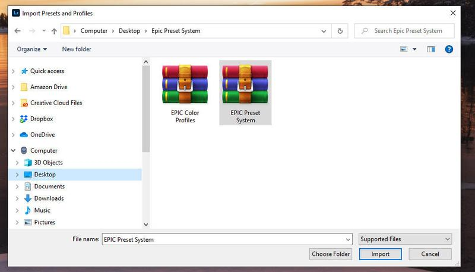

Here is a quick guide on how to install Lightroom Presets on desktop computers. Whether you use Lightroom on Mac or Windows.

### Lightroom Classic CC (2018 and newer)

**STEP 1**

Go to **Develop Module** (Shortcut D) and click the **plus sign** on the right side of the Presets panel.

How to import Lightroom Presets in Lightroom CC Classic Develop Module

**STEP 2**

Select your presets **individually** or install a **zip file** that is easier and faster and then click Import.

Import a zip file including all the presets at once.

Or select individual XMP-files to install.

### Lightroom CC

**STEP 1**

Inside Lightroom CC, go to **File > Import Profiles & Presets**.

In Lightroom CC, go to File -> Import Profiles & Presets

**STEP 2**

Select the presets. Either import **a zip file** or select the presets and use shortcut CTRL/CMD+A to select all presets you want to add directly to Lightroom CC.

Import a zip file containing the presets

[**Download 8 New EPIC Presets for Free.**](/epic-presets)

### How to install Lightroom 4, 5, 6 & CC 2017 Presets for Windows

1. Open Lightroom
2. Go to: Edit • Preferences • Presets
3. Click on the box titled: **Show Lightroom Presets Folder**
4. Double click on Lightroom
5. Double click on Develop Presets
6. Copy the folder(s) of your presets into the **Develop Presets** folder
7. Restart Lightroom

### How to Install Lightroom 4, 5, 6 & CC 2017 Presets for Mac

1. Open Lightroom
2. Go to: Lightroom (Dialogue) • Preferences • Presets
3. Click on the box titled: **Show Lightroom Presets Folder**
4. Double click on Lightroom
5. Double click on Develop Presets
6. Copy the folder(s) of your presets into **Develop Presets** folder
7. Restart Lightroom

### [Learn more about my Fine Art Landscape Presets](/store)