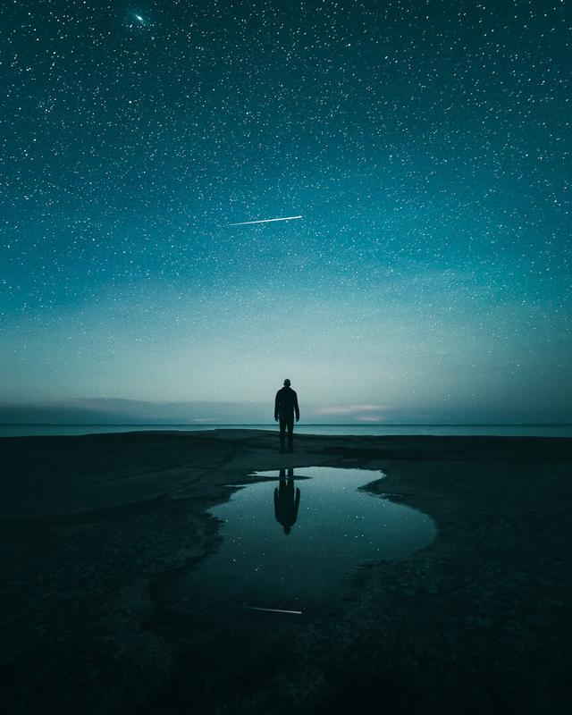

As I'm looking back to my ten-year journey in photography, I realize that I have had my ups and downs. The thing that I have found out to be one of the keys to my success and for the other photographers I spend time with is ***perseverance***. It's not a surprising thing, but how many of us overlook it? I certainly did. Why? Is it because we don't want to admit that it takes a long time to create beautiful work?

It's much easier to focus on things that don't matter. Or it might be because someone else is developing stunning work, they must have it in their genes? Why do we do this? It's paralyzing!

As I have been creating the [**Day & Night**](/day-to-night) video course, I have realized that I can't focus on many things at the same time. It led me to focus only on the course, which then lowered my ability to go out and photograph. And I haven't been active on social media either. Looking back over the last two months I have barely gone out to shoot which has dropped my confidence in creating beautiful work. If you didn't know by now, I'm not perfect.

I haven't seen many posts about motivation when it comes to photography, so I decided to write one. I'm sure all of us sometimes lack the motivation to take photos, but I think it all depends how fast you can bounce out of it.

For me, it's sometimes hard to find balance. I love to share my knowledge with people, but if I "can't" go out to photograph I feel uninspired. I think we all have these assumptions of how we are and that we cannot do anything about it. In fact, I think that those are just scripts that run in the back of our mind to keep us taking action needed to break out from the jam we are.

**So what are the steps we can take to break out of these excuses and keep us motivated to create beautiful photographs?**

## 1. PLAN

Make a plan that is easy to follow through. I use an "easy-motivation-planner" I have created when I'm planning my week. I don't plan all of my weeks like in the below example. Instead, I use it if I haven't been photographing lately or find it hard to go out and take photographs. The planner has a day, time, place, goal and ideas sections.

View fullsize

A preview of how the planner looks like.

Here is a breakdown of the planner:

* ***The Day,*** of course, is the day you want to go out and photograph in a specific location.
* ***Time*** is when you need to head out from your home, so calculate enough time before the sunrise, sunset or any time you want to visit a location.
* ***The Place*** is a specific location you want to visit that time. If you don't have a place in mind, use Google maps as a location scouter.
* ***The Goal*** is what it is that you want to capture, is it perhaps seascape or landscape or anything you wish to achieve from the location.
* ***Ideas*** are from your idea archive. Put at least one idea for the shoot in this section. Don't know how to create ideas that are unique? Check out my [**video course**](/day-to-night).

Download a copy of my ***easy-motivation-planner*** [**here**](/s/photography-motivation-planner.pdf).

## 2. Make it Impossible to fail

I bet there have been times when you have woken up but felt that you need to keep on sleeping instead of heading out to photograph. I know I have. Or you have been busy doing something else and forgot to go out and capture the sunset. We all have many excuses not to go out and photograph...

One of the best things you can do is ***prepare*** for it. Take the excuses away!

* Charge your camera & gear beforehand
* Pack your gear into your backpack and keep it ready
* Make sure you have enough gas in your car if you wish to travel with it

When you want to capture the ***sunrise***:

* Keep your clothes prepared near your bed
* Make it easy to take a coffee or tea with you or grab one on the go
* Cook your breakfast the day before

You can add any steps you think makes it easier to go out. If you have gone through all of these, I bet you would feel stupid not to go!

## 3. TAKE ACTION NO MATTER WHAT

It sounds counter-intuitive but if you doubt yourself the only way to break out of that doubt is to take action. Go out and take photographs, no matter what. When you make a plan, you can always say to yourself that this is what you promised yourself when you were thinking about the best interest of your photography. So listen to your past-self and take action. Action-cycle is where you want to end up!

## 4. GO OUT WITH OTHER PHOTOGRAPHERS

Chat with a fellow photographer and plan a trip, whatever it takes for you to start taking action and going out to photograph. If you make yourself accountable to other photographers, you will make progress. ***"You are the average of the five people you spend the most time with."*** Yeah, it's a cliche already, but having people around that increases your positivity is crucial! Having like-minded people who want to create work that stands-out makes you feel inspired.

## 5. STOP SPENDING TIME ON SOCIAL MEDIA

Scrolling the internet (except my site of course) or using the smartphone instead of going out is a way to kill your productivity. I'm not saying that you should entirely stop using social media or any platforms that connect you with other creators and followers. I'm just saying that you should have more time for creation than for watching what other people have done. Create work that inspires you!

 The above steps have worked for me, let me know if you find them useful!

I know this post was something different, so leave a comment and let me know if you want to see posts like these in the future. Enjoy Spring everyone!

## GET THE LATEST CONTENT FIRST

If you like this post. Subscribe to be the first to receive fresh new tutorials straight to your inbox!

First Name

Last Name

Email Address

Subscribe

We respect your privacy.

Thank you!

