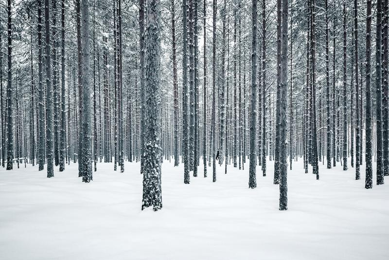

I love to capture minimalist photographs, and it often comes naturally to me. A Zen-like view is more pleasing to my eye than a whole lot of mess in the frame. I always search the scenery to look for the main subject and how I could frame the composition so it would be simple and beautiful. In this tutorial, we go through five tips on how to create minimalist landscape photographs. Aesthetically, minimalist photography is a purified form of beauty. It is a representing of order, simplicity, and harmony.

## 1. Simplify the view

When you want to capture a minimalist photograph, focus on what you want in the frame and what you do not want. Find the focus point or subject and then try to frame it so that the other elements do not obstruct or distract the eye. It is easier said than done, and sometimes it is not possible. However, as you practice framing, you get better at it and find ways to create space between the elements.

Crop out anything that is in the way of the subject. Find different perspectives to have fewer distractions. Walk around the subject and find the perfect spot to take a photograph. If it's not possible to get a clear view of the subject, and the subject is something you want to capture, you can use Lightroom to get rid of some of the elements you don't want to see in the final photograph.

View fullsize

Mikko Lagerstedt – Solitude – 2018

## 2. Equipment for minimalistic views

With different equipment, you can simplify and create harmony in the photograph. Use a telephoto lens to simplify a landscape and isolate the subject from the foreground. When it is foggy, try to emphasize the view by capturing the landscape with a wide-angle lens and a tiny subject. I use a 14-24 mm f/2.8 lens to capture those wide views.

Often, it can be hard to capture a grand landscape view. Search for interesting foreground elements, and if you see something interesting, you can use a shallow depth of field to capture the subject and thus create a minimalist photograph. Using 50 mm with f/1.4 or 85 mm f/1.4 lens gives you a great shallow depth of field.

View fullsize

Mikko Lagerstedt – Alone in the Mist – 2018

## 3. Negative space and isolation

Negative space, in photography, is the space around the subject. Using negative space is a great way to create a more minimalistic view. If it's a cloudless sky, try to tilt the camera, so you have a wide-open sky with a tiny subject. Mist and fog give the perfect opportunity to use negative space in photography.

You can use darkness as negative space and light up the subject or have a light around the dark subject.

View fullsize

Mikko Lagerstedt – Reflected – 2019

## 4. Timing and weather

A great way to create minimalistic photography is to capture the image in a time where the light hits the subject just right or when there is mist. Photographing in fog or mist is a fantastic way to isolate a subject and find minimalistic compositions. I love to capture fog and often go out when I know there will be a possibility for some foggy views. When you want to have a great contrast between the elements, you can go out at night.

If it’s snowing a lot, go out, because it is the perfect opportunity to isolate subjects and create simplistic photographs.

View fullsize

Mikko Lagerstedt – Old Ghost in the Mist – 2019

View fullsize

Mikko Lagerstedt – First Snow – 2018

## 5. Patterns and harmony

It's not always necessary to have the simplest landscape in a minimalist landscape photograph. Instead, use nature's patterns such as trees to create a pleasing and harmonious landscape photograph. Threes and fog go well together.

View fullsize

Mikko Lagerstedt – Harmony – 2010

View fullsize

Mikko Lagerstedt – Patterns – 2015

## **GET THE LATEST CONTENT FIRST**

If you like this post. Subscribe to be the first to receive fresh new tutorials straight to your inbox!

First Name

Last Name

Email Address

Subscribe

We respect your privacy.

Thank you!