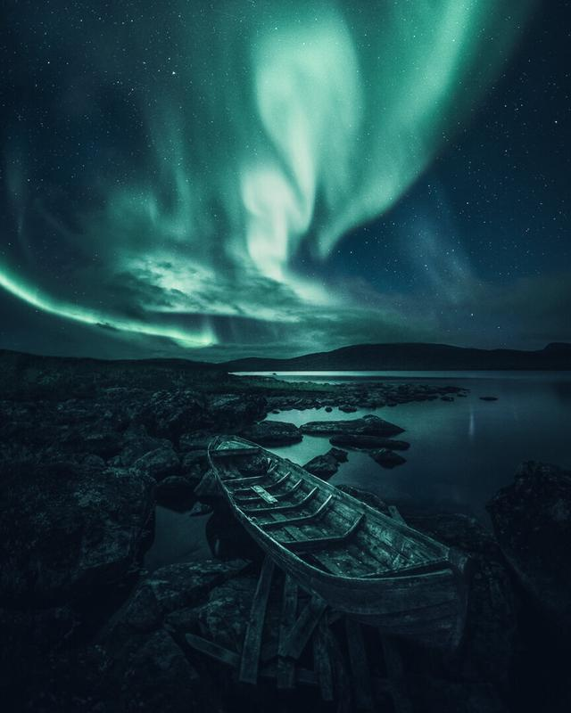
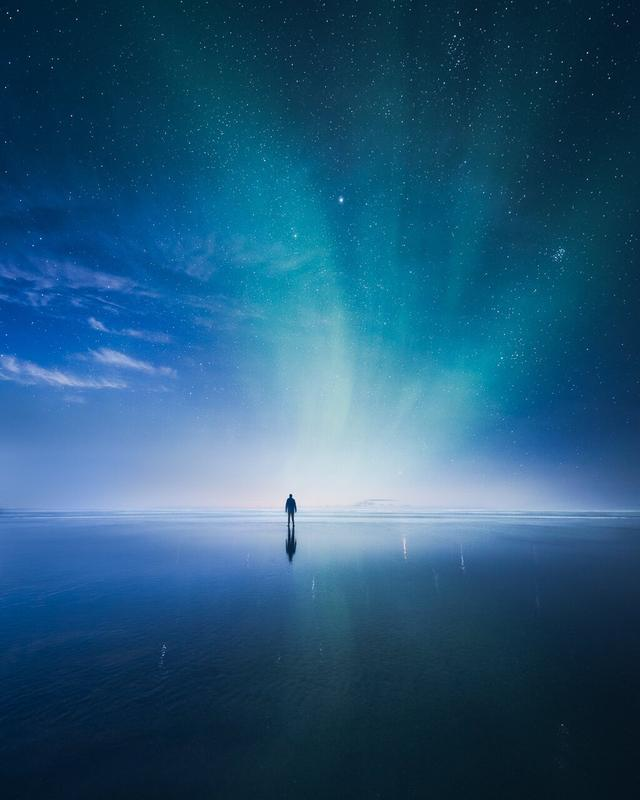
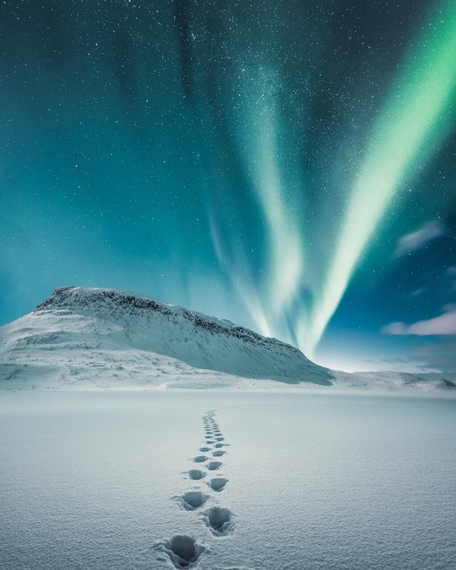
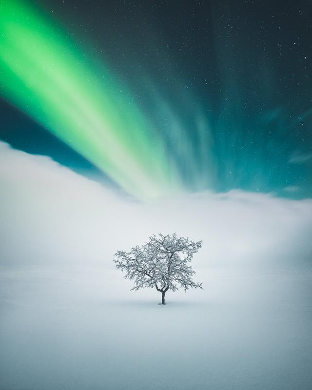
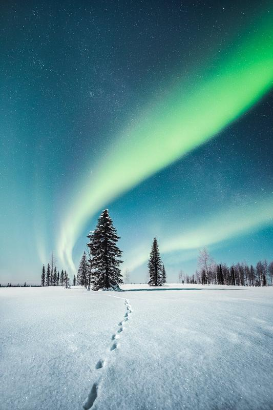
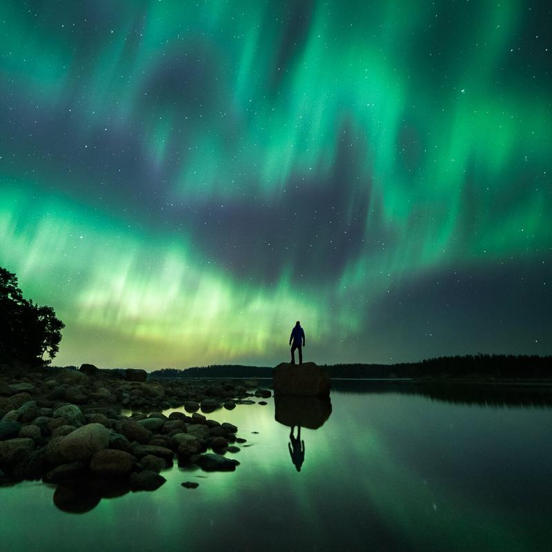
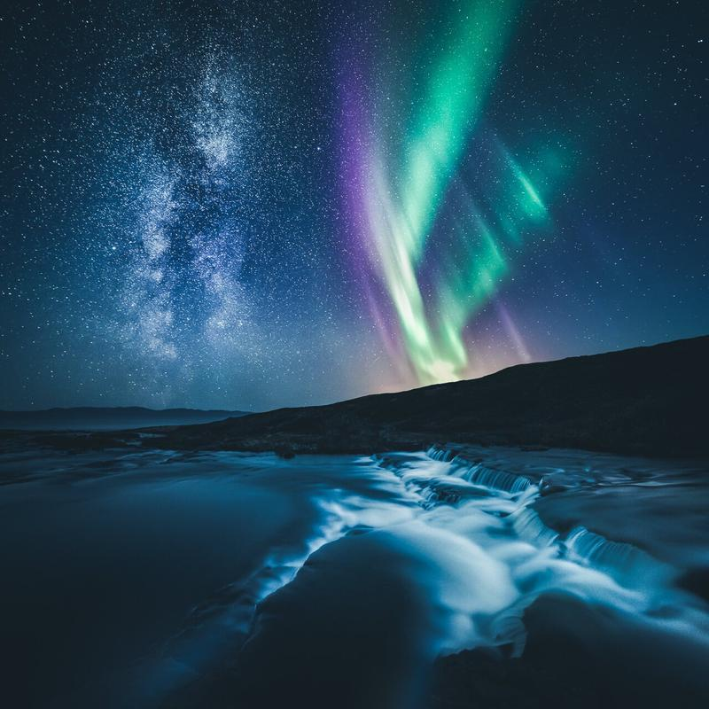

I love to capture the northern lights, and because I get questions from people on how to capture them, I decided to share my experiences on the topic. I’m sure it is possible to photograph some kind of shots of the northern lights with our phones. However, when talking about a decent quality image, you need a DSLR or mirrorless camera, at least at the moment I’m writing this article. The gear part is continually changing, so I’m not going to spend a whole lot of time talking about it. Instead, I’ll give you advice on settings, how, when and where to capture the northern lights.

### What kind of equipment is needed to capture Aurora?

* DSLR or a mirrorless camera that can handle high ISO settings up to 6400 without being overly grainy. Most of the latest cameras work well with high ISO settings.
* Wide-angle lens between 12 to 24 mm (full-frame equivalent) with an aperture between f/1.4 to f/2.8
* Tripod

### Where to capture the northern lights and when?

* Go north and shoot towards the north is an excellent place to start. Some areas that I think are worthy of consideration to capture Auroras: Finnish Lapland, Swedish Lapland, Iceland, Svalbard, and Northern Norway.
* Stay away from city lights. If you have captured night shots, you know how bad those lights can look on the horizon, that’s why I always recommend avoiding light pollution.
* The best time to capture the Aurora Borealis is from autumn until spring.

### How to know when to shoot?

* Other than continually looking at the evening sky, there are plenty of different apps that show you forecast for Auroras. The forecasts use the KP index, which is a scale of geomagnetic activity. The higher the KP, the higher the chance of seeing the Aurora in lower latitudes. For example, if a place you are visiting has usual visibility when it’s KP 3, then you might want to head out even when it’s KP 2 because you might get lucky. Some of my favorite Aurora Borealis forecast apps are Aurora Now, Aurora Fcst, and My Aurora Forecast
* Check the weather forecast and hope for clear skies, but remember to look out because sometimes the estimates are wrong, and you don’t want to miss out on the show!

### What settings to use?

* Use the manual mode on your camera and manual focusing. If you have never tested manual mode or focusing, I recommend doing both in the daylight, so you get used to it before heading out.
* ISO between 800-6400 depending on the brightness of the scenery and Aurora.
* Use f/2.8 or smaller f-stop numbers.
* Shutter speed depends on how fast or bright the northern lights are. Shutter speed can be between 4 to 30 seconds. The most common is somewhere between 10-25 seconds in my experience. You must figure it out as you shoot. Go more prolonged exposure first and then lower it if the lights are brighter or faster than you expected. You can also reduce the ISO if the images seem to be overexposed.

### Tips on taking the photographs

* Try to find different perspectives: look up, look for reflections, and unique subjects.
* Focus on having the Aurora in line with the subject. Circle around the subject you are focusing on and try to find creative angles.
* Aurora is a great way to compose a subject because it works great as a leading line.

**Learn and Master Photography Through My** [**Complete Photography Bundle**](/complete-bundle)**!**

Kilpisjärvi, Finland 2018 – Nikon D810, Laowa 12 mm f/2.8 – ISO 1600, 13 sec. f/2.8

In this above photograph, I had different ways to compose it. Still, because I wanted to show the whole night sky, I opted to create a vertorama of three different horizontal photographs.

Kilpisjärvi, Finland 2018 – Nikon D810, Laowa 12 mm f/2.8 – ISO 2000, 15 sec. f/2.8

Above is another view of the same subject with an entirely different atmosphere obtained by shifting the perspective from the other side of the boat wreck. Editing the image with colder tones makes it feel more ethereal than the first shot.

Below are some of my favorite recent northern lights photographs. Click on the image to see the equipment and settings used to capture them.

[View fullsize
](https://images.squarespace-cdn.com/content/v1/63ceaffd33529a45e572bf90/1674497141839-GEH0K2KQSTZZ9PJMNPUY/Mikko-Lagerstedt-Killpi-2.jpg)

[View fullsize
](https://images.squarespace-cdn.com/content/v1/63ceaffd33529a45e572bf90/1674497143660-SPVPZXNFPALHB3TUE4ND/Mikko-Lagerstedt-Killpi-5.jpg)

[View fullsize
](https://images.squarespace-cdn.com/content/v1/63ceaffd33529a45e572bf90/1674497145061-NZHWJ7WNU2HXNUCFJIYF/Mikko-Lagerstedt-Killpi-7.jpg)

[View fullsize
](https://images.squarespace-cdn.com/content/v1/63ceaffd33529a45e572bf90/1674497146736-7TPJSB4W8H48UE3EVD0Q/Mikko-Lagerstedt-Killpi-10.jpg)

[View fullsize
](https://images.squarespace-cdn.com/content/v1/63ceaffd33529a45e572bf90/1674497148526-LZMXK5J0G9DVJU8P0ZED/Mikko-Lagerstedt-Killpi-8.jpg)

[View fullsize
](https://images.squarespace-cdn.com/content/v1/63ceaffd33529a45e572bf90/1674497150577-RW9T2Z37G4A4LQGN7BPL/Mikko-Lagerstedt-Killpi-9.jpg)

## Quick Recap

Camera settings for capturing the Northern Lights

* Focal length: 12-24 mm
* Manual focusing
* ISO settings: 400-6400
* Aperture: f/1.4-2.8
* Shutter speed: 4-30 sec. depending on the movement and brightness of the Aurora

Places to capture the Northern Lights in Autumn, Winter, and Spring

* Finnish & Swedish Lapland
* Northern Norway
* Svalbard
* Iceland

Would you like a second post about Auroras? Perhaps about the editing the shots of the northern lights?

Have you experienced Aurora Borealis yourself, if so where did you see them?

## Subscribe

Subscribe to get to receive fresh new tutorials straight to your inbox.

First Name

Last Name

Email Address

Sign Up

We respect your privacy.

Thank you!