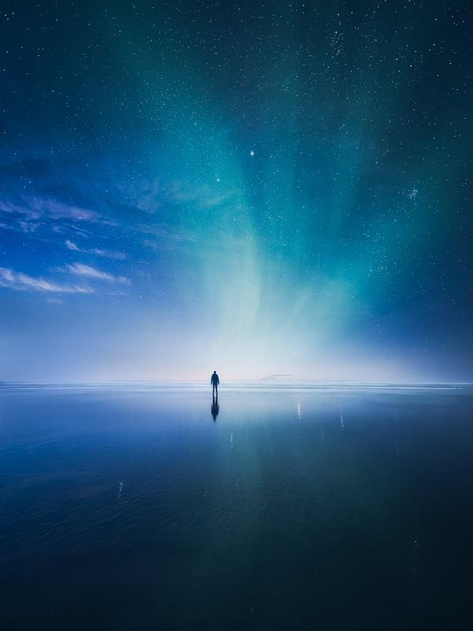
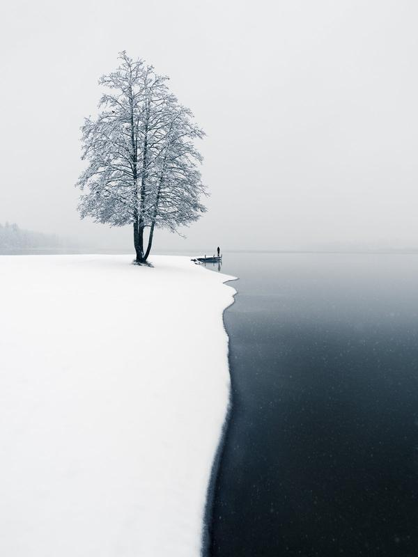
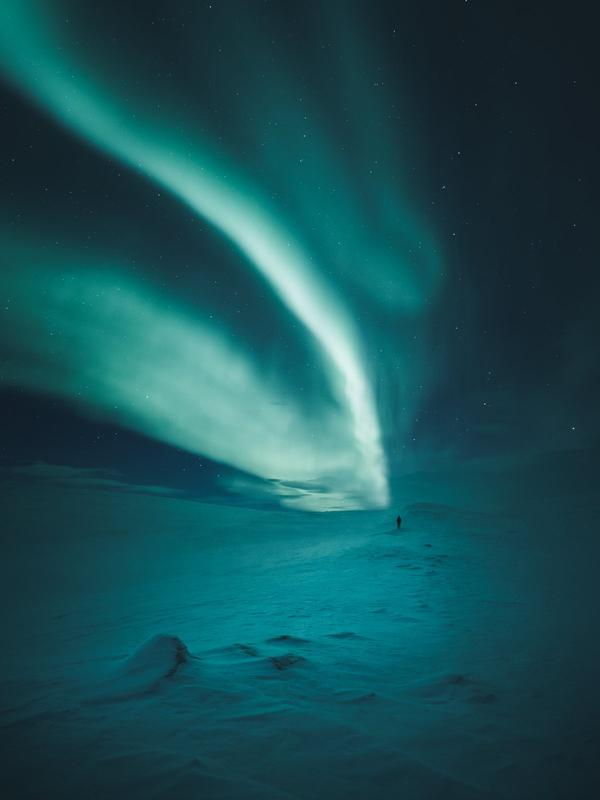

I’m excited to announce my new exhibition, ‘**In the Solitude of Nature.’** It’s an exhibition including my best photography from the Nordics of the past ten years of my photography journey.

The exhibition is in the **Redi Shopping Center**, in Finnfoto Gallery in space **A2-03,** starting on the **1st of August 2023** and running until the **30th of September**. The gallery is open 8-23, and it’s free entry. Below are the exhibition notes if you want to read about it.

### Exhibition information

‘In the Solitude of Nature’ is a photography exhibition that showcases Mikko Lagerstedt’s profound vision of Nordic landscapes and atmospheric moments. Capturing unforgettable landscapes from the morning mist to the darkness of night. The images do not just capture places; they capture emotions, bringing you closer to the silence of nature.

On display are photographs from Finland, Norway, Iceland, and Sweden, revealing the hidden treasures of these places. The photos are stories created through light, shadow, and color. They are an invitation to step away from everyday life, take a deep breath, and step into the heart of the Nordic countries, where the beauty of the landscapes is untouched, and time seems to stand still.

The exhibition photos present images from both near and far, reminding us that we do not always have to travel to the ends of the Earth to experience magnificent landscapes. The ‘In the Solitude of Nature’ exhibition beautifully manifests different seasons, weather conditions, and locations.

Each photograph in the exhibition holds a story or message. It is up to you to find them.

—

Mikko Lagerstedt (b. 1982) is an internationally acclaimed landscape photographer specializing in minimalist and atmospheric landscape images. Born and raised in Finland, the rural landscapes of his childhood in Kauhava have instilled in him a love for nature and art. His photographs are like visual poems, telling stories through light, shadow, and color.

Lagerstedt’s initial inspiration for photography was born in 2007, on a trip to a relative’s cottage when rain turned into sunshine. It created a stunning combination of fog and light, which he captured with his compact camera— this beautiful moment sparked the desire to document and photograph such atmospheric moments. More than 1.7 million people worldwide follow Mikko’s images on social media.

His images have gained widespread attention and recognition globally. They can be found in the book “Masters of Landscape Photography,” which features photographs from the most renowned landscape photographers. His works have been featured in prestigious publications, including BBC, Business Insider, Daily Mail, and The Telegraph. Additionally, Mikko has worked with photographer Konsta Punkka on the YLE mini-series Exploring Earth, filmed in Patagonia, Chile. One of his most famous photos, “Reflect,” gained special attention when renowned real estate agent Ryan Serhant shared it on social media.

Lagerstedt’s style is characterized by a minimalist approach, capturing the essence of the world in all its splendor - from the peace of a foggy morning to the ethereal brightness of the Northern Lights. He aims to evoke emotions by capturing fleeting moments of nature and creating a deeper connection between the viewer and the landscape.

The meditative nature of landscape photography is emphasized in his work, where being present in the moment and capturing the diversity of nature in his own way is vital. The goal of his images is not just to interest people but also to make them feel something when looking at them as if they were in the picture themselves.

**In Finnish - Suomeksi**

### Luonnon hiljaisuudessa

'Luonnon hiljaisuudessa' on valokuvanäyttely, joka esittelee Mikko Lagerstedtin syvällisen näkemyksen Pohjoismaiden maisemista ja tunnelmallisista hetkistä. Aina aamun usvasta, yönpimeyteen taltioiden unohtumattomia ja ajattomia maisemia. Kuvat eivät vain vangitse paikkoja, ne vangitsevat tunteita, tuoden sinut lähemmäksi luonnon hiljaisuutta.

Esillä on valokuvia Suomesta, Norjasta, Islannista ja Ruotsista, jotka paljastavat paikkojen piilotetut aarteet. Valokuvat ovat tarinoita, jotka on luotu valon, varjon ja värin avulla. Ne ovat kutsu pois arjesta, hengittää syvään ja astua Pohjoismaiden sydämeen, missä maisemien kauneus on koskematon ja aika tuntuu pysähtyvän.

Näyttelyn valokuvien tarkoitus on esitellä kuvia läheltä sekä hieman kauempaa. Muistuttaen, että aina ei tarvitse matkustaa maailman ääriin, jotta voi kokea upeita maisemia. Eri vuodenajat, sääolosuhteet ja paikat näkyvät upeasti 'Luonnon hiljaisuudessa' -näyttelyssä.

Jokainen näyttelyn valokuva kätkee sisäänsä tarinan tai viestin. Sinun tehtäväsi on löytää ne.

—

Mikko Lagerstedt (s. 1982) on kansainvälisesti tunnettu maisemavalokuvaaja, joka on erikoistunut minimalistisiin ja tunnelmallisiin maisemakuviin. Syntynyt ja kasvanut Suomessa, lapsuuden maalaismaisemat Kauhavalla ovat luoneet hänen rakkautensa luontoon ja taiteeseen. Valokuvat ovat kuin visuaalisia runoja, jotka kertovat tarinoita valon, varjon ja värin kautta.

Lagerstedtin ensi-inspiraatio valokuvaukseen syntyi vuonna 2007, matkalla sukulaisten mökille, kun sade muuttui auringonpaisteeksi. Tämä loi upean sumun ja valon yhdistelmän, jonka hän taltioi kompaktikamerallaan. Tämä kaunis hetki herätti halun tallentaa ja valokuvata tällaisia tunnelmallisia hetkiä. Sosiaalisessa mediassa Mikon kuvia seuraa yli 1,7 miljoonaa ihmistä ympäri maailmaa.

Kuvat ovat saaneet laajaa huomiota ja tunnustusta eri puolilla maailmaa. Niitä löytyy kirjasta ”Masters of Landscape Photography”, joka sisältää tunnetuimpien maisemavalokuvaajien valokuvia. Töitä on esitelty arvostetuissa julkaisuissa, kuten BBC, Business Insider, Daily Mail ja Telegraph. Lisäksi Mikko on työskennellyt yhdessä kuvaaja Konsta Punkan kanssa Ylen lyhytsarjassa Exploring Earth, joka on kuvattu Chilen Patagoniassa. Yksi suosituimmista valokuvista, "Reflect", sai erityistä huomiota, kun tunnettu kiinteistövälittäjä Ryan Serhant jakoi sen sosiaalisessa mediassa.

Lagerstedtin tyylille on tunnusomaista minimalistinen lähestymistapa, joka vangitsee maailman olemuksen sen kaikessa loistossaan - aina sumuisen aamun rauhasta revontulien eteeriseen kirkkauteen. Pyrkien herättämään tunteita tallentamalla luonnon ohikiitäviä hetkiä ja luomaan syvemmän yhteyden katsojan ja maiseman välille.

Maisemavalokuvauksen meditatiivinen luonne korostuu työssä, jossa on oltava läsnä hetkessä ja taltioitava luonnon moninaisuus omalla tavallaan. Kuvien tavoitteena on, että ihmiset eivät vain kiinnostu niistä, vaan myös tuntevat jotain katsoessaan niitä, aivan kuin he olisivat kuvassa.

## Subscribe

Stay up-to-date with prints and offers.

First Name

Last Name

Email Address

Subscribe

We respect your privacy.

Thank you!