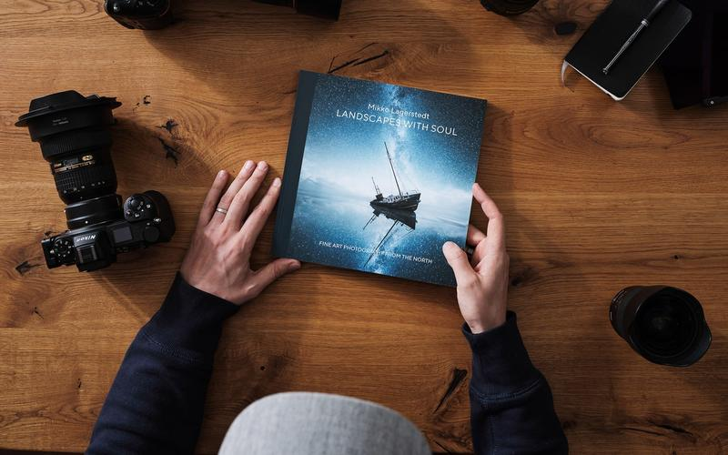
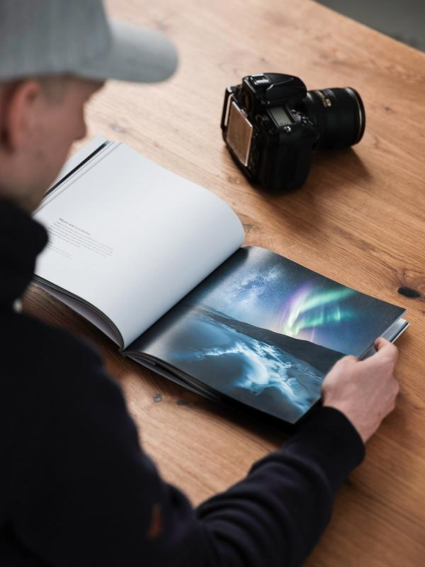
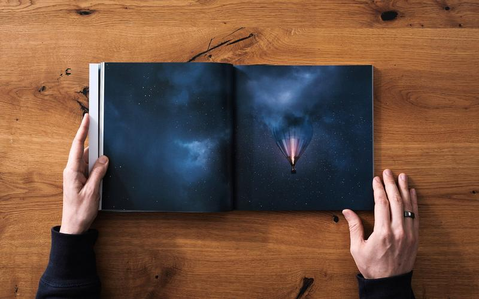
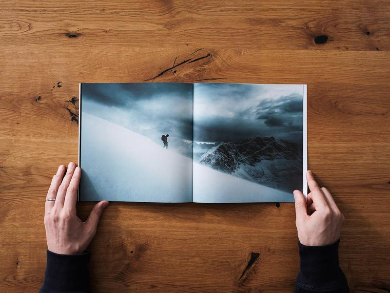
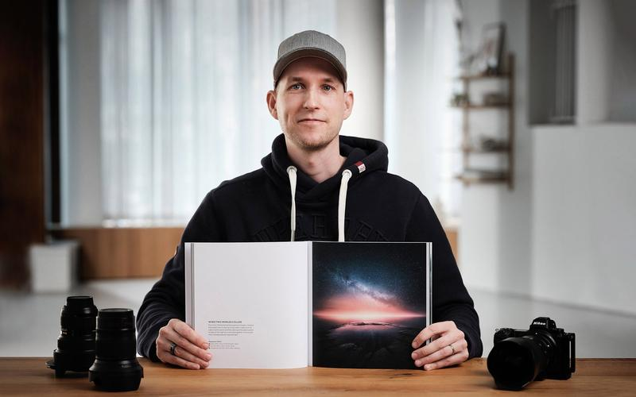
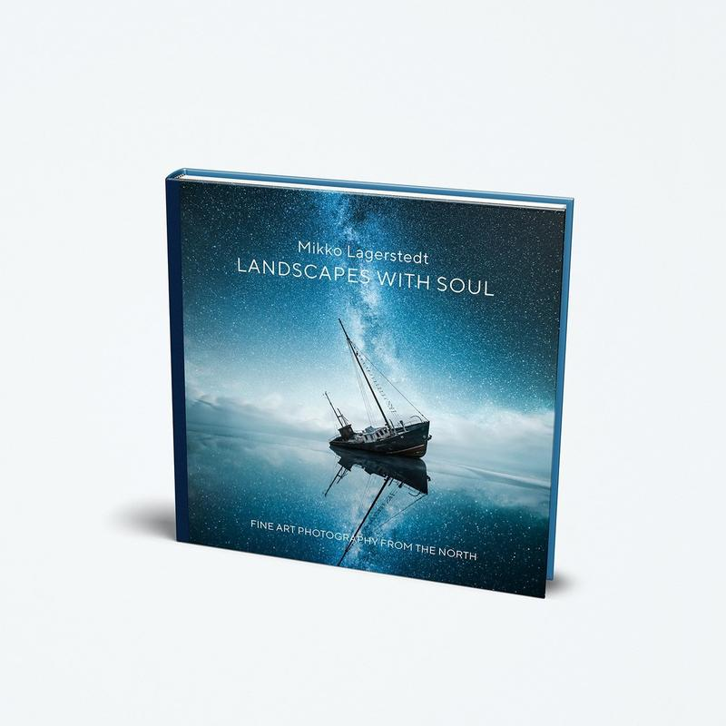
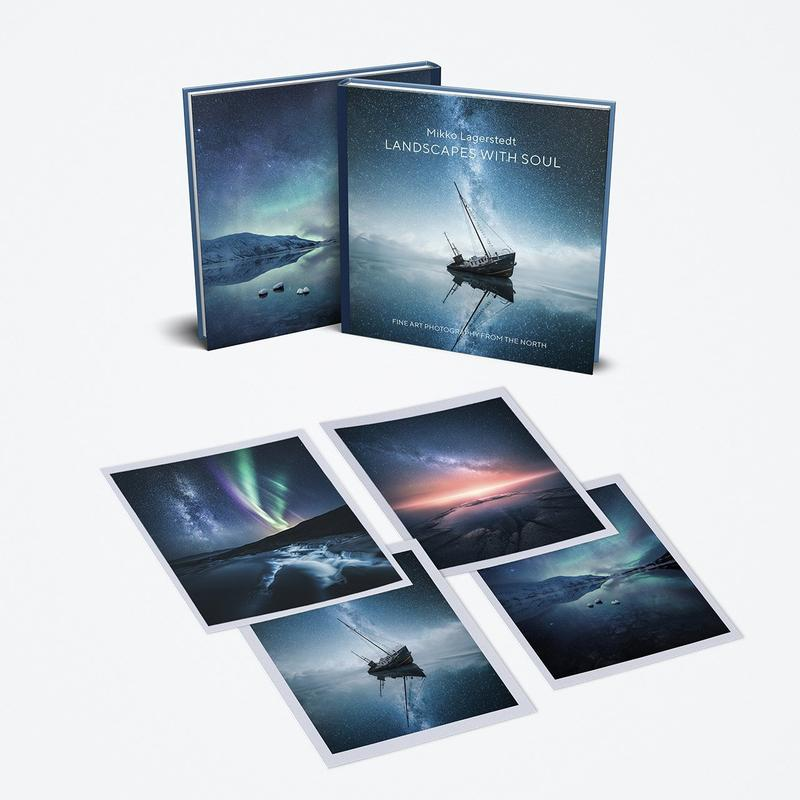
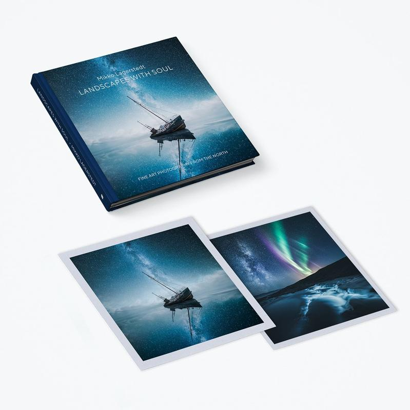

I’m excited and proud to announce my photo book, [**Landscapes with Soul**](https://mikkolagerstedtbook.com/collections/landscapes-with-soul). This collection of imagery is my best work captured from the coast of Finland to the mountains of Norway. It's an ode to the North. You can experience the breathtaking landscapes and moody seasons in this premium photo book. Along the way, I share behind-the-scenes details about how I captured some of my best work.

You can pre-order the limited edition book now and get it before Christmas, but act fast since this first edition is very limited and we don’t know when the next edition will be available!

It's been an eventful thirteen-year journey as a photographer with countless sleepless nights and unforgettable moments. I'm grateful for your never-ending support! None of this would be possible without your help. It hasn't been the easiest year of my life recovering from back surgery. Still, I'm hopeful for a healthier future and more photography adventures, and more photos to share with you along the way. I hope you enjoy this book as much as I have enjoyed creating the photographs. It was an epic journey putting it all together. Special thanks to the team I had the pleasure to work with to make it all happen.

PS. Yes, that's a rare photo of me holding the book.

[Shop Book](https://www.mikkolagerstedtbook.com/collections/landscapes-with-soul)

[View fullsize
](https://images.squarespace-cdn.com/content/v1/63ceaffd33529a45e572bf90/1674496906565-VFELCKK1EHJXIMJW3EXM/Mikko-Lagerstedt-Landscapes-With-Soul-Cover-2.jpg)

[View fullsize
](https://images.squarespace-cdn.com/content/v1/63ceaffd33529a45e572bf90/1674496908299-GS4H0JZTE55WISOQRL1H/Mikko-Lagerstedt-Landscapes-With-Soul-Prints.jpg)

[View fullsize
](https://images.squarespace-cdn.com/content/v1/63ceaffd33529a45e572bf90/1674496910234-LSRI82877OEM5U0GVGFE/Landscapes-With-Soul-3.jpg)

[View fullsize
](https://images.squarespace-cdn.com/content/v1/63ceaffd33529a45e572bf90/1674496912359-RKE6IH6NX9I1IJSJ8PLU/Landscapes-With-Soul-9.jpg)

[View fullsize
](https://images.squarespace-cdn.com/content/v1/63ceaffd33529a45e572bf90/1674496913782-9B8FH85OGQX8QKMCX3QR/Landscapes-With-Soul-13.jpg)

[View fullsize
](https://images.squarespace-cdn.com/content/v1/63ceaffd33529a45e572bf90/1674496915333-8XVCJF8SZOK3BQKFQ2LC/Mikko-Lagerstedt-Landscapes-With-Soul-Book.jpg)

[View fullsize
](https://images.squarespace-cdn.com/content/v1/63ceaffd33529a45e572bf90/1674496916776-AOD8ICQ9TKIRM7GB2DFF/Mikko-Lagerstedt-Landscapes-With-Soul-Gift-Collection-small.jpg)

[View fullsize
](https://images.squarespace-cdn.com/content/v1/63ceaffd33529a45e572bf90/1674496918249-SV72J0ZXFJQD7L7A5CWF/Mikko-Lagerstedt-Landscapes-With-Special-Collection.jpg)

### Landscapes with Soul Photo Book

Experience the breathtaking landscapes and moody seasons of the North in this premium fine art photography book from the comfort of your home. Landscapes with Soul draws from Mikko Lagerstedt's breathtaking portfolio of photographs captured over the last thirteen years. Along the way, Mikko shares behind-the-scenes details about how he captured such astounding images under challenging conditions.

From dusk till dawn, and from one season to another, you can travel in time with this beautifully crafted photography book you can proudly keep on the coffee table to invigorate yourself and others. Enjoy Mikko's fascination with photography and post-processing and see his unique style in the final images.

### PREMIUM QUALITY

* A handbound hardcover premium coffee table book
* Printed in a high-quality art printing house in Finland
* Book dimensions: 25 cm x 25 cm
* 132 pages of high-quality fine art paper (170 gsm)
* The edition is limited to 500 books, including gift and special collections.
* Signed by the Author

[Learn more](https://www.mikkolagerstedtbook.com/collections/landscapes-with-soul)