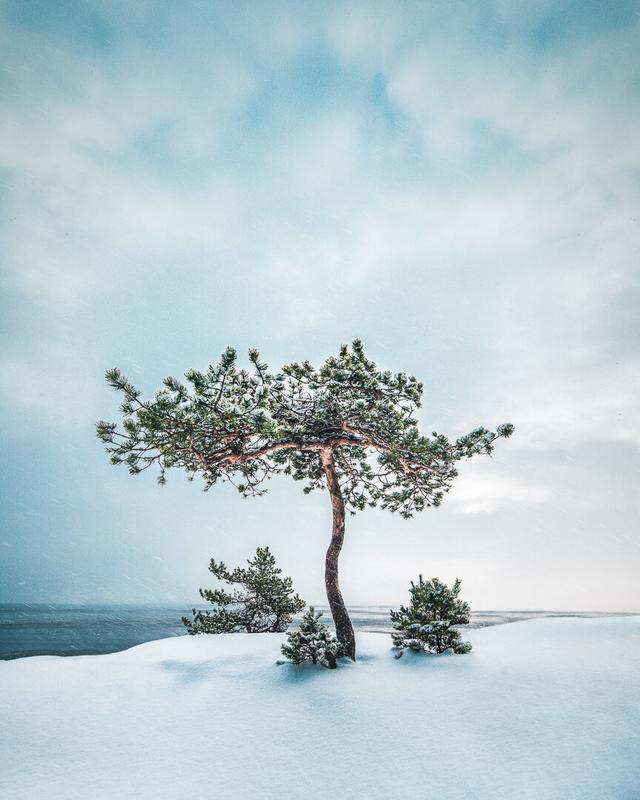

For the past couple of weeks, I have been photographing all over Southern Finland. Last week I visited Emäsalo, Finland for the first time this winter and it sure was a beautiful day. I captured one of my favorite trees there while it was snowing and ice was gathering on the shore.

I couldn't believe that I had the place all to myself the whole time I was there. It is undoubtedly a hard place to walk when there are snow and ice covered rocks. Nevertheless, I had fun time photographing there. Here is my favorite shot from that day.

View fullsize

Lonely Tree - Mikko Lagerstedt 2018 - Emäsalo, Finland

### EXIF & EQUIPMENT

Nikon D810, Nikon 14-24 mm f/2.8  
ISO 100, 16 mm, 1/250 exposure & f/5.0

### POST-PROCESSING

I used Lightroom basic settings to edit the photograph. The colors I edited by using my [Phase Preset Collection](https://mikkolagerstedt.squarespace.com/presets).