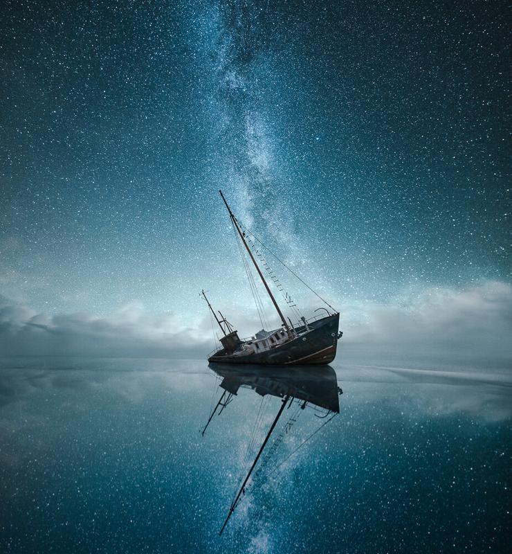

New work created using my Lightroom Presets ([Phase Collection](/phase-presets)) and a couple of my photographs. I had this work sitting on my computer for a long time, somehow I felt that now was the perfect time to share it. I hope you enjoy my new work!

### Exif & Equipment:

Nikon D800, Nikon 14 - 24 mm f/2.8 & Sirui Tripod R-4203L and K-40X  
The Sky: 30 sec, ISO 6400, f/2.8  
The Shipwreck: 30 sec, ISO 800, f/4.0  
The Foreground: 30 sec, ISO 6400, f/2.8

### Editing:

First I imported all of the files in Lightroom and applied a [Phase Preset](/phase-presets) (Balanced - Base). After I had adjusted the colors, I opened the photographs in Photoshop. I masked the pictures to create the final peace. Once ready I applied another Phase Preset (Hazy Night) in Lightroom to give the image atmospheric final look.

Click to view full size on a dark background!

[Buy A Print Of This photograph](https://www.mikkolagerstedt.com/edge-prints/the-lost-world)

View fullsize

Mikko Lagerstedt - The Lost World - 2015

If you are interested in my post-processing techniques, you can see my [tutorials here](/tutorials). You can also subscribe to my newsletter, to receive newly released tutorials.