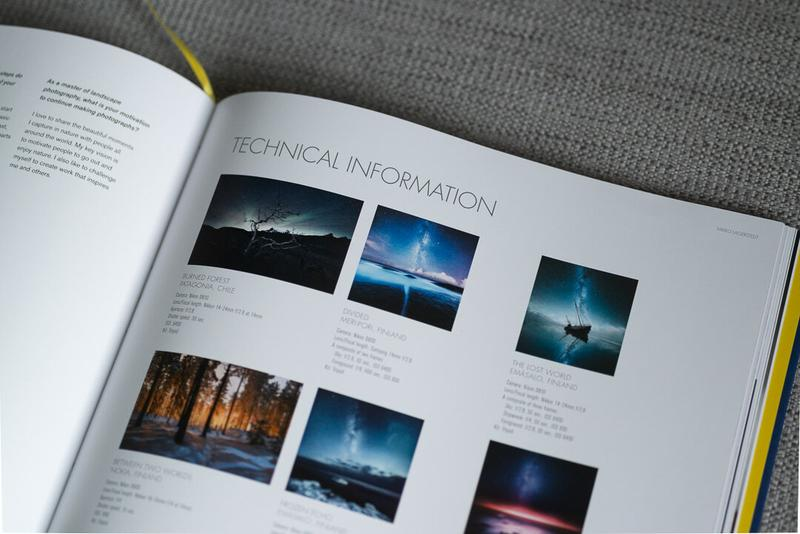

I'm honored to announce that I was selected as the Master of Nighttime for the new **[Masters of Landscape Photography](https://amzn.to/2rIxwj6)**book by Ross Hoddinott. It includes photographers such as Art Wolfe, Daniel Kordan, Marc Adamus and many more. The 176 page-book includes interviews with ten selected photographers including yours truly. There are ten pages for each photographer with many photos with all the EXIF information and words from the photographers. The book is beautifully well made and the look is high quality, and I can highly recommend it.

*"The work of these 'masters of landscape' changes one's sense of the world: leaves it somehow brighter around the edges, darker in its currents, or more lively in its energies."*

