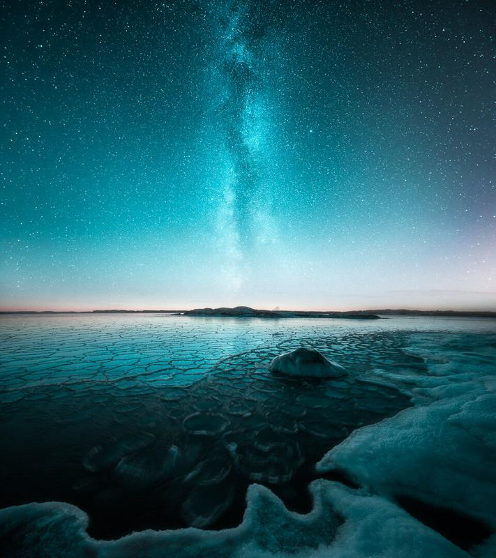

In this tutorial, you will learn how to match two photographs colors in Lightroom to create a composite image. We will take advantage of the new Reference View in the Lightroom CC Develop Module to see the images side by side. I chose cold colors to give this final image cool atmosphere.

## 1. Import pictures and Create a collection

Open Lightroom and import the images from File > Import Photographs. Choose the images you want to match the colors and create the composite. Once the pictures are imported, select both of them and create a new collection from the Collections Panel. Having the both images in the same collection helps you to visualize the final image.

If you want to learn how I setup my catalog [learn it in this free tutorial](http://www.mikkolagerstedt.com/blog/2014/1/8/lightroom-tutorial-organizing-photos-using-smart-collections).

View fullsize

View fullsize

Give the collection a name. I usually have a date first and then a title for the edit.

View fullsize

## 2. Base Image Edit

The first step is to select the base image and edit it individually. Use shortcut D to get to Develop Module.

### 2.1. BASIC SETTINGS

The settings depend on what kind of image you are working on and what is the final outlook you want to create. In this step focus on color and light. I always start by reducing saturation and adding some detail to shadows.

View fullsize

### 2.2. COLOR

Looking through the color panel, see if there are some color you wish to edit. I tend to leave most of these colors untouched. I personally love the green hue over blue color.

*Settings used for this image*  
Red: Hue -49,  Luminance -7  
Orange: Hue -18, Saturation -9, Luminance +2  
Yellow: Hue +33, Luminance -9  
Aqua: Hue -31  
Blue: Hue -51, Saturation +7, Luminance -2

View fullsize

### 2.3. SPLIT TONING

To enhance the cold atmosphere of the base image add cool Split Toning.

*Settings used for this image*  
Highlights: Hue 210, Saturation 26  
Shadows: Hue 210, Saturation 18

View fullsize

## 3. Reference View

You can now use Reference view in Lightroom's latest CC update to see the images open in the Develop Module. You can open the Reference View by using shortcut SHIFT+R.

Now you have both images side by side in the Develop Mode. You can change the reference photograph by dragging an image from the filmstrip.

### 3.1 Basic Settings

Edit the basic settings to make them consistent with the base image. For star photographs, I add contrast and clarity.

View fullsize

### 3.2 Color

Editing the colors from the Color Panel is the most important step to make the colors work perfectly with the reference image.

*Settings used for this image*  
Aqua: Hue -29  
Blue: Hue -38, Saturation -13, Luminance +13

View fullsize

### 3.3 Split Toning

Similarly to the reference image add some blue tones with Split Toning.

*Settings used for this image*  
Highlights: Hue 210, Saturation 17  
Shadows: Hue 210, Saturation 11

View fullsize

The colors look similar thanks to the reference view and the cool thing is that you can fine tune it as much as you need in the Develop mode.

Here is the final image edited in Lightroom and blended together in Photoshop with the techniques in our new [Star Photography Composite](/star-photography-composite) tutorial.

Star Photography Composite

[FREE TUTORIALS](/tutorials) | [LEARN MY TECHNIQUES](/learn)

## Subscribe

Sign up with your email address to receive new tutorials straight to your inbox.

First Name

Last Name

Email Address

Subscribe

We respect your privacy.

Thank you!