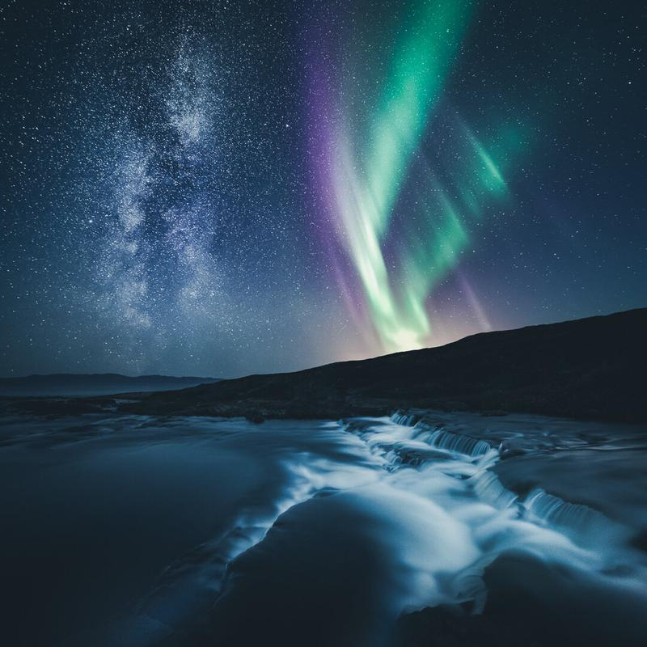

A couple of weeks ago I went on a six-day road trip with Sami ([@samiheiskanen](https://www.instagram.com/samiheiskanen/)) from Helsinki to Utsjoki to all the way up to Varanger, Norway. Even with over 4500 km's of driving we had an excellent photo journey there.

For the final day in Norway, we had a chance to watch the Northern Lights dance over the clear sky near Vadsø. I captured this view from a nearby small river.

### Exif & Equipment

Nikon D810, Nikkor 14-24 mm f/2.8 & Manfrotto MT190CX Pro tripod.   
Two horizontal photographs ISO 6400, 30 sec., f/2.8 @ 14 mm

### Post-processing

I blended the two vertical images manually in Photoshop CC. If you wish to learn this blending technique go and see my ebook [Star Photography Masterclass](/star-photography-tutorial). After combining the images, I opened the final work in Lightroom and edited it with [Saga Lightroom](/preset-collection-saga) presets Star Landscape - Born and Split-Toning - Blues.

View fullsize

Milky Way & Aurora - Vadsø, Norway - 2016