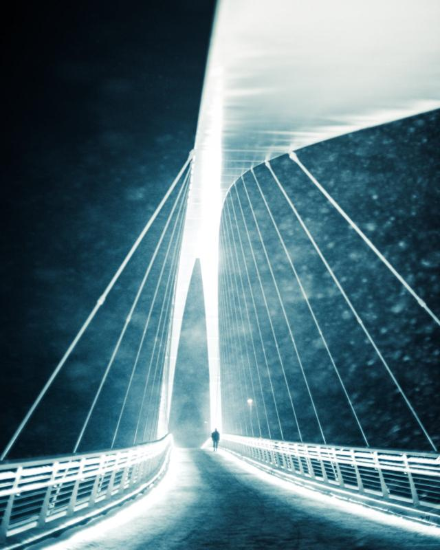

Let’s talk about minimalistic photography. It’s my favorite type of photography at the moment. So what does minimalistic photography include? Minimalistic photography is a style of photography that focuses on simplicity and minimalism. In this kind of photography, simple compositions, clean lines, and a limited color palette are what makes it unique. The point is to create highly stylized and elegant images. You can tell a powerful story by using simple aesthetics.

The goal of minimalistic photography is to highlight the beauty and simplicity of the subject rather than to provide a complex or detailed depiction of it.

One key element of minimalistic photography is the use of negative space, which is the empty space around and between the photograph's main subject. This empty space helps to draw the viewer's attention to the subject and to create a sense of calm and balance in the image.

Another critical aspect of minimalistic photography is the use of light and shadow. I often use directional light to create sharp, clean lines and highlight the subject's textures and details. This can help to create a sense of depth and dimension in the photograph.

Minimalistic photography can be applied to a wide range of subjects, including landscapes, architecture, still life, and portraits. This style of photography is often associated with modern and contemporary art, and many minimalistic photographs have a very graphic and abstract quality.

Overall, minimalistic photography is a unique and visually striking way to capture the world around us. It can be an excellent way to express creativity and artistic vision.

## **Here are a few tips for creating minimalistic photography**

1. Simplify the composition: Minimalistic photography often uses simple compositions, with the subject placed in the center of the frame. Avoid clutter and distractions in the background, and focus on the photograph's main subject.
2. Use negative space: Negative space is the empty space around and between the subject of the photograph. This empty space helps to draw the viewer's attention to the subject and to create a sense of calm and balance in the image.
3. Use a limited color palette: In minimalistic photography, the color palette is often very limited, with just a few colors used throughout the photograph. This can help to create a cohesive and elegant look in the image.
4. Play with light and shadow: Light and shadow are essential elements in minimalistic photography. Use directional light to create sharp, clean lines and highlight the subject's textures and details.
5. Experiment with different angles and perspectives: Try shooting the subject from different angles and perspectives to create exciting and unique compositions. This can help to add a sense of visual interest to the photograph without adding clutter.

Overall, creating minimalistic photography is all about simplifying the composition, using negative space, and playing with light and shadow to highlight the subject. With practice and experimentation, you can develop your own unique style of minimalistic photography.

I hope you enjoyed this article! **All images were edited with the** [**Epic Preset collection**](/epic-presets)**. 50% off for a limited time!**

## Subscribe

If you enjoy this post. **Subscribe** to be the first to receive **fresh new** **tutorials** straight to your inbox!

First Name

Last Name

Email Address

Sign Up

We respect your privacy.

Thank you!