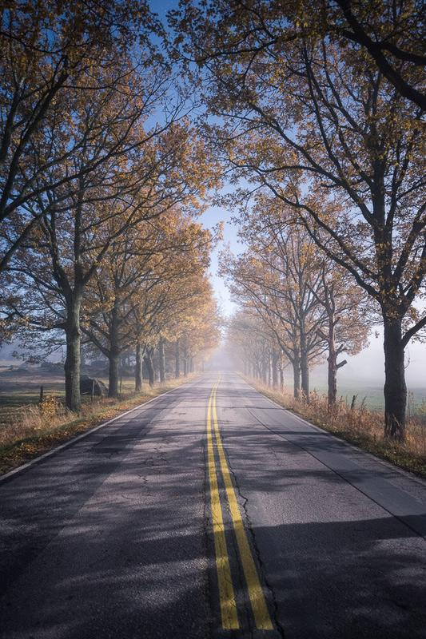

I had the pleasure to witness this beautiful night view near Loviisa, Finland. The moonlight and fog created this unique atmosphere. This road is by far one of my favorite roads in Finland!

### Exif & Equipment

Nikon D810, Nikkor 14–24 mm f/2.8 G ED, Sirui Tripod  
30 sec. ISO 1000, f/2.8 @ 24 mm

### Post-Processing

Minor edit with my [Phase Presets](/presets) Basic Settings: Balanced - Smooth

View fullsize

Moonlit Road - Mikko Lagerstedt - Loviisa, Finland 2015