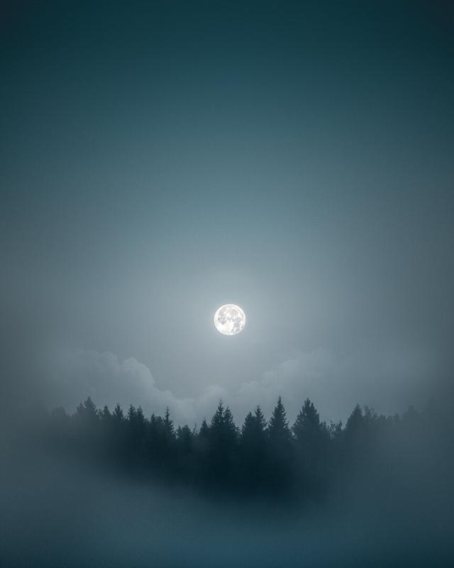

Whenever I force myself out of bed at 3 am to catch the sunrise and mist. I never feel disappointed with the time I spend outside. I might feel tired and frustrated if I don't find anything to photograph, but I always try to learn something from these situations. It's not easy by no means. Sometimes I might learn that no, I should have gone photograph the stars instead or create a timelapse. After a shoot, I try to write a few words if I feel frustrated with my work to help solve the feeling. Usually, I just feel that I let myself down by not being good enough in some situation. I also write a few words of what could I do differently next time I go out. I try not to make the same mistakes but of course, I might forget these learning experiences when time goes on, I guess it's part of being a creative.

This morning I felt cold as my shoes got wet by walking around the wet field. It didn't bother me much. My goal was to capture the setting moon as I knew it was a full moon morning. After some experimenting with compositions, I chose a simplistic approach. Mist, trees and the moon. Sometimes the simplest things can be the one I find myself enjoying the most. I hope you enjoy it as well!

### Equipment & Exif

Nikon D810, Nikon 70-200 mm f/4.0 VR & RRS tripod  
200 mm, f/8.0, 1/30 sec. ISO 100.

### Post-processing

Lightroom basic settings and radial and gradual filters. I also applied a Discreet - Blue preset from the [Phase preset collection](/phase-presets).

View fullsize

Moonset - Tuusula, Finland - 2018