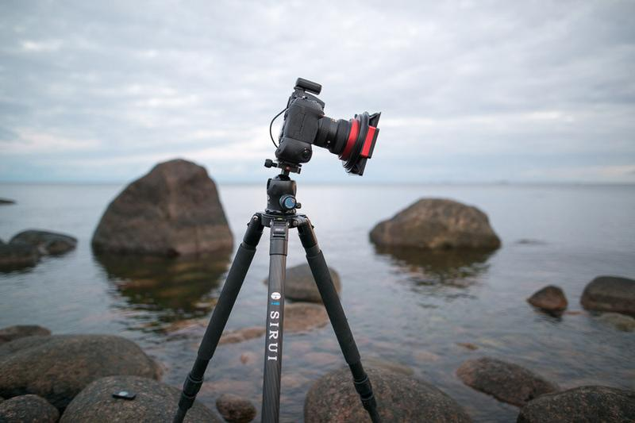

Since I get a lot of questions about my photography gear and tools I use, I decided to create a new series of equipment. As many have said – gear doesn't matter! However, if you have decent gear, it can inspire and help you to create more! I look at gear as tools, when it works great it works with you and won't get in your visions way. When it doesn't work like you would want it to work it controls and limits your vision. Don't fell into the trap of more gear is better because it might not ease the process but rather confuse what to use. For the first part of the series, here is a list of my most used equipment.

View fullsize

## Everyday Photography Gear

The set I carry 90% of the time with me every time I go out to photograph. You can [view this whole set on Amazon Store](http://astore.amazon.com/photomikkolag-20?_encoding=UTF8&node=1).

### **Two Camera Bodies**

[*Nikon D810*](http://amzn.to/1U3GsZr)*&*[*D800*](http://amzn.to/1Mk7hpM)— Why do I carry two camera bodies? Well because I tend to shoot long exposures. So when the other camera (usually D810) is taking for example 10 minute long exposure, I go and scout for the next landscape I want to capture or shoot a time-lapse with the D800. When I'm out photographing in the daytime, I keep the wide-angle lens on the D810 and a telephoto lens on the D800. This way if something interesting happens far away I can just grab the other camera and start shooting.

### **Lenses**

[*Nikkor 14–24 mm f/2.8 G ED*](http://amzn.to/1U3HK6B) — This is my go-to lens, I use it 90% of the time on my D810. It's super sharp and excellent for star photography with the aperture of 2.8. View my full review of this lens [here](http://www.mikkolagerstedt.com/blog/2015/10/13/nikkor-1424-mm-f28-g-ed-review-night-photography).

[*Nikkor 16–35 mm f/4.0 VR*](http://amzn.to/1Mk7Dg0)  — I bought this as my first full frame wide-angle lens back in December 2012 and used it to capture all of my landscape photographs. I still use this lens but most of the time handheld, because it has a great image stabilisation. It's not as sharp as the 14–24 mm lens, but it's already quite sharp wide open at f/4.0. After my interest in star photography, I wanted a wider lens with a larger aperture, so I bought the Samyang 14 mm f/2.8.

[*Samyang 14 mm f/2.8*](http://amzn.to/1Mk7E3p) — This was my most used lens for astrophotography until I bought the 14–24 mm Nikkor. I still use this lens when I want to capture time-lapse at night with the D800 or when I'm scouting.

[*Nikkor 50 mm f/1.4 G*](http://amzn.to/1T4OMaj) — I always have at least one faster lens in my camera back in case I want to shoot shallow depth of field or if I wish to capture any behind the scene footage. This lens is so small that I almost always prefer it over my Sigma ART lenses.

[*Nikkor 70–300 mm f/5.6–6.3 VR*](http://amzn.to/1Mk7JnX) — I don't use a telephoto lens too often. I first bought this lens for my first camera Nikon D90. It is a decent lens if you want to add some range to your camera. It is the next lens I will be replacing with the superb [Nikkor 70–200 mm f/4.0 VR](http://amzn.to/1Mk7PMn).

View fullsize

### **Camera Accessories & Backpack**

[*Hähnel Giga T Pro II*](http://amzn.to/1Mk8aP4)— This is my go-to remote controller for the Nikon D810. I use it to capture sharper images and when I need the extra range to take a self-portrait. What I like about is that you have a lot of options you can adjust. When used in cold temperature with gloves it's too small and hard to change the settings without taking the gloves off.

[*Lee Filter System for Nikkor 14–24 mm*](http://amzn.to/1Mk8jSH) — I always have these filters with me when I'm photographing sunrise/sunset or daylight. These filters are top quality yet pricey.

[*Lens Cloths*](http://amzn.to/1U3KEsj) — I have at least three lens cloths with me every time I head out to photograph. When using filters, one cloth is simply not enough. These are needed if you shoot near open water or in high humidity.

[*Lowepro ProTactic 450AW*](http://amzn.to/1qvth7i)— I have used quite a few backpacks in my days as a photographer. The ProTactic from Lowepro is the best one I have ever tried and used. The build quality is superb. You can access your gear four different ways. It is very helpful when you have two camera bodies and a lot of lenses in the bag. The customizability of the straps and pockets is fantastic. I carry my Lee Filter pouch with all of my filters and a tripod in the straps behind the bag. The backpack also has two different small pockets in the front strap where you can put a headlamp and lens cloths, which is handy.

### **Mobile Phone App**

[*PhotoPills*](http://www.photopills.com/)— When I need to capture scenery using my "[Vision of Depth](/star-photography-tutorial)" technique I use PhotoPills to calculate the exposure. It's also very handy when scouting a location! It's unfortunately only available for iPhones.

### Tripod

[*Sirui R4203 L*](http://amzn.to/1XLS7KC) — I always have at least one tripod with me. I use my Sirui tripod most of the time I go out to photograph. I have a lighter tripod for my travels, but I still prefer the Sirui.

[*Manfrotto MHXPRO–3WAY*](http://amzn.to/1Zr5mlg) — I love this tripod head. It's so much quicker to adjust in cold temperatures than the [Sirui K-40X](http://amzn.to/1Zr5Tnk) which I also use. You don't need an L-bracket for your camera when changing from vertical to horizontal frames when using this Manfrotto 3-Way head. Which makes it quick and easy to find better composition and perspective.

[*Manfrotto MT190CX PRO 4*](http://amzn.to/1qvpln8) — I bought this tripod for my travels because it's light and fits in my bigger bag. I would recommend getting these [Retractable Rubber Spikes](http://amzn.to/1qvpren) with it because there are no spikes in the tripod and these are really important when you photograph in snow or ice.

That's it for the first part of my gear list. I hope you enjoyed reading. The next list will be for the scouting gear I use. Meanwhile subscribe to my newsletter to receive new tutorials and photo gear talk as soon as they are released fresh to your email. I will also make a list of my favorite accessories and tools I use when I edit my photographs, so stay tuned!