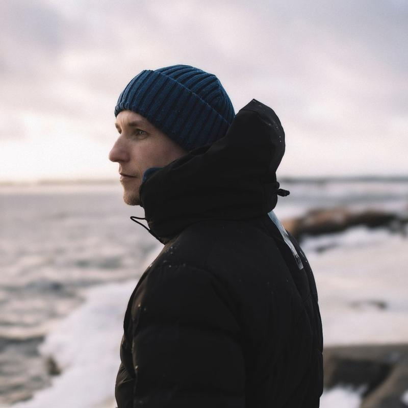

This week, I wanted to share a story about myself and my work. Why I create and what motivates me as a photographer. I hope you enjoy what I wrote. It was straight from my heart.

I'm a creative landscape photographer from southern Finland. Ever since I was a kid, I have been fascinated by art and paintings and how to create something out of nothing. My photography style is dreamy and minimalistic.

With my photography, my goal is to transport you to a timeless, peaceful, and beautiful world and connect you back to nature, reminding you of what it feels like to be alive and what it feels like to be human.

Mikko Lagerstedt – In The Mist - 2022

My grandma was the biggest inspiration when I grew up – she has made beautiful paintings and drawings throughout her life. She is 94 at the moment I write this. I didn't understand how she or anyone created such beautiful art. I thought it was a gift you either had or not. Of course, I tried making sketches and paintings as a child. Still, I never spent enough time learning to create something unique until photography found me. I have been photographing for the past 15 years and have always photographed for myself from the early days.

Playing outside was my favorite thing when I grew up. I often spent my free time outdoors with my friends and siblings, whatever the weather. That's where my love for the outdoors began.

## How it all started

My first inspiration for photography came when I was driving to our relative's cabin. It was a summer evening in 2007, and after a rainy day, the sun came out, and so did the fog. I had to stop taking a couple of photographs with a point-and-shoot camera. As I was going through the images I captured, I was amazed. And thought that these were the moments I wanted to start to capture. This is the view I witnessed and is the only one I still have from those photos.

My first nature photograph captured with point-and-shoot camera in 2007.

As a photographer, I am in awe of the beauty of the world around me, from mist to late-night views of stars. There is always something inspiring to capture with my camera.

When I bought my first DSLR camera in 2008, I learned that photographing is only the first step. The process of creating my work is not linear. I started using Camera Raw to edit the peculiar raw files. From there, I moved to Lightroom, which I use 80% of the time.

I started sharing my photographs in 2008 on Flickr. Since then, I've been fascinated by how my photos can provoke emotions in the viewer. Sometimes how I wanted and sometimes completely differently I envisioned. I also use multiple exposures and photographs of scenes to represent the view and feelings I experience while taking the photographs.

Capturing a stunning photograph can be challenging. You must be in the right place at the right time to capture the perfect light, weather, and composition. I often capture only a few photographs I'm satisfied with within a year.

## Inspiration

I have always been drawn to using a single subject in my pictures, which may be related to the passing of my best friend the day before I turned 19. This solitary element serves as a reminder to appreciate the solitude and solitude of the world around us. The events and experiences of our past give our work depth and richness. Your struggles and hardships give your work a unique angle. Embrace it.

Mikko Lagerstedt – Into the Unknown – 2022

Mikko Lagerstedt – Alone – 2022

Nothing lasts forever, and our surrounding world is ever-changing. Through my photography, I aim to inspire others to see the world differently and appreciate its beauty. I want to connect with others and share the moments that inspire me, hoping they will inspire others.

From the early days of Facebook and Instagram, I gained a significant following of around 1.7 million across social media platforms. In 2009 I entered some of my work in competitions, got mentions, and won second place in the Nikon photo competition, which boosted my confidence to continue photographing.

Nikon Photo Contest 2nd Place

## Sharing knowledge

Fast forward to 2014, I left my job in a restaurant and started creating full-time. It has been a challenging route, but one I would never change. I was one of the pioneers of [Lightroom presets](/epic-presets). I released my first preset collection in 2013, and the sales of the collection helped me take the leap of faith to create full-time.

I wrote, designed, and published a book, [Star Photography Masterclass](/star-photography-tutorial), and was astounded by how people received it. It's still one of the most sold items in my catalog. I've been balancing teaching others and creating for myself ever since.

Mikko Lagerstedt – Night Glow from [Star Photography Masterclass](/star-photography-tutorial)

I rarely travel far from where I live. And capturing beautiful photographs does not always require traveling to the far corners of the world. There is beauty to be found all around us if we take the time to look for it.

Sharing my work online has allowed me to connect with a broad audience and to grow a community of people who appreciate the beauty of the world around us. I constantly strive to improve my craft and create captivating, compelling images.

Mikko Lagerstedt – Infinite – 2022

Thank you for reading! This is me.

## Subscribe

Subscribe to my newsletter to receive content like this.

First Name

Last Name

Email Address

Sign Up

We respect your privacy.

Thank you!