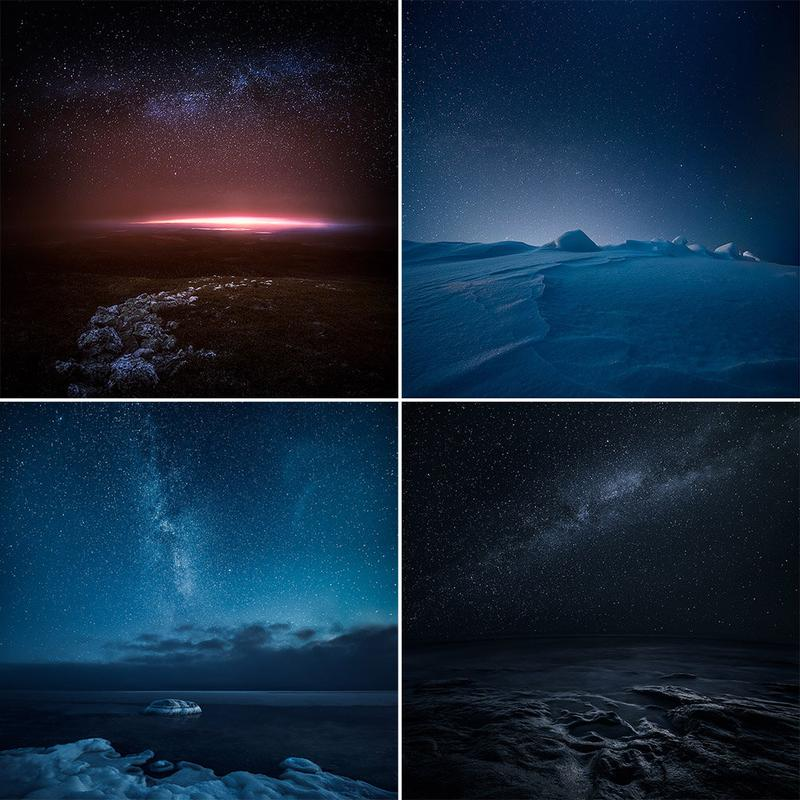

I'm just starting to work on a Night Photography Master class eBook. It will be available this summer, if nothing unexpected happens. The eBook will contain specific details on how to create similar work as in my Edge series and also containing files to practice the post-processing.

Enjoy your Summer everyone!

Here is a new similar work: Evolving Depths

View fullsize

Evolving Depths - Mikko Lagerstedt

View fullsize

Upcoming Night Photography Master Class - eBook, available in Summer 2015