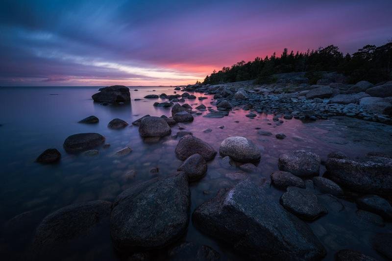

I have now been using the Nikkor 14–24 mm f/2.8 G ED lens for the last month. As promised, here is an overview and review of the lens for the type of work I do. I have also included some photos taken with it in the daylight to show full-size unedited photographs.

### Introduction

[Nikkor 14–24 mm f/2.8 G ED](https://www.nikonusa.com/en/nikon-products/product/camera-lenses/af-s-nikkor-14-24mm-f%252f2.8g-ed.html) ultra-wide-angle lens is made for Nikon full-frame cameras and if calculated, you would need a 9.2–16mm lens on a crop-sensor camera to replicate the angles of view that this 14-24 mm lens gives on FX cameras.

### Specification

* Focal Lenght: 14–24 mm, aperture: 2.8
* Internal Focusing (IF) system; autofocus with a built-in SWM and manual focus
* Lens construction: 14 elements in 11 groups inc. 2x ED and 3x aspherical elements and 1x element with Nano Crystal Coat
* Picture Angle: 114° - 84°
* Size: 98 x 131.5 mm, Weight: 1 kg

### Build Quality

The first thing you notice when you get your hands on the Nikkor 14–24 mm f/2.8 lens is the size and weight. The quality is excellent, in the hand it feels solid and extremely well build. Compared to the Samyang 14 mm f/2.8 - it's a monster. The Nikkor is almost two times bigger and the price tag is over three times more than the Samyang.

*The question is:* Is it worth the size and price? And for a quick answer, yes! It is a top quality lens. Now of course you have to know what are you going to use it for. My primary usage is star photography and landscapes, and the Nikkor is a fantastic lens for both of these.

### Accessories

With the lens, you get a case (Nikon CL-M3) to carry the lens. I occasionally use the case strapped to my Lowepro ProTactic 450AW camera bag if there is not enough space inside. There are no filter threads, so you have to use an external filter holder. In the image below I use a Lee filter system made for the Nikkor 14–24 mm. For star photography, I never use filters.

My gear includes [Nikon D810](https://www.nikonusa.com/en/Nikon-Products/Product/dslr-cameras/d810.html) and an [MB-D12](https://www.nikonusa.com/en/nikon-products/product/power-packs/mb-d12-multi-power-battery-pack.html#tab-ProductDetail-ProductTabs-RatingsReviews) Multi Power Battery Pack. The Nikkor 14–24 mm is perfectly balanced with the setup. For tripod, I use a Sirui R-4203L with a K-40X ball head.

### Autofocus

The autofocus is fast and works accurately in the situations I have used it. If you are primarily using the lens for star photography, you might want to learn when it is focused to infinity either manually or with the autofocus in vast landscapes. If there is a small light source in the scenery, the lens can focus to it in most of the cases. In pitch black situations, I recommend using the manual focus. Thanks to an AF-S drive (Silent Wave Motor) autofocus operations are fast and almost silent.

### Optics & Sharpness

I have used many different wide-angle lenses in my past, but with the full-frame camera I have used the Nikkor 16–35 mm f/4.0 VR, Samyang 14 mm f/2.8 and the Nikkor 14–24 mm f/2.8 G ED.

Distortion is moderate when compared to the heavily distorted photographs taken with the Samyang 14 mm. The barrel distortion is really easy to fix in Lightroom with the correct lens profile for the Nikkor. The real advantage of the Nikon 14–24 mm f/2.8 against the Samyang is the sharpness of the images overall image quality. Against the Nikkor 16–35 mm f/4.0 the sharpness is better already wide open and the extra stop is essential when you photograph in low light situations.

### Example Photographs

You can see a couple of example photographs taken with Nikon D810 and Nikkor 14–24 mm f/2.8. The images shot in RAW and exported with Lightroom CC: [View the full-size gallery here.](https://www.dropbox.com/sh/5eij3qun6ub4rh6/AAC1uDxfH6JCf2v5ZM106Pq4a?dl=0)

From corner to corner the sharpness is very good already from wide open. I used two different 14–24 mm f/2.8 lenses and I have also used two Samyang 14 mm f/2.8 lenses. The Samyang focus seems to change in different parts of the image. For example, if the corners of the image are correctly focused the center is not in focus. This is not the case with the Nikkor, once you nail the focus the whole image is razor sharp.

I have gathered below some of my favorite photographs taken with the Nikkor 14–24 mm f/2.8 lens in the past month with the lens. If you are into star photography, make sure to check out my [Star Photography Masterclass eBook](/star-photography-tutorial).

### Series of photographs captured with the Nikon D810 and Nikkor 14–24 mm f/2.8 G ED

View fullsize

Fog & Stars - Nikon D810 & Nikkor 14–24 mm f/2.8 G ED - ISO 6400, 30 sec. f/2.8 @ 14 mm

View fullsize

Under The Stars - Nikon D810 & Nikkor 14–24 mm f/2.8 - ISO 6400, 14 mm, f/2.8, 30 sec.

View fullsize

Fog & Stars II - Nikon D810 & Nikkor 14–24 mm f/2.8 G ED - ISO 6400, 14 mm, f/2.8, 30 sec.

View fullsize

Koli at Night - Nikon D810 & Nikkor 14–24 mm f/2.8 - ISO 8000, 15 mm, f/2.8, 30 sec.

View fullsize

Glow - Nikon D810 & Nikkor 14–24 mm f/2.8 - ISO 6400, 14 mm, f/2.8, 30 sec.

View fullsize

Koli at Night - Nikon D810 & Nikkor 14–24 mm f/2.8 - ISO 8000, 15 mm, f/2.8, 30 sec.

View fullsize

Searching For Horizon - Nikon D810 & Nikkor 14–24 mm f/2.8, ISO 6400, 14 mm, f/2.8, 30 sec.

View fullsize

Stillness of Night - Nikon D810 & Nikkor 14–24 mm f/2.8 - ISO 6400, 14 mm, f/2.8, 30 sec. & ISO 800, 630 sec.

View fullsize

Star Reflection - Nikon D810 & Nikkor 14–24 mm f/2.8 - ISO 3200, 14 mm, f/2.8, 30 sec.

View fullsize

Road To Aurora - Nikon D810 & Nikkor 14–24 mm f/2.8 - ISO 3200, 14 mm, f/3.2, 15 sec.

View fullsize

Pier to Nowhere - Nikon D810 & Nikkor 14–24 mm f/2.8 - ISO 100, 14 mm, f/10, 200 sec.

View fullsize

Darkness - Nikon D810 & Nikkor 14–24 mm f/2.8 G ED - ISO 100, 24 mm, f/5.6, 400 sec.

View fullsize

Long Sunset - Nikon D810 & Nikkor 14–24 mm f/2.8, ISO 64, 14 mm, f/11, 310 sec.

### Verdict

If you are looking for an extreme wide angle lens for a full-frame camera and you do not mind the weight factor, then this is an excellent lens for you. If you are into landscape and star photography I highly recommend the Nikkor 14–24 mm f/2.8. I already see using it 90% of the time on my Nikon D810.

Pros  
+ Sharpness  
+ Build Quality  
+ Focus (fast, silent and accurate)

Cons  
- Size (Weight 1kg)  
- Need Costly Third-Party Filter System (no screw-on filters)