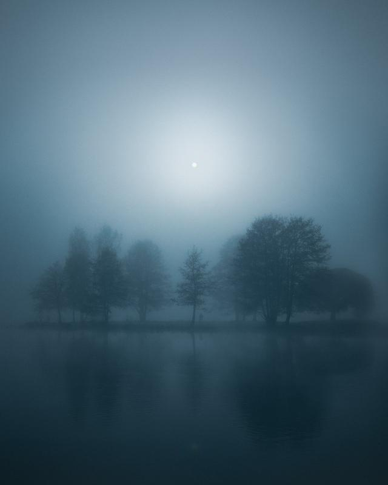

Today, I'm excited to announce something entirely new! Photography challenge I'll participate alongside you. This challenge is designed to push our creative boundaries, help us improve our skills, and, most importantly, have fun! This is an experiment and I don’t know how many participants we will have, but I’m looking forward to seeing as many as possible. There might be a small reward at the end of the challenge, but the main reward is to inspire yourself!

## The Challenge: "Discovering the Unseen"

The theme of this challenge is "Discovering the Unseen" The goal is to capture something people often overlook in your local area. It could be a hidden corner of a park, a unique architectural detail, or an unusual perspective on a familiar scene. The aim is to encourage us to look at our everyday surroundings with fresh eyes and discover beauty in unexpected places.

## Challenge Guidelines

1. **Location –** The location should be within a 20 km / 12-mile radius of your home. This is to encourage exploration of your local area.
2. **Timing –** The challenge will run for one month. From the 14th of August to the 14th of September 2023. This should give you plenty of time to scout locations, plan your shots, and experiment with different techniques.
3. **Sharing Your Work –** Share your final image on Instagram using the hashtag **#DiscoverWithMikko**. At the end of the challenge, I'll feature some of my favorite entries on [**my Instagram**](https://www.instagram.com/mikkolagerstedt/) Stories. If you don’t have Instagram and want to participate, please send me your photographs at hello@mikkolagerstedt.com.
4. **Feedback –** Feel free to comment on other participants' photos and share your thoughts and love. This is an excellent opportunity to learn from each other and build a supportive community.

## Challenge Ideas

If you're not sure where to start, here are a few ideas:

1. Night photography. Try capturing a familiar urban or landscape scene at night. Look for interesting light sources, reflections, or shadows.
2. Minimalist landscapes. Try to capture a landscape in a minimalist style. Look for simple compositions, clean lines, and a limited color palette.
3. Details. Explore the tiny world of your backyard or local park with macro photography. You might discover a whole new world in the patterns of a leaf, bark texture, or an insect's intricate details.
4. Abstract architecture. Look for unusual angles or details in local buildings that can be turned into abstract images.

Remember, the goal of this challenge is not to take the "best" photo but to push your creative boundaries and see your local area in a new light. I can't wait to see what you all come up with!

Happy shooting!

Mikko Lagerstedt – [In Silence](https://mikkolagerstedt.com/prints/p/in-silence) – Southern Finland, 2023

I hope you enjoyed this post! If you do, feel free to share it and subscribe to my newsletter to receive new tutorials straight to your inbox.

## Subscribe

Sign up with your email address to receive new tutorials and updates!

First Name

Last Name

Email Address

Sign Up

Thank you!

Until next time my fellow photographers, keep on creating!