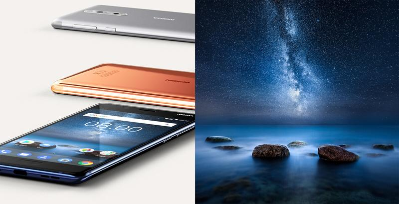

I'm honored to have another of my images chosen as the main image for Nokia. This time for the new Nokia 8 smartphone. The image was created using my Vision of Depth technique, I teach in my eBook: [Star Photography Masterclass](http://www.mikkolagerstedt.com/star-photography-tutorial). More about the photograph can be found [here](http://www.mikkolagerstedt.com/blog/2015/8/31/stillness-of-night).

Nokia 8 - Stillness of Night Image

I was also mentioned as one of this list of [best astrophotography blogs](http://blog.feedspot.com/astrophotography_blogs/). Thank you!