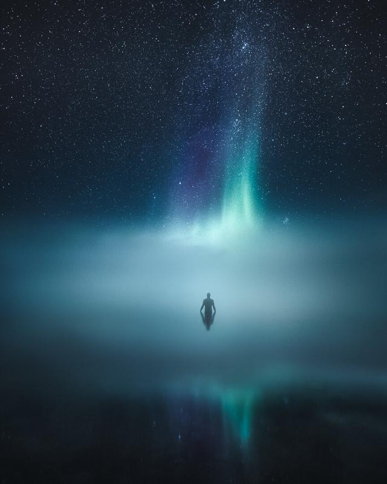

In this weeks tutorial, we are talking about how to set goals for your photography, and what it takes to become full-time creative. As I said earlier in one of my previous tutorials "[**How to keep yourself motivated and take better photographs**](https://www.mikkolagerstedt.com/blog/2018/4/25/how-to-keep-yourself-motivated)" asking questions is crucial if you want to become better! Every six months I find myself asking the same questions about my photography. I do find these questions to be valuable in other areas of my life as well.

If you are aspiring to become a full-time photographer, I think it’s essential to be intentional about your work and path. If you want to do photography for a living or if you wish to get your photography to the next level these questions will give you the guide to do so.

Take at least two days to focus on your goals. I recommend to switch yourself into offline mode. Yeah, it's difficult but I find it so important! Keep yourself out of the internet and don’t watch the news or anything that might affect your decision making. Do it for just two days, and I promise you that you will be inspired to create your goal list. And the best thing is that you will set goals that motivate you.

## Setting Goals

I set my yearly goals at the end of each year sometimes even earlier. If I skip this step, I don’t have a clear path I want to drive myself, and that is not good. Early on I just focused on creating, and my primary goal was to become a better photographer. As time has gone this goal is not relevant to me, of course, I want to become better all the time, but it doesn’t drive me forward. The key takeaway is that the things you want to achieve each year should excite you not others! Don’t just look at what everyone else is doing, do your thing.

***I use four categories to set my goals each year.***

### 1. The Craft

Even if you are working hard on other parts of photography such as social media and pitching clients, you still need to put in the work to take photographs. It’s a no-brainer, but even I have sometimes been too focused on other parts of my business and in those moments I have lacked motivation to take pictures. And that's when [planning](https://www.mikkolagerstedt.com/blog/2018/4/25/how-to-keep-yourself-motivated) comes in handy. When you are setting goals for your photography, try to ask yourself the following questions.

*How many times do I want to photograph weekly?  
How much time do I want to spend on post-processing?  
hat type of photography excites me at this moment?  
Where do I want to take my photographs?  
What kind of photography projects do I want to focus on?*

### 2. Community

Having a community is essential in today's World. It gives you purpose and insight on how you are doing. I usually ask these questions about the community.

*How do I want to reach people?  
What is my goal for my channels?  
Do I want to grow them and why?  
Where do I want to focus more and why?  
How many photographs do I want to share weekly?  
What does it take to do these things?  
Who other photographers would I like to spend my time with?*

### 3. Traveling

Most of the photographers I know have fantastic traveling plans for each year. Sometimes I have those as well, but at times I want to focus on the nearby locations. I set my goals based on the following questions.

*What are my traveling goals this year?  
Where do I want to visit and why?  
What places excite me?*

### 4. Money

I have never been the kind of person who focuses on money goals; however, when you want to become full-time photographer, you need to set goals for your finances as well. Break it down to these questions.

*How much money do I want to make with my photography this year? Why?  
Where do I want to spend the money?  
How much do I need for living expenses and traveling?  
How do I want to make money?  
What has worked best in the past year or so?  
What type of projects do I feel inspired to do?  
What kind of clients do I want to work with?*

## Take Action

For each of the categories, I try to put down at least three to six action steps I can take each week to move forward. If I skip this step in the planning process, I find myself focusing on things that will never lead me toward my goals. Such as scrolling the internet and social media. Losing track of time and looping in this devious cycle. Make sure to plan your actions, put them on your calendar!

## Keep track of your goals

As you are doing the goal setting, put a reminder on your calendar to go through your goals in one month. Make sure you have selected a date that works best for you to do this type of analyzing. Ask yourself another set of questions to keep yourself on the right path.

*Do I feel that my actions are in line with my goals?   
What bugs me about my photography? Why?  
In which areas do I feel stuck or lack motivation?  
How do I keep moving towards my goals?  
What is the next action step I can take to change the projection towards my goals?*

Damn, that’s a lot of questions! But that’s how you keep yourself on the right path. Let me know if you found this article to be helpful in any area of your life.

Mikko Lagerstedt – Arise – 2018, Finland

## GET THE LATEST CONTENT FIRST

If you like this post. Subscribe to be the first to receive fresh new tutorials straight to your inbox!

First Name

Last Name

Email Address

Subscribe

We respect your privacy.

Thank you!