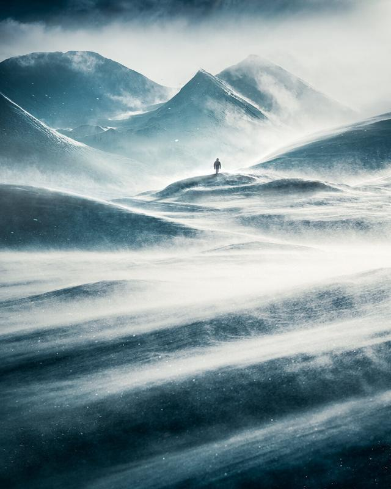

I know a lot of photographers that have made most of these mistakes, and I certainly am one of those. So, I decided to share them with some insight on how you can avoid them.

## 1. You don't realize how much time and work goes into creating beautiful images.

Yes, it's common to think that it doesn't take that much time to create new work. Even if you have been a photographer for some time, you forgot how much work you put into creating just a single photograph. Of course, it all depends on what type of photographer you are, but for example, if you want to put out beautiful work, it takes a lot of work. Take as much time as you can for the photography and editing part. Don't rush your work. Having a deadline is essential, but if it makes you miserable and you feel that it affects the quality of your work, try to stretch the timing and figure out realistically how long it will take you. I'm all about efficiency, but if something starts to affect the quality of my work, I try to keep my head down and put more hours into my work.

## 2. Comparing yourself to other photographers.

Yup, there are times when you lose yourself by looking at some other photographer's work and thinking that why can't you do the same. And then you start to lose confidence in your work. Stop comparing yourself to others. It's good that others inspire you to create; however, if it doesn't make you concentrate on your work, then it's not real inspiration. Be grateful where you are now, and keep working on getting better.

## 3. Not checking the images while you are photographing.

I'm sure most of us have been there. Back at home, when you had a successful photography trip, you check the images and realize that something is wrong with the picture. Either you shot slightly blurry photographs, or you thought you had a good composition even though you didn't concentrate enough. Or you might have found your images to be out of focus or shot with wrong settings like high ISO in situations that didn't need such settings. While you are photographing a subject, go through a couple of things before you move to another composition or subject: settings, focusing, sharpness, and framing/composition.

## 4. Spending too much time on things that takes your time from photographing.

As a photographer, there are plenty of things you can do to get income or share your photographs. Internet and social media are great to focus occasionally, but it can't be your primary focus. I certainly have felt the need to focus on stuff other than photography. However, if you keep on doing that for too long, you get lost in all the other stuff, and then you start feeling uninspired. Just go out and take photographs. Keep it simple.

## 5. Thinking that you know everything about photography.

Yes, I have been in a situation where I thought I knew it all. I think it's part of being a photographer or any creative professional. You start to believe that you have figured out everything, and therefore you lose yourself. You can always learn something new. Keep your head down and try to be receptive to new things. I, for one, try to learn new stuff every day. I do have times when I feel too confident about my approach. A good reminder is that we don't know much about anything in this universe. If you want to be creative, it is essential to keep learning, no matter what.

## 6. Focusing too much on what others might think about your work.

The thing is, you don't know what others think. Be the best you can be and don't mind what you think others might think about your work. Yeah, I know it's hard, but that's how you create original work. And it's how you keep evolving as a photographer. Creating from a place of pleasing others or being too critical of your work may make you feel stagnant and uninspired. It's important to create work that you feel inspired to create.

Windswept – Swedish Lapland, 2020

## GET THE LATEST CONTENT FIRST

If you like this post. Subscribe to be the first to receive fresh new tutorials straight to your inbox!

First Name

Last Name

Email Address

Subscribe

We respect your privacy.

Thank you!