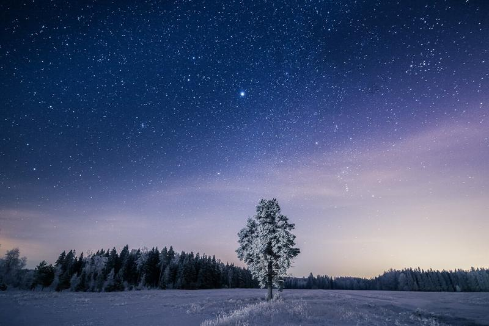

Here is a Winter version to a similar photo I captured on one [Summer evening](http://www.mikkolagerstedt.com/blog/2013/11/8/night-photography-tutorial-lightroom-5-photoshop). This was taken about a week ago. It was beautiful evening under the stars. Cold and quiet. I used my flash light to lit the tree from the left side of the frame.

Nikon D800, Samyang 14 mm f/2.8, Sirui Tripod R-4203L + Sirui Ball Head K-40X

f/2.8, ISO 3200, 30 sec.

I decided to process this photo with my recently updated [Fine Art Presets](/presets).

View fullsize

Something About A Tree II, After my Fine Art Presets (Landscape - Stars, Split Toning - Yellow Blue, Vignetting)