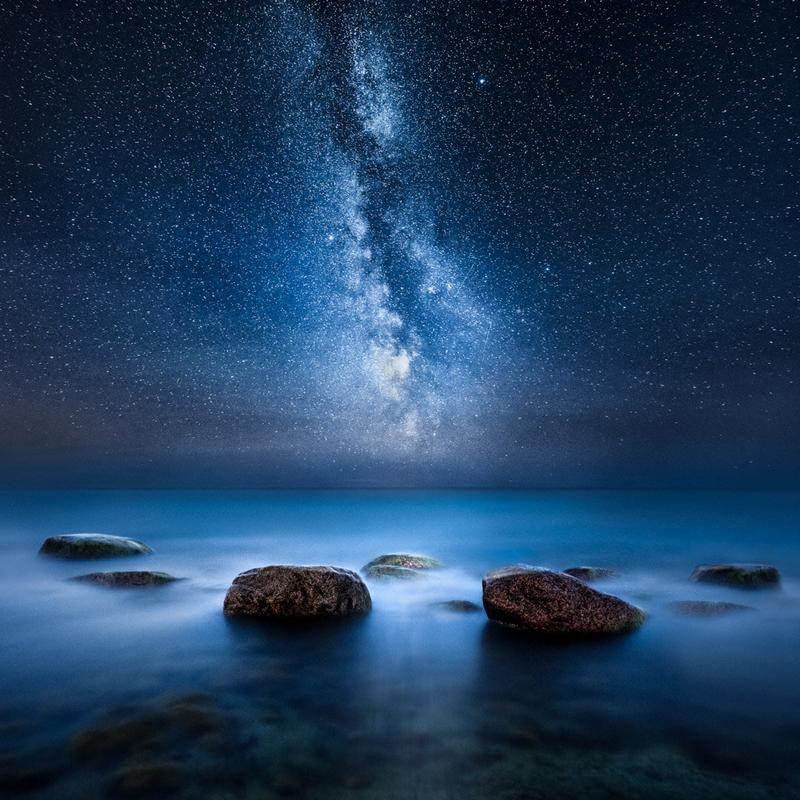

I have been fortunate to photograph at night for the last couple of weeks. This is one of my favorites from the time. I used my Vision of Depth technique from my Night Photography Masterclass. You can learn it here: [Star Photography Masterclass](/star-photography-tutorial).

### Equipment & Exif

Nikon D810, Nikon 14 - 24 mm f/2.8, Sirui Tripod  
ISO 6400, 30 sec., 14 mm, f/2.8 & ISO 800, 630 sec., f/3.5

[Buy a print of this photograph](https://www.mikkolagerstedt.com/edge-prints/stillness-of-night)

View fullsize

Stilness of Night - Mikko Lagerstedt