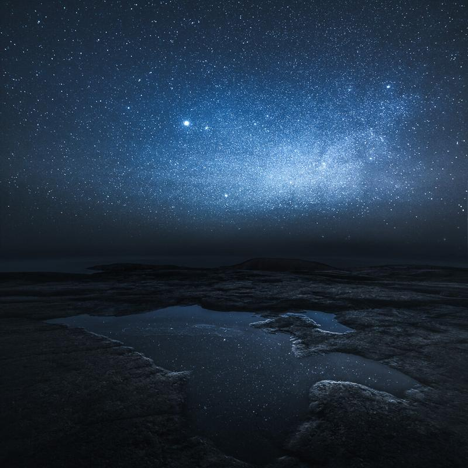

A view from captured about a month in Meri-Pori, Finland. The night was beautiful and clear. I really enjoyed to stop and stare at the stars. I was actually walking in the Yyteri Beach for three hours and then ended up in Reposaari late at night.

### Exif & Equipment

Nikon D800, Samyang 14 mm f/2.8 & Sirui Tripod R-4203L and K-40X  
30 sec. ISO 6400, f/4.0  
Edited with my [Preset Collection Phase](/phase-presets) (Basic Settings & Colors - Hint of Blue)

[Learn More about my Post-Processing Techniques!](/phase-presets)

View fullsize

The Approaching Night - 2015 -Meri-Pori, Finland

I was inspired to title the image from this track by Philip Wesley: