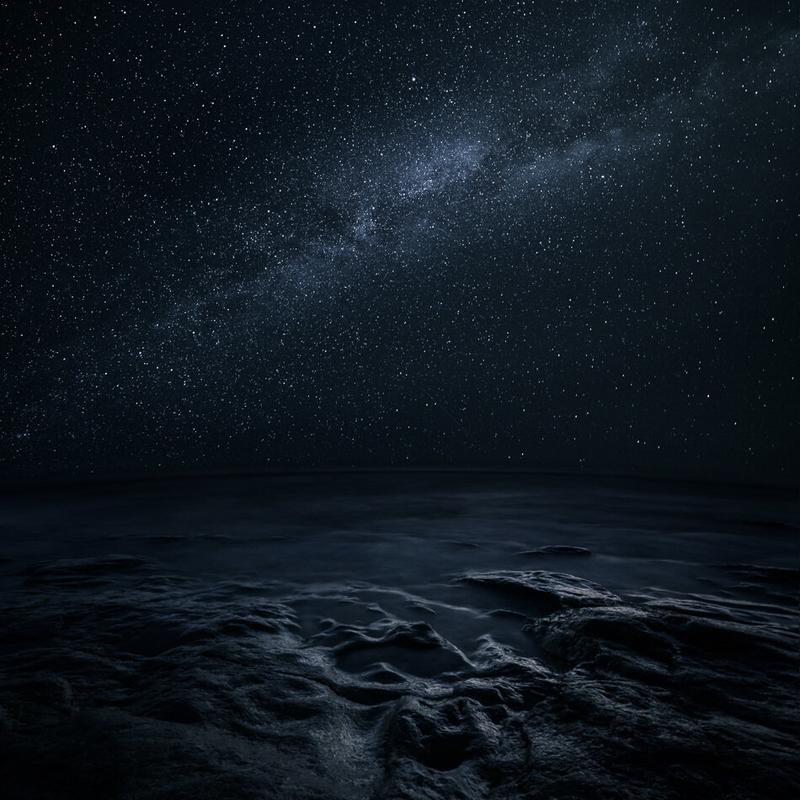

I had great time in Meri-Pori Finland last Sunday. Here is a picture from my trip there. It was great fun, but freezing cold in the very windy conditions. Luckily my tripod was solid enough for the windy condition.

This is an addition to the series [Edge](http://www.mikkolagerstedt.com/#/edge/).

### Equipment

Nikon D800   
Samyang 14 mm f/2.8, Nikon 16 - 35 mm f/4.0  
Sirui Tripod R-4203L + Sirui Ball Bead K-40X

Double exposure work, f/5.6 (Nikon) for the foreground and f/2.8 (Samyang) for the sky.   
ISO 3200, 30 sec.

View fullsize

