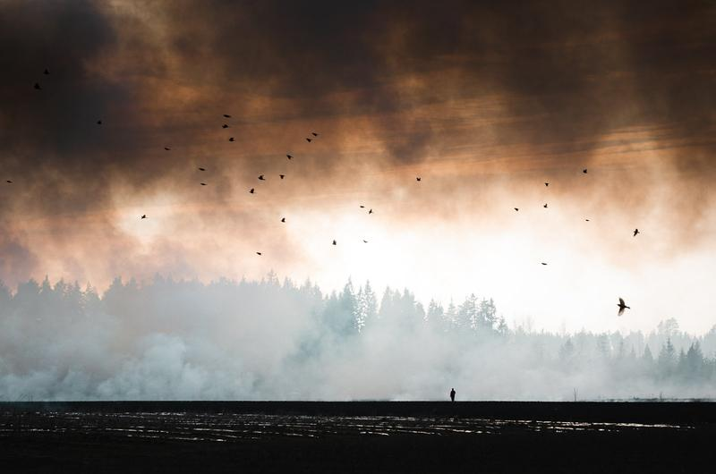
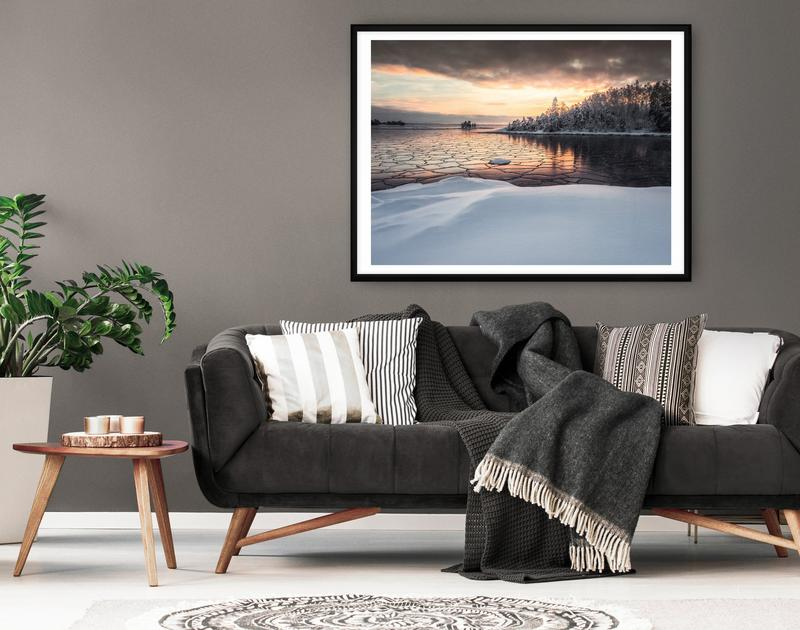

As a professional landscape photographer, I've had the pleasure of capturing breathtaking images of nature, traveling to some of the most stunning locations, and sharing my passion for the beauty surrounding us. However, my journey didn't begin overnight. After graduating from a graphic design school in 2008, I decided to immerse myself in the world of photography. When I started, I focused on the technical aspects of photography. I photographed everything and anything. No constraints. I was testing out different settings and following my inspiration.

Over time I realized that maintaining a beginner's mind is one of the most essential factors in my growth as a photographer. And when I feel uninspired, it's usually because I get caught up with doing the same things repeatedly. Then I remind myself to start again with a beginner's mind, following my inspiration. Sometimes I might start it with either a new location or technique.

While researching for this blog post, I came across the concept of "beginner's mind," an ancient Buddhist principle known as "[Shoshin](https://en.wikipedia.org/wiki/Shoshin)." This way of thinking emphasizes the importance of approaching our experiences with an open, curious, and humble mindset, regardless of how advanced we may become in our chosen fields.

In this post, I will share how embracing a beginner's mind has shaped my photography journey and how it can benefit photographers, artists, and creatives of all levels.

## Maintain Curiosity

One core principle of a beginner's mind is maintaining a sense of curiosity. When I first started photography, I was eager to learn everything I could about the craft. Over time, I've found it essential to keep that curiosity alive, continuously exploring new techniques, subjects, and perspectives. This constant drive to learn has allowed me to grow and evolve as a photographer. It has not always been easy. And at times, I have lost that spark or inspiration. But then I know I need to focus on being a beginner again and find that curiosity.

* How can you expand your creative horizons by exploring new subjects or techniques you haven't tried before?
* What resources or learning opportunities can you seek to deepen your understanding of your craft further?

## Embrace the Unknown

Throughout my photography journey, I've found that embracing the unknown and stepping out of my comfort zone has led me to some of my most memorable experiences. One story comes to my mind: My initial idea was to capture some seascapes, but on my way to the coast, I saw a massive cloud of smoke. I started driving towards the smoke. Finally, I arrived near a field where I saw prescribed burning. While taking photographs, I saw a man standing amid it all, taking pictures of the area. I took a photo I still can’t believe is a single frame where birds were flying perfectly with the composition I chose.

A beginner's mind encourages us to take risks and experiment, leading to unexpected discoveries and growth. In those moments of uncertainty, like venturing into unfamiliar locations or trying a new technique, I've often found my most creative and unique ideas.

* What fears or hesitations might discourage you from trying something new in your photography or creative work?
* Can you identify a specific project or idea that pushes you outside your comfort zone? How might you approach it?

Mikko Lagerstedt – Still Standing – 2012, Finland

## Learn from Mistakes

As a photographer or creative, it's essential to understand that mistakes are inevitable. Early in my career, I sometimes felt disheartened by errors, but over time, I've learned to view them as valuable learning opportunities. Adopting a beginner's mind has taught me to embrace failure as a part of the process, which ultimately helps me become more resilient and adaptable in my work.

* When was the last time you made a mistake in your work? What lessons did you learn from that experience?
* How can you shift your mindset to view mistakes as opportunities for growth rather than setbacks?

## Seek Feedback

Throughout my journey, I've learned the importance of seeking constructive feedback from peers and mentors. Their insights have been invaluable in helping me grow as a photographer. By being open to criticism and suggestions, I've been able to refine my techniques and learn from the experiences of others. A beginner's mind means being humble enough to recognize that there is always more to learn and that others can offer valuable insights.

* Who are some trusted peers or mentors you can contact for feedback on your work?
* How can you create an open, receptive environment that encourages honest and constructive feedback from others?

## Mindfulness and Reflection

Reflecting on my work and creative process has been crucial in staying connected to the wonder and curiosity that first drew me to photography. Mindfulness practices, such as journaling or meditation, can help cultivate a beginner's mind by encouraging self-awareness and fostering a spirit of curiosity. By regularly evaluating my progress and intentions, I can stay true to my creative vision and continue to grow as an artist.

* What mindfulness practices can you incorporate into your daily routine to help foster a beginner's mind?
* How can you create space for regular reflection and self-evaluation to stay connected to your creative vision and goals?

## Unlock Your Creative Potential

As you continue cultivating a beginner's mind in your photography journey, consider exploring some of the resources I've created to help photographers at all levels improve their skills and find inspiration.

* [**The Complete Photography Collection**](/complete-bundle)**.** This all-inclusive package features all of my tutorials, presets, and eBooks, offering a comprehensive guide to enhancing your landscape photography and achieving the recognition your photos deserve.
* [**Epic Preset Collection**](/epic-presets)**.** Transform your editing process in Lightroom with my presets designed to help you unlock your creative potential and bring your images to life.
* [**1-on-1 Photography Coaching**](/coaching)**.** Whether you're a beginner or an experienced photographer, my new online 1-on-1 coaching service is designed to provide personalized guidance and support to your needs and goals.
* [**Free Tutorials**](/tutorials)**.** For those just starting or looking to expand their skills without breaking the bank, check out my collection of free tutorials covering various aspects of photography and editing.

[Learn Photography and Editing with Mikko](/learn)

Embracing a beginner's mind has been instrumental in my growth as a photographer and artist. By maintaining an open, curious, and humble approach to my craft, I've evolved continually and discovered new techniques and perspectives that have enriched my work.

No matter where you are in your photography or creative journey, I encourage you to cultivate a beginner's mind. Embrace curiosity, be open to learning, and don't be afraid to step outside your comfort zone.

As always, I'd love to hear your thoughts and experiences with the beginner's mind. Please feel free to share your stories and insights in the comments below, and let's continue to learn, grow, and create together.

Mikko Lagerstedt – Late Night Meditation – 2018, Porvoo Finland

## Subscribe

If you enjoy this post, SUBSCRIBE to be the first to receive **fresh new tutorials** straight to your inbox!

First Name

Last Name

Email Address

Subscribe

Thank you!

# Print Collection

Surround yourself with inspiration by adding one of my [fine art landscape photography prints](/print-collection) to your home or workspace. These prints constantly remind you of the beauty of the World and inspire you to seek out your hidden gems.

 