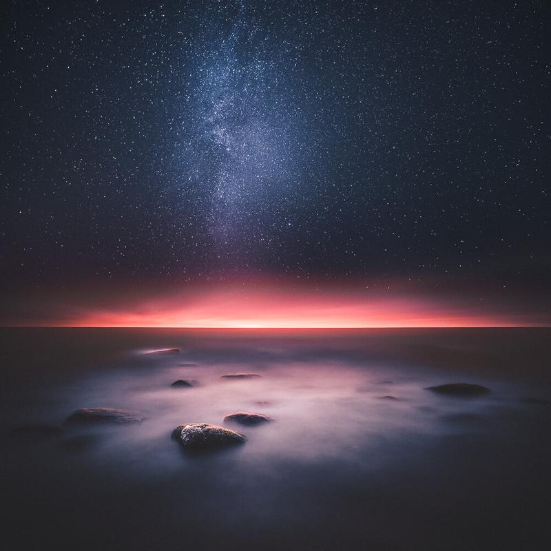

Finally new work from just couple of days ago. I used two exposures to create this surreal effect. Remember to visit my exhibition Atmosphere open through 14th January to 8th of February 2015 in Pohjanmaan valokuvakeskus, Lapua.

I was inspired to title my image by this quote "To the mind that is still, the whole universe surrenders." - Lao Tzu.

### Equipment & Exif

Nikon D800, Nikon 16-35 mm f/4.0 VR & Sirui Tripod R-4203L and Sirui Ball Head K-40X

For the sky: 30 sec, f/4.0 ISO 3200 @ 16 mm  
For the foreground: 445 seconds, f/9.0, ISO 100 @ 16 mm

### Post-Processing

Edited with my new [Phase preset collection](/phase-presets) "Hazy Night" using Lightroom. After the images were edited they were blended together in Photoshop.

Hope you like it!

[Buy a print of this photograph](https://www.mikkolagerstedt.com/edge-prints/whole-universe-surrenders)

View fullsize

Mikko Lagerstedt - The Whole Universe Surrenders, Emäsalo, 2015