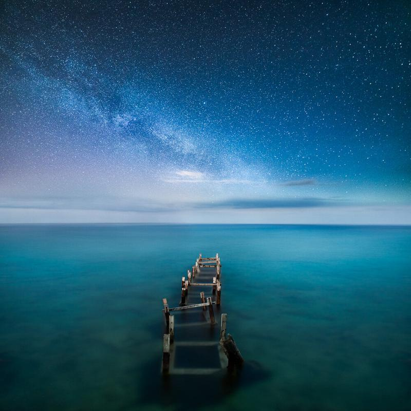

I have always loved to photograph water. There is something magical about the planet we live in, and I have always enjoyed being around water, in fact, Earth surface is 75% water. I have plans to enjoy more places like this in the Summer. I captured this seascape in Cyprus. 

Do you have travel plans for this Summer?

### Exif and equipment

Nikon D800, Nikon 16 - 35 mm f/4.0 VR  
Dual exposure ISO 3200, 30 sec. f/4.5, 16 mm

### Editing

Panorama using the new Lightroom Panorama function. I made a tutorial on how to use it, [check here](http://www.mikkolagerstedt.com/blog/2015/5/7/how-to-create-night-panorama-lightroom-cc). Color editing with the [Phase Presets](/phase-presets) (Balanced & Blue) and star enhance with [Fine Art Actions](/actions).

Last chance to get [Fine Art Presets](/preset) on sale!

[Buy a print of this photograph](https://www.mikkolagerstedt.com/edge-prints/tranquil-night)

View fullsize

Tranquil Night - Cyprus, 2015