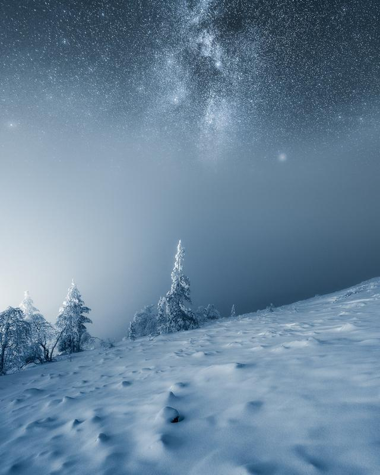
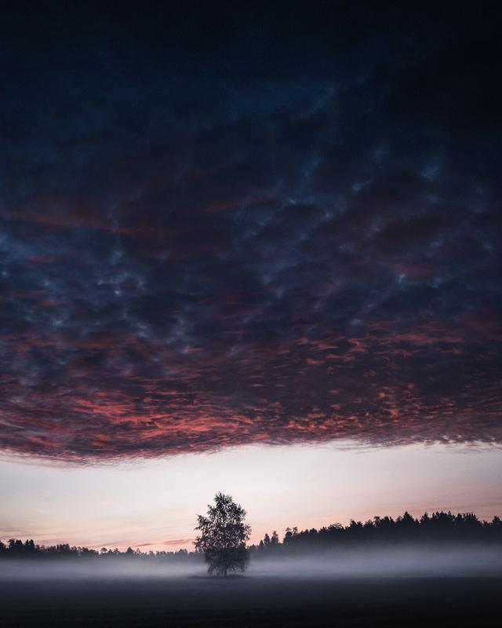
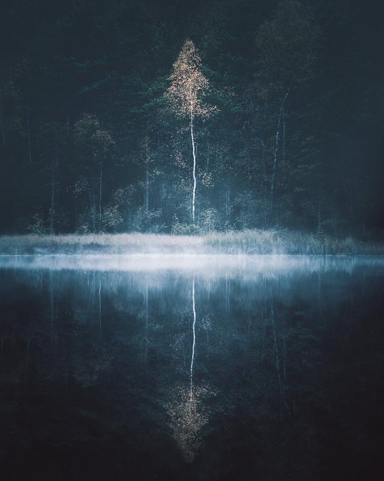
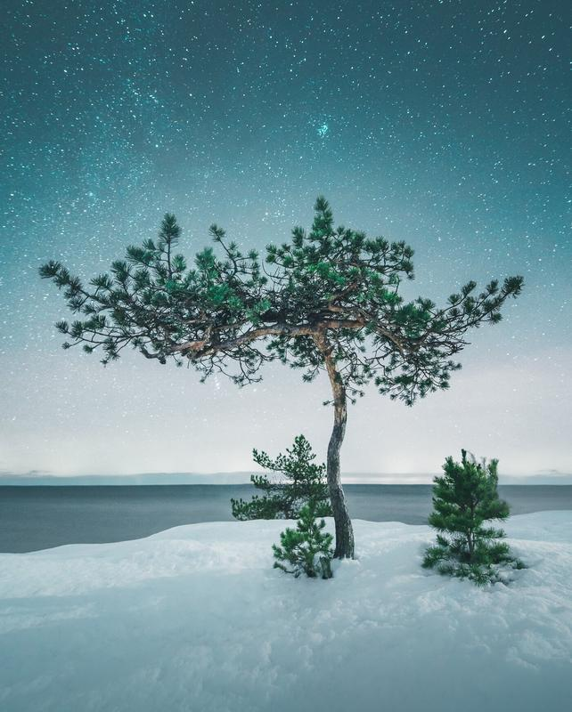
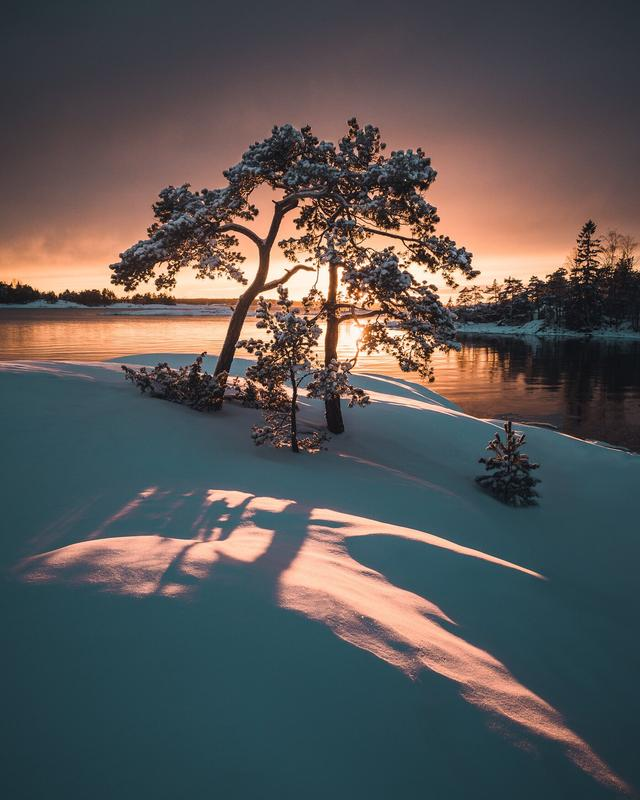
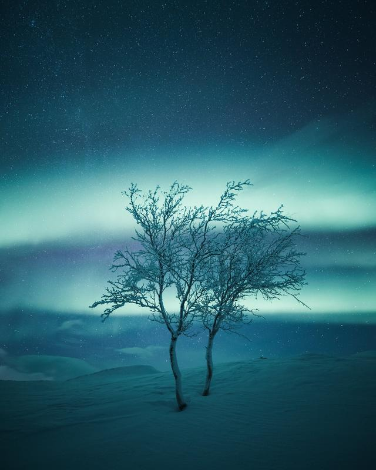

Here is a new series of photographs captured in the last two years. You can view the set of images on my [Behance](https://www.behance.net/gallery/88443031/t-r-e-e-s) page. The collection of images featured on [Colossal](https://www.thisiscolossal.com/2019/11/majestic-trees-photographed-by-mikko-lagerstedt/) as well.

The photographs were captured in 2018-2019 in Finland. From Lapland to Southern Finland. My goal is to convey the feeling I had when I was photographing the subjects. To appreciate the never-ending beauty of trees. In our lives, we rarely recognize them, yet trees surround us with their beauty. They tell us many stories about life and the struggle to survive in harsh conditions.

Fine art prints are also available of the images [here](/buy-art).

[View fullsize
](https://images.squarespace-cdn.com/content/v1/63ceaffd33529a45e572bf90/1674497201365-VH7EYTQRHQO0SRUWCJMX/Mikko-Lagerstedt-Trees.jpg)

[View fullsize
](https://images.squarespace-cdn.com/content/v1/63ceaffd33529a45e572bf90/1674497203936-0VI4U0M8RXC69I8C6SLR/Mikko-Lagerstedt-Trees-4.jpg)

[View fullsize
](https://images.squarespace-cdn.com/content/v1/63ceaffd33529a45e572bf90/1674497205735-2D1KFWMK1IFKSHAVQFS6/Mikko-Lagerstedt-Trees-5.jpg)

[View fullsize
](https://images.squarespace-cdn.com/content/v1/63ceaffd33529a45e572bf90/1674497207318-B5DVA0GBHWJA0844QU4F/Mikko-Lagerstedt-Trees-7.jpg)

[View fullsize
](https://images.squarespace-cdn.com/content/v1/63ceaffd33529a45e572bf90/1674497209400-64Z3OY8ABE9KQFUR0Y24/Mikko-Lagerstedt-Trees-6.jpg)

[View fullsize
](https://images.squarespace-cdn.com/content/v1/63ceaffd33529a45e572bf90/1674497211896-UR8GKTHDUJL6NL7B8BR0/Mikko-Lagerstedt-Trees-8.jpg)

[View fullsize
](https://images.squarespace-cdn.com/content/v1/63ceaffd33529a45e572bf90/1674497214261-S9H2ZTLMG10XXEH8U0CP/Mikko-Lagerstedt-Trees-9.jpg)

[View fullsize
](https://images.squarespace-cdn.com/content/v1/63ceaffd33529a45e572bf90/1674497216534-AH9WMMMX07JR4WAT7126/Mikko-Lagerstedt-Trees-11.jpg)