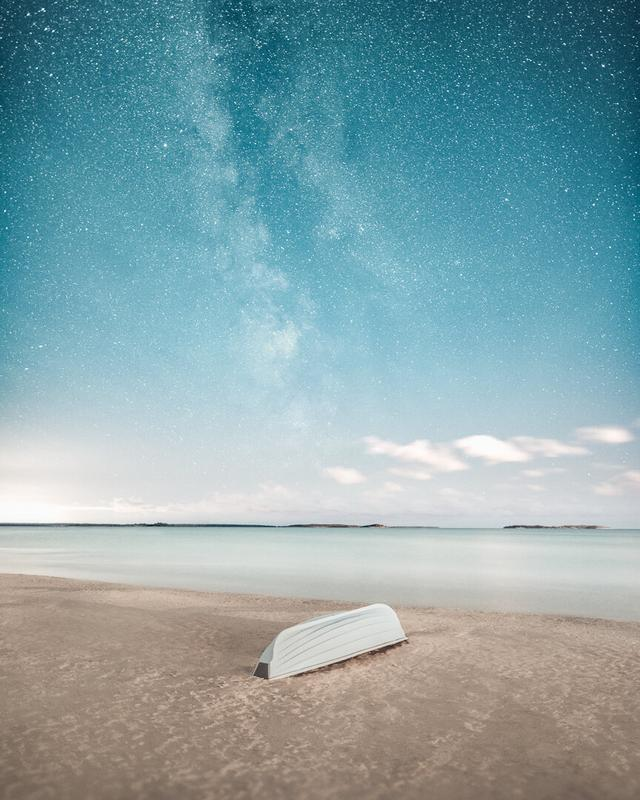

Vacant Beach is a series of images captured one August night after summer season on the deserted Yyteri beach, Finland

I visited Yyteri Beach a couple of weeks ago. After walking down to the beach first thing I noticed was this bright source of light in the distance of the beach. It was a new restaurant I hadn't seen before, and it was right at the beach. Unfortunately, it had huge lights that almost blinded me while I passed the place. I almost turned back to my car because it was something I had not wanted to be in my photographs, but I kept on walking along the beach and saw a lifeguard chair and a lifeboat. I took some shots and finally ended up in a darker part of the beach. As my eyes got used to the darkness, I loved how the dunes and sand looked.

I saw this feather in the sand and knew there was something that intrigued me. I visioned a shallow depth of field photograph with stars in the background and the feather as the central part of the image. I captured a couple of different shots while lying on the ground and waiting for the camera to take the long exposures. And while I was lying on the sand I was in awe of the moment and how something so simple as a feather can get in the state of awe. I started by capturing three horizontal images. It was hard to get the perfect low angle I wanted. Finally, I got what I was looking for and continued to photograph and roam around the beach. I love the combination of crashing waves and stars and the smell of the sea.

I wanted to create a small series of what I captured that night. I hope you enjoy the series as much as I enjoyed capturing these photographs.

### Exif & Equipment

All of these photographs were captured with Nikon D810 and Sigma 20 mm f/1.4 lens. I used a RRS-tripod.  
20 mm, ISO 3200, 20 sec, f/1.4

### Post-Processing

I used Lightroom to edit these photographs with my [Phase Presets](/phase-presets) (Color: Oldie).

### Prints

All of my prints are numbered, signed and dated. You can view the prints from the button below. There are three different sizes and editions. You can read more about my prints [here](/print-info).

Mikko Lagerstedt - View - Yyteri, Finland - 2017

Mikko Lagerstedt - Flow - Yyteri, Finland - 2017

Mikko Lagerstedt - View II - Yyteri, Finland - 2017

Mikko Lagerstedt - Feather - Yyteri, Finland - 2017

Mikko Lagerstedt - Steps - Yyteri, Finland - 2017

Mikko Lagerstedt - Safety - Yyteri, Finland - 2017