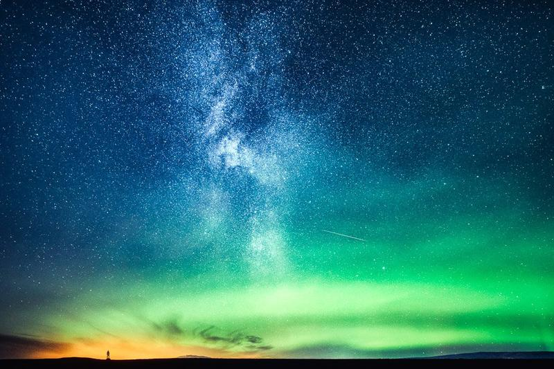
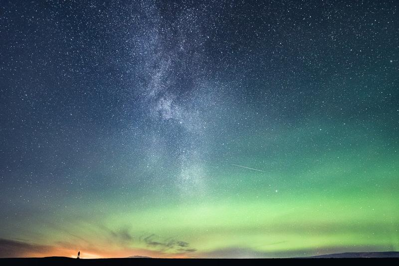

After driving to Vík for my first night in Iceland, I decided to head out and capture the beautiful night sky. I drove to multiple locations and one of which was Reynisfjara. This beach is a gem even in the daylight. I wanted to focus on the beautiful sky and vast landscape, so I ended up taking multiple shots of the Milky Way. I set my camera on my tripod and left it to take multiple photographs and shot this one. Standing still for 15 seconds is always a difficult task, and in this wind, it was almost impossible. Thankfully I ended up with a shot I was happy. With the photograph, I want to show you how beautifully vast the landscapes are in Iceland and also convey the feeling of how small we are in this Universe.

### Equipment & Exif

Nikon D810, Nikkor 14–24 mm f/2.8, Sirui R4203 L Tripod & Manfrotto 3WAY-Head  
ISO 6400, 24 mm, f/2.8, 15 sec.

### Post-Processing

I used the new [Saga Preset Collection](/saga-presets) to edit the image. First, I chose a Landscape preset: Cool Water and used the built-in graduated filters in the Saga Collections to enhance the stars and Milky Way. I chose a split-toning preset from the collection Blue and Green to slightly boost the colors. I opened the image in Photoshop and used the Puppet Warp to straighten my silhouette in the picture and remove the distortions from the picture. Lastly, I used Stars Enhance from my [Fine Art Actions](/actions) to boost the night sky.

**Click on the image to see it before!**

