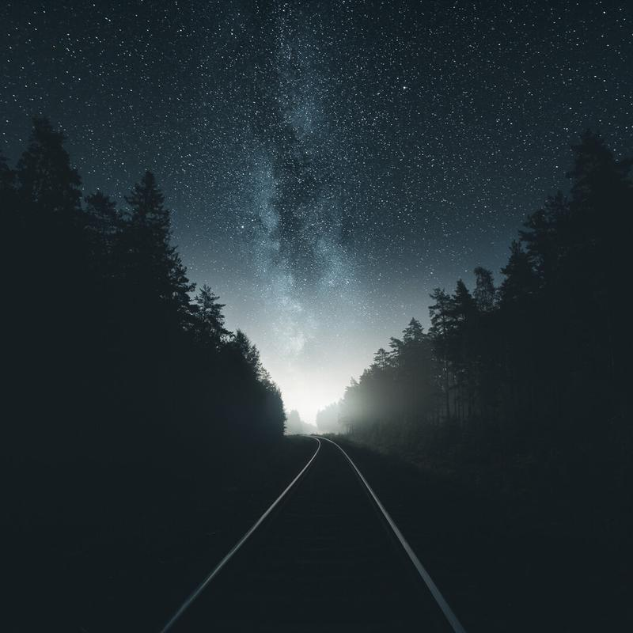

Driving around Western Finland in pitch black night I found myself looking at train tracks to the horizon. Focusing on getting the settings perfect while the train sounds were breaking the silence of the night. It was a feeling to remember. While I was nowhere near the upcoming train, the moment certainly made my heart rate go up. Be safe out there, don't do anything stupid.

I hope the image conveys the feeling I had in that specific moment.

### Exif & Equipment

Nikon D810, Nikkor 14-24 mm f/2.8, Sirui Tripod & Ballhead  
Two horizontal photographs with settings: ISO 6400, 2.8, 30 sec. 14 mm.

### Post-Processing

I used Lightrooms built-in panorama function to stitch the two images together. I edited the colors with [Phase Preset](/presets): Hazy Night and edited the basic settings. I also enhanced the Milky Way in Photoshop with my [Fine Art Action](/actions): Enhance Stars.

View fullsize

Way Of Light - Western Finland, 2016