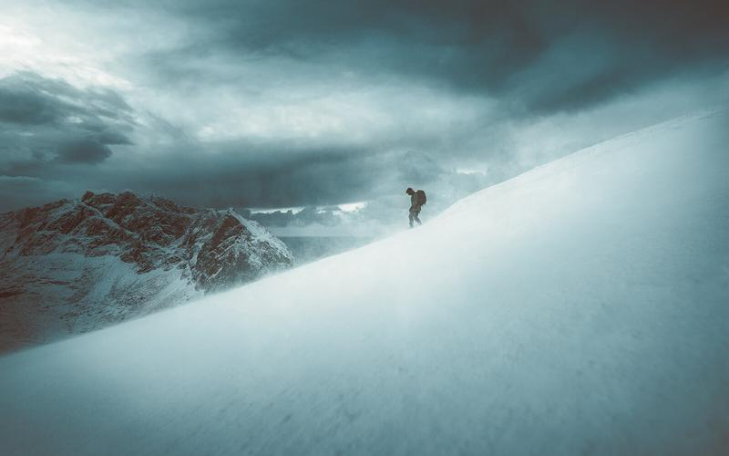

It has been a long while since the last time I wrote a tutorial or a longer post. Here is a short story of what I learned by taking over six months off from photography and social media.

I have been photographing for over ten years and using social media for the past eight years, so I thought I probably should take a break.

After our wildly successful workshop in February 2019, I finally decided to take a break from photography and social media. I didn’t have a plan on how long I would be out or what I would do in between the time. I just wanted to do something different. I was tired of the whole social media loop (post, comment, like, and repeat). The major reason was that it was starting to affect my thoughts when I was out photographing. Social media was not why I enjoyed photography in the first place; in fact, it started to make me dislike photography. The way I felt when I looked at my photographs was also concerning, I didn’t enjoy anything I had done or shot in a few years.

I started the experiment by deleting all social media apps from my phone and decided to logout from all the platforms. The first week was quite easy to do, and I didn’t have any regrets about my decision. Occasionally I would find myself taking my phone and realizing that I was trying to fill in the habit of looking at the apps, but in few days, I caught myself before I even picked up my phone.

The only thing I wanted to accomplish with this experiment was to follow my internal inspiration. I wanted to do anything I was drawn to and try and learn if it was something I really wanted to do now and in the future. The process led me to study and read a lot of books about self-development, habits, and life in general. As I was learning more about self-development, I started taking notes and quotes from the books I read. I wasn’t trying to get anything out of it. The whole studying was just a way of self-discovery and to find out where my inspiration might lead me. Actually, I’m still not sure what I will do with more than 50 pages of notes and translations of my favorite books. I might write about them later, who knows.

I had one photography assignment and made two major photography licensing deals in the time I had the break, so I didn’t have to worry about what I would do for money. I kept saying to myself that if things went sideways, I could always go and work for someone else. I wouldn’t care what other people might think of me.

So were there any significant breakthroughs? Not really, but after five or six months without taking a single photograph, I started to feel a subtle inspiration towards photography again. I opened Lightroom for the first time in a long while to go through my past work, and I didn’t feel sick while doing so, which was a huge thing. After a while, I started to re-introduce social media back in my life. I still don’t have any social media apps installed on my phone; I use my iPad if I want to share photos or comment on something on Instagram. The most significant difference to before I began the experiment is that I don’t use social media as much as before, and I don’t have to check it out compulsively. My focus has developed a lot, and I stay in the present moment far more than before. I know there is always a struggle to keep it that way.

### What I learned

* If my goal is to inspire others, I have to feel inspired first to transfer that to others.
* Taking break from social media might not be the key to restore your inspiration, but it can lead to finding your inner inspiration if you are too caught up with the “loop”.
* Photography, to me, is about spending time outside and feeling the inner inspiration rather than getting external validation.
* I don’t need to spend time on social media when I don’t have anything to share. No fear of missing out.
* If I feel the urge to share something on social media, even if I don’t have anything to share, I don’t do it anymore.
* Whenever I’m out photographing, I don’t always think and compare myself to other photographers.
* If my work doesn’t get the recognition, I thought it would; I don’t care if I still enjoy the work myself.

So what comes next? At this moment, I just want to enjoy photography. Share my work whenever I feel inspired to do so. When I started the experiment I had no inspiration towards photography, now I’m happy to say that my inspiration has grown day by day. I will be creating new work and projects in the future.

I hope you learn something out of my experiment, and if you feel a need to have a change in course, try it out yourself. The amount of extra time you get might be worth it.

## GET THE LATEST CONTENT FIRST

If you like this post. Subscribe to be the first to receive fresh new tutorials straight to your inbox!

Email Address

Subscribe

We respect your privacy.

Thank you!

No blog post of mine is complete without a picture, so here is a view from Lofoten back from 2017. Stormy winds and views for days.

View fullsize

Descent - Lofoten, Norway - 2017

*“Your worst enemy cannot harm you as much as your own unguarded thoughts.”*

*- Buddha*