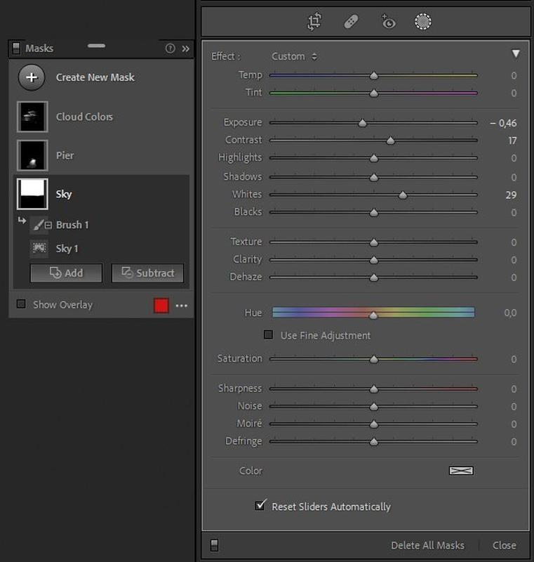

Are you tired of making tedious selections with the brush tool to your photographs in Lightroom? I know I’m. Lucky for us, this week, Adobe released updates to Lightroom CC, and Classic introducing new features, which I think will be extremely useful for most photographers. This article goes through the new artificial intelligent masking features and how you can use them to make better selections.

## What is new?

*Lightroom CC (version 5) & Classic (version 11) October 2021 update.*

There is now a way to use artificial intelligence to make selections and masks quickly in Lightroom. There are two options, select subject and select sky.

You can control each of your masks from the masking panel, and have the chance to name the masks, so it's easy to find the mask you want to change. You can also invert the masks you have made by using these new tools.

## The Masking Panel

* Select & create a mask of a subject using artificial intelligence
* Select & generate a mask of the sky using artificial intelligence
* Name and keep your masks in one place
* Refine the masks with any of the selection tools available
* Duplicate masks and invert them with ease
* Create masks using color and luminance selections

## A quick guide to the new masking tool

**1. Select the masking -tool and select a mask you want to create**

**2. After applying a new mask, you can find it in the mask-panel**

**3. If you want to refine the mask, simply click the mask and add or subtract. You can select a tool you want to use to edit the selected mask.**

**4. Make changes to the settings, such as exposure and contrast.**

## When to use masking?

* It's a great way to create contrast and depth to your images.
* It’s a fantastic way to balance the exposure.
* To select the sky and adjust it separately from the rest of the image.
* If you want to make adjustments to the foreground, invert the sky mask and edit it.
* If your photograph has a subject, such as a lonely tree, you can select it with the subject selection mask option and edit it to make it stand out more.

## Conclusion

I have now experimented with the new masking tools, and I have to say that they work really well. However, on some occasions, Lightroom couldn't find the subject, or the sky selection needed minor adjustments, but other than that, it is a welcome update.

**PS. Let me know in the comments below if you have already tried the new features and what you think about them! Also, if you have any questions, feel free to ask me.**

Until next time my fellow photographers, take care and keep on creating!

## Subscribe

If you enjoy this post. **Subscribe** to be the first to receive   
**fresh new tutorials** straight to your inbox!

First Name

Last Name

Email Address

Subscribe

We respect your privacy.

Thank you!