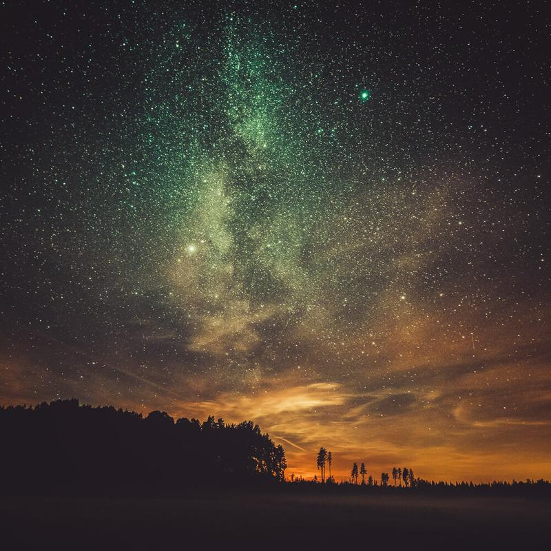

I'm happy to announce the Lightroom Preset giveaway winners, who have bought my previous Fine Art [Lightroom Preset](/presets) Collection. And the winners are...

Bruno Melim  
Ari Pelkonen  
Julie Velky

Congratulations to the winners! I will be sending the new Lightroom Phase Collection to the winners next week! Thanks to everyone who participated in this giveaway! Good luck next time! :)

If you are interested in the new collection, make sure to subscribe to my newsletter to add yourself to the first persons who will receive the information of the publishing!

## Lost at Night

Meanwhile here is a view from another beautiful night at the countryside of Finland. This one was edited with the new Presets Collection Phase.

### Equipment & Exif

Nikon D800, Samyang 14 mm f/2.8 & Sirui Tripod R-4203L and Sirui Ball Head K-40X  
ISO 6400, 30 secs. f/2.8

Lost at Night, 2014 - Mikko Lagerstedt

Sign up to be the first to receive information about the upcoming Preset Collection Phase!

First Name

Last Name

Email Address

Submit

Thank you!