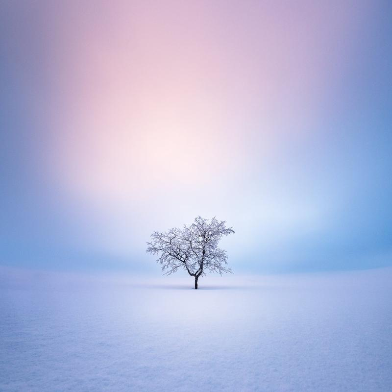

This week I wanted to share with you something different, a behind-the-scenes post about what it took to capture my new "Frozen Lake" photographs. I have a page called [behind the photography](/behind-the-photography). I haven't posted there lately, and I want to develop the section with more information and maybe videos in the future. That said, let's transport to the day I shot the photographs.

When I woke up, I saw fresh snow on the ground and already felt inspired. As soon as I had fed our dogs, I got my gear ready. I chose to carry only one camera because I knew I might spend the whole day walking on ice. And with my back situation, I don't want to carry any extra weight. I chose shoes with spikes because they are perfect when walking on slippery terrain.

What gear do I use in harsh winter conditions?

### **Camera Equipment**

* [Nikon Z7](https://amzn.to/345bCwd)
* [Nikon S 24–70 mm f/4.0](https://amzn.to/35jllzT)
* [Nikon 70–200 f/4.0 VR](https://amzn.to/3nPXYEA)
* [Nikon 14–24mm f/2.8](https://amzn.to/3rPhD8R)
* [Sirui Traveler 7C](https://amzn.to/3Ixa6lx) & [RRS Ball head](https://amzn.to/3IDvHcl) + [L-Plate](https://amzn.to/3fZe2zb)
* Three [Nikon camera batteries](https://amzn.to/3fOV12F)
* At least two microfibre cloths

### **Clothes**

* Icebug shoes
* Winter jacket and trousers
* Layers of clothing
* Good windshield gloves

In hindsight, I should have taken my other camera body (D810) with a longer lens (70-200) attached because there were moments I wanted to switch lenses, but it's a pain to do it when the snow gets everywhere in the wind. Also, I missed the snow goggles at times, but it wasn't too bad.

I stepped out of the house with my gear ready and saw plenty of snow and blistering wind. I felt inspiration rush through me. These are the moments where you can either let the inspiration come or feel overwhelmed trying to get the most out of the situation. Luckily I felt only the inspiration, no pressure.

As you can see from my phone snap, the car was under some snow, so it took me some time to get going.

See what I did there? 😂 *(hint: the plate)*

My first location idea was to head to the coast of Finland, but after checking the wind direction (north), I decided to head to Lake Tuusulanjärvi. The roads were still quite hard to drive on because of the weather. Luckily driving to the lake only takes five minutes from our home.

After arriving at the parking place, I grabbed my gear and headed out. Just a couple hundred meters of walking, and I was at the lake.

I have plenty of photographs still to go through, but the next one stood out because it shows you how it felt when the elements aligned. Walking on the frozen lake is something I love to do, even when the weather is not as cool as on that day. Here is what the frozen lake looked like in the daytime when the wind was the strongest.

### **Exif & Equipment**

Nikon Z7 and Nikon S 24-70 mm f/4.0  
ISO 64 ∙ 24 mm ∙ f/22 ∙ 1/400 sec.

### **Editing**

I edited the photograph entirely in Lightroom. After removing sensor dust spots, I used an [EPIC Preset Collection](/epic-presets) – color profile "EPIC II - Begin" to achieve the final look.

View fullsize

Mikko Lagerstedt – Blast – 2022, Tuusulanjärvi Finland

After spending four hours capturing the wind gusts at the lake, I headed home to make some food. As soon as I was done eating, I decided to head back to the lake, this time to another spot. I felt happy I was back at the lake. Sun had just set, and the wind was picking up. I spent three hours photographing the full moon and wind, throwing the snow over the landscape.

The snow patterns were incredible, and I fell in love with a view and used the tripod to get a low angle and started taking photographs of me walking in the scenery. I used the self-timer to take nine pictures at a time. I didn’t have to worry about extra footsteps, they vanished so quickly with the wind blowing.

### **Exif & Equipment**

Nikon Z7, Nikon 14–24 mm f/2.8 & RRS-Tripod  
ISO 400 ∙ 14 mm ∙ f/4.0 ∙ 1/80 sec.

### **Editing**

I used Lightroom to make basic adjustments for this image and opened it in Photoshop. I wanted to straighten the picture, so I used the warp tool to correct the horizon and treeline. I also deleted a couple of small branches from the left side of the frame to make it slightly more pleasing to the eye. Back in Lightroom, I used the radial filter to smoothen the horizon and add light. Finally, using a color profile "EPIC III - Low Sun" with 56% opacity, it was ready.

View fullsize

Mikko Lagerstedt – Windswept – 2022, Tuusulanjärvi Finland

After taking a photograph, I spent time lying on the ice, having the wind blow straight to my face—the pure joy to be outside and do what I love.

I placed my camera on the ice and recorded some videos. As it got darker, I decided to head back home—what a day it was. I hope the feeling of joy comes through my images. I'm sure I will release more photographs later from that day.

**If you enjoy this post, please let me know. I love to share my experiences with you and if you like these types of posts, comment below!**

Until next time my fellow photographers, take care and keep on creating!

*PS. I’m an Amazon affiliate, I get a small fee if you purchase anything using the links in this post.*

## Subscribe

If you enjoy this post. **Subscribe** to be the first to receive   
**fresh new tutorials** straight to your inbox!

First Name

Last Name

Email Address

Subscribe

We respect your privacy.

Thank you!

THE EPIC PRESET COLLECTION

Simplify your Lightroom editing and make your photographs EPIC!

[THE EPIC PRESET COLLECTION](/epic-presets)

LANDSCAPES WITH SOUL

Fine art photography from the North by Mikko Lagerstedt

[LANDSCAPES WITH SOUL BOOK](https://mikkolagerstedtbook.com)

TUTORIALS

Check out my latest posts and tutorials.

[FREE TUTORIALS](/tutorials)