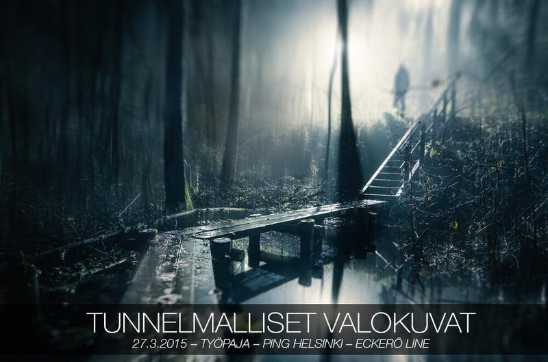

I'm happy to announce a new workshop about Atmospheric photography. This time it will be in Finnish, but there will be new workshop announcements later this year, so stay tuned!

Tuleva työpaja: Tunnelmalliset valokuvat; järjestetään [Ping Helsingin](http://pinghelsinki.fi/) Eckerö Line Finlandian uudistuneessa kokouskeskuksessa klo 16-17.30. Voit ostaa liput IltaPING risteilylle, jossa työpajani pidetään suoraan [täältä](https://holvi.com/shop/BJbS08/product/26960906694979f6231104efc0a2fca7/) alennettuun hintaan, kun ilmoitat **@mikkolagerstedt** alennuskoodin ostoksen yhteydessä kommenttikenttään. Arvon myös kaksi ilmaislippua seuraajieni kesken sunnuntai-iltana.

Nähdään Ping Helsingissä!

Linkit:   
[Tietoja työpajastan](http://pinghelsinki.fi/ohjelma/tyopaja-iltapingilla-tunnelmalliset-valokuvat-by-mikko-lagerstedt)  
[Liput](https://holvi.com/shop/BJbS08/product/26960906694979f6231104efc0a2fca7/)  
[Ping Helsingin nettisivut](http://pinghelsinki.fi/)

*Update*   
Ilmaisliput saavat seuraavat henkilöt:  
Jan Viljanen  
Taru Piehl

Onnea voittajille! Kiitokset kaikille osallistujille!  
Mikäli olette kiinnostuneita osallistumaan työpajaani, onnistuu se ylhäältä löytyvistä tiedoista.

