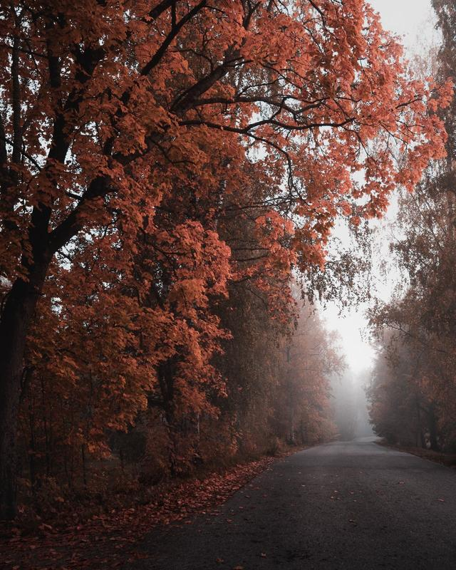

I hope you are having a great start to the new year! Two weeks are gone in the year 2022, but in this post, I want to focus on the year 2021. I wanted to share a glimpse at one of my most challenging years. What did I learn, what did I accomplish, and what about failures? As I write this, I don't feel happy about what I made out in 2021. I know; I'm my most brutal critique. Health issues made a huge impact, yet there is no one else to blame.

I published a mere 13 new photos in 2021, though I felt I had done more. While taking well over 6000 images in 2021, the percent of success is pretty low. About 0,20%. It's around 500 photos for a single published photograph. And of course, I left out the shots taken for time-lapses.

It's been a year with ups and downs. The year started well and, even though my back issues made my walk challenging, I took about a thousand pictures in January. I managed to get a few ok shots as well. Here are my favorites from January.

View fullsize

Mikko Lagerstedt – Winter evening – Järvenpää, Finland 2021

Mikko Lagerstedt – Lost – Kangasala, Finland 2021

View fullsize

Mikko Lagerstedt – Cold Mist – Porvoo, Finland 2021

February was quiet in terms of photography, and I went out to take photos just twice. No surprise, I didn't capture anything worth publishing. And as the year went forward, nothing changed. Health issues kept me from going out and taking photographs.

I started working on the EPIC Preset Collection. Which is something I'm proud of creating. It wasn't a huge success straight away, and I felt like all my hard work was for nothing. I had high expectations because I know how good the presets are. When you work alone, there is no one else to blame other than yourself. It's a blessing and a burden at the same time. However, I received so much good feedback from many photographers that I would say it's a great success. You can take a look at the presets here: [**The Epic Preset Collection**](https://www.mikkolagerstedt.com/epic-presets).

First conversations about creating a book of my photographs were in 2020, but we started working on "[**Landscapes with Soul**](https://mikkolagerstedtbook.com)" in early spring. We didn't have the title figured out instantly. It was a work in progress for many months. I went through photographs from my 13-year journey as a photographer. I felt proud to pick some of my favorites for the book. It took us tens of meetings, planning, and conversations, and quite some time to work everything together. I'm absolutely thrilled how the book turned out.

Summer came, and so came the early morning fog sceneries. Those were beautiful. I took the following photographs from a nearby lake.

Mikko Lagerstedt – Fragile – Tuusula, Finland 2021

Mikko Lagerstedt – Early morning magic – Tuusula, Finland 2021

Mikko Lagerstedt – In the mist – Tuusula, Finland 2021

As the summer neared the end, I captured a couple of different views. Some stormy clouds and a misty view in the surroundings of a beautiful mansion.

Mikko Lagerstedt – Storm – Finland 2021

Mikko Lagerstedt – Walking into a dream – Turku, Finland 2021

Mikko Lagerstedt – Dark days – Porvoo, Finland 2021

The above seascape photograph is my favorite of the year. I feel it encapsulates a lot of what I was dealing with the whole year.

Autumn was beautiful, and I spent time capturing night photographs. I always tend to shift towards the night when autumn comes. Also, the early autumn views are absolutely beautiful.

Mikko Lagerstedt – A passing moment – Porvoo, Finland 2021

Mikko Lagerstedt – Dreaming – Inkoo, Finland 2021

Mikko Lagerstedt – Autumn road – Tuusula, Finland 2021

What else happened in 2021, and what did I learn and fail in? Here is a short recap of my year.

### What did I learn?

* Traveling and seeing new places is essential to keep your vision evolving.

  + You don't have to travel far to find new inspiration.
* Another year and another reminder to check the sharpness of your images before taking another one.
* Fear of missing out is your inner compass on what you should be doing.
* Weather is vital if you don't have time to travel.
* Spend more time taking photographs than editing them.
* Making a plan for your week is extremely important.
* Visioning yourself in a third-person perspective helps you achieve your goals.

### what to improve on in 2022

* Be active on social media

  + Have a plan for different social media platforms
  + Stay consistent
* Create more photography projects
* Self-care

### Accomplishments & what I'm proud of

* Releasing my first book, [Landscapes with Soul](https://mikkolagerstedtbook.com/).
* Creating [EPIC Preset Collection](https://www.mikkolagerstedt.com/epic-presets).
* Engaging more with my followers.
* For starting to share and write on my blog again.
* Being genuine and trying my best.

**How was the year 2021 for you? What did you learn? Do you have photography goals for 2022?**

Until next time my fellow photographers, take care and keep on creating!

**PS. The year 2022 is going to be a photography** [**Twitter**](https://twitter.com/MikkoLagerstedt) **year, so follow me there if you want to see my most recent work.**

## Subscribe

If you enjoy this post, subscribe to be the first to receive fresh new tutorials straight to your inbox!

First Name

Last Name

Email Address

SUBSCRIBE

We respect your privacy.

Thank you!