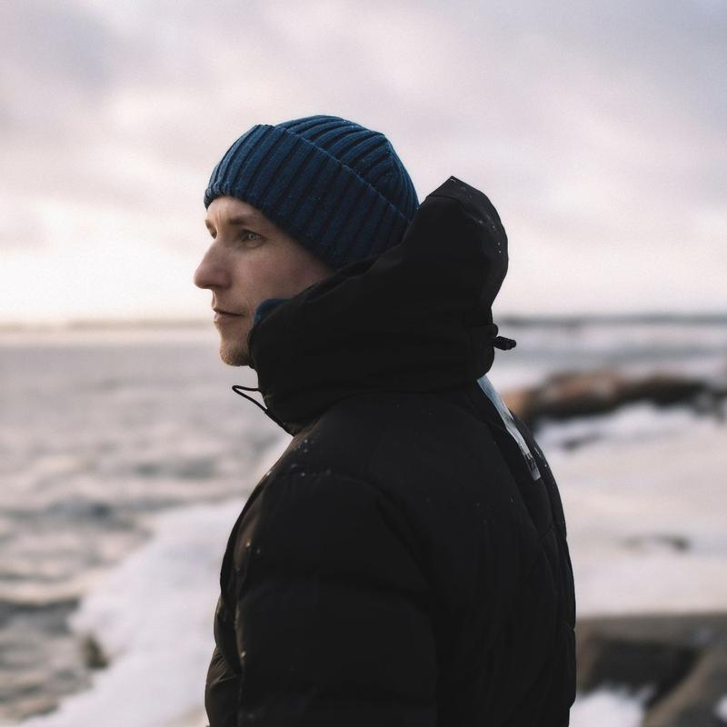
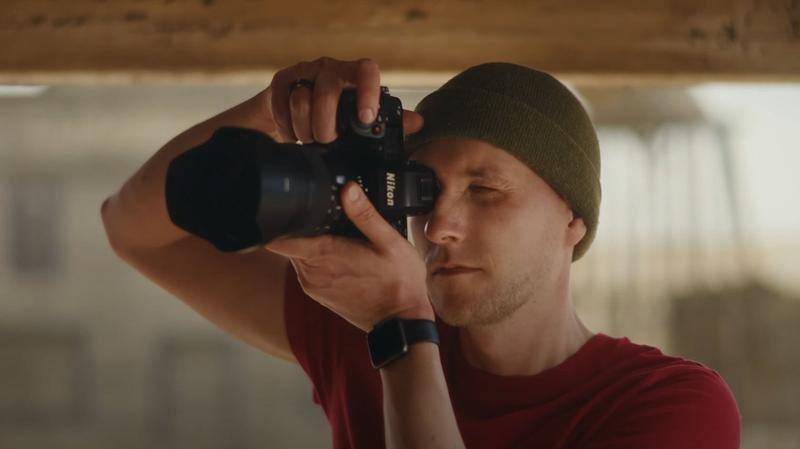

*Live from the office*

# Mikko Lagerstedt

[hello@mikkolagerstedt.com](mailto:hello@mikkolagerstedt.com)

Contact Mikko

Contact

Name
\*

Email Address
\*

Subject
\*

Message
\*

How Did You Find My Work
\*

- Please Select One -
1x.com
500 px
Behance
DeviantArt
Facebook
Flickr
Google
Instagram
LinkedIn
Pinterest
Reddit
StumbleUpon
Surfingbird
Tumblr
Twitter
Vimeo
Youtube

From a Client
From a Friend
Magazine
Web Article
- Other -

Thank you! We will contact you as soon as possible.

### **Evoking Emotion Through Photography**

Photography is about seeing beyond what is obvious. Light shifts, shadows stretch, and a familiar landscape transforms into something unexpected. A single moment, often unnoticed, carries depth and meaning.

This is what draws me to photography. A misty morning, the stillness before a storm, the glow of the Northern Lights. These moments tell a story, one that speaks not just through what is seen, but through what is felt.

My work reveals beauty in places that often go overlooked. Each image is an invitation to slow down, to pay attention, to experience the world in a new way. Thank you for being here. I hope my photography inspires you to look beyond the surface.

#### **About Me**

Photography was never part of my plan. Art was always present in my life through my grandmother’s paintings, but I had never considered picking up a camera. That changed in 2007.

Driving through the Finnish countryside after a rainstorm, I saw something that made me stop. Fog moved across the landscape, shifting with the light. I reached for my small point-and-shoot camera and took a photo. When I looked at the image later, I realized I had captured more than a scene. I had captured a feeling.

That moment stayed with me. A year later, I bought my first DSLR and began exploring light, composition, and emotion. Photography became more than an interest. It became a way of understanding the world.

Over 1.7 million people follow my work. My images have been featured in global publications, known for their ability to find the extraordinary in the everyday.

#### **Philosophy & Creative Vision**

Photography is not just about recording what is there. It is about creating something that resonates. A powerful image stirs emotion, bringing a sense of connection, wonder, or nostalgia.

I approach each photograph with patience and awareness. Light, shadow, and composition work together to shape an image that lingers in the mind. Whether capturing a quiet landscape or an atmospheric night sky, I wait for the right conditions and let nature guide the outcome.

A single image can shift perspective. It can invite stillness or awaken curiosity. My goal is to create photographs that hold meaning long after they are seen.

---

#### **Recognition & Features**

My work has been featured in leading global publications and platforms, including:

* BBC
* The Telegraph
* The Huffington Post
* Nikon
* Colossal
* Petapixel
* Digital Camera Magazine
* Practical Photography

My photography has been exhibited internationally and is part of private collections and interior design projects around the world.

#### **What Collectors Say**

*"Mikko’s photography has a rare ability to transform a space. His work captures emotions that few photographers can. Evoking an atmosphere that lingers long after you’ve seen it. His art,* [***The Lost World***](/limited-edition-prints/p/the-lost-world)*, is the centrepiece of my collection, and I continue to be captivated by its depth and beauty."*

— **James W.**

*"The way Mikko captures light and mood is simply unparalleled. His limited edition prints are more than just photographs; they are immersive works of art that bring a profound sense of serenity and elegance to any interior. His pieces are a favourite among my clients, elevating spaces with their cinematic and dreamlike presence."*

— **Maria J.**

*“Your photos transport me to a world that's timeless, peaceful, and beautiful, and they connect us back to nature, reminding us of what it feels like to be alive, what it feels like to be human.”*

— **Chris Cerrato**

---

### **Limited Edition Prints**

My work is available as museum-quality fine art prints, created for collectors who value exclusivity and rarity.

* Each photograph is part of a numbered edition, preserving its uniqueness and long-term value.
* Signed, dated, and numbered to ensure authenticity.
* Printed on archival fine art papers for exceptional longevity and brilliance.
* Select works are available in large formats, perfect for statement interiors.

[**Explore Limited Edition Prints**](/limited-edition-prints)

### **Open-Edition Prints**

For those who want to bring fine art photography into their space without limitation, I offer open-edition prints. These are produced with the same dedication to quality but are not restricted in number, making them accessible to a broader audience.

[**Discover Open-Edition Prints**](/prints)

### **For Collectors, Interior Designers & Exclusive Projects**

I collaborate with private collectors, luxury hotels, and interior designers to create fine art pieces tailored to refined spaces. If you are interested in a commissioned work or a bespoke large-format piece, I welcome your inquiry.

## Video about Mikko

### [Read My Story](/blog/my-story)

*Follow me on* [*Instagram*](https://www.instagram.com/mikkolagerstedt/)*,* [*Facebook*](https://www.facebook.com/mikkolagerstedt/)*, and* [*Twitter*](https://twitter.com/MikkoLagerstedt)*.*

### **Selected Clients**

Do you want to license Mikko’s work? See the [**LISENSING**](/licensing) page.

> “Mikko Lagerstedt’s images do all the talking. No, scrap that. They scream and shout brilliance.”

— Digital Photography Magazine

> “Utterly captivating, the images are full of imagination that endeavors to relay a sense of magic after dark.”

— Trend Hunter

[FAQ](/faq) [GUIDING](/photo-tours-and-guiding)