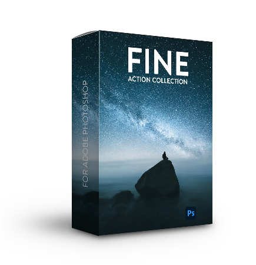
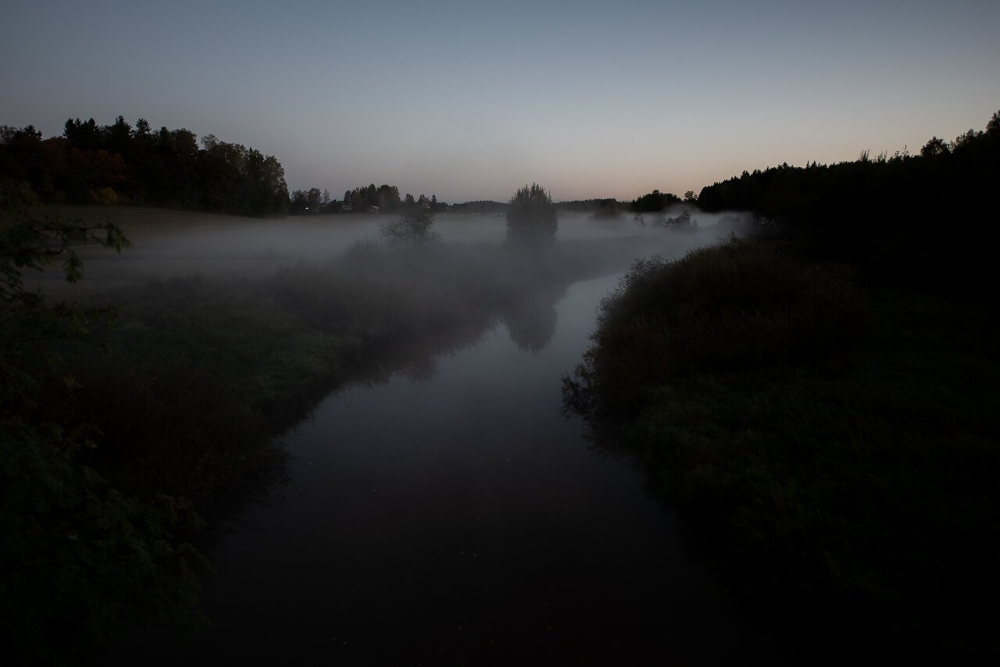
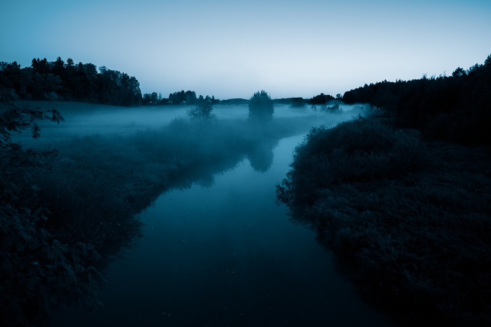
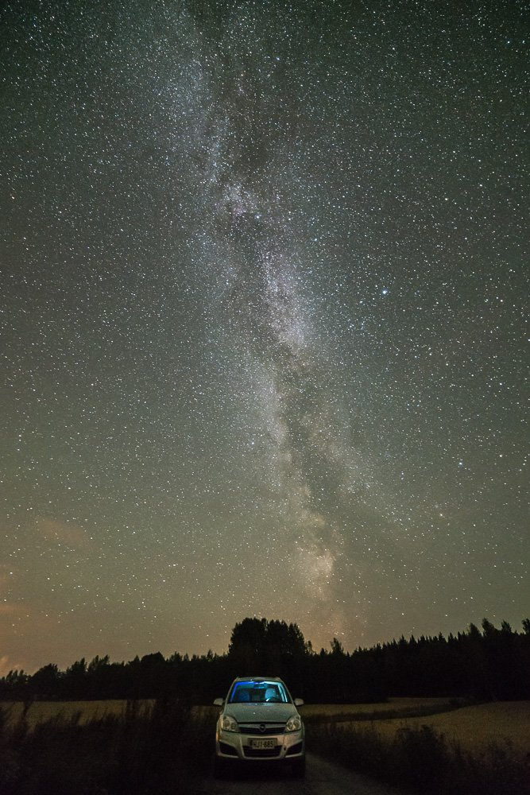
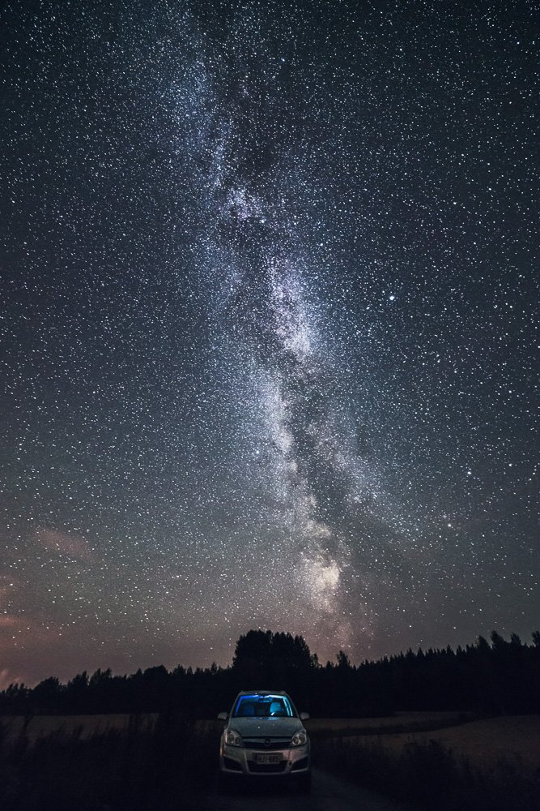
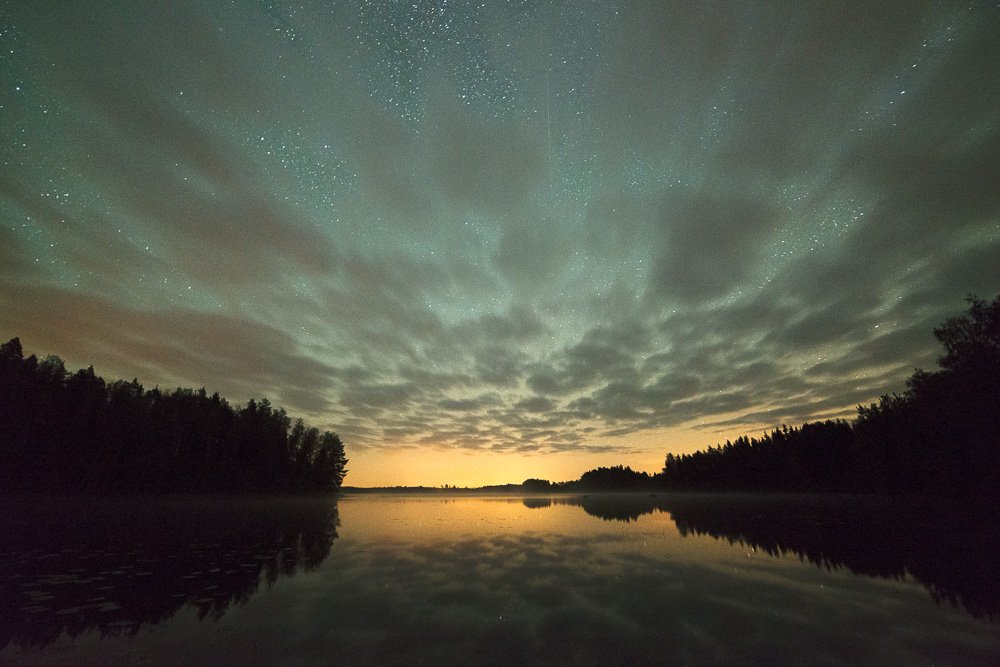
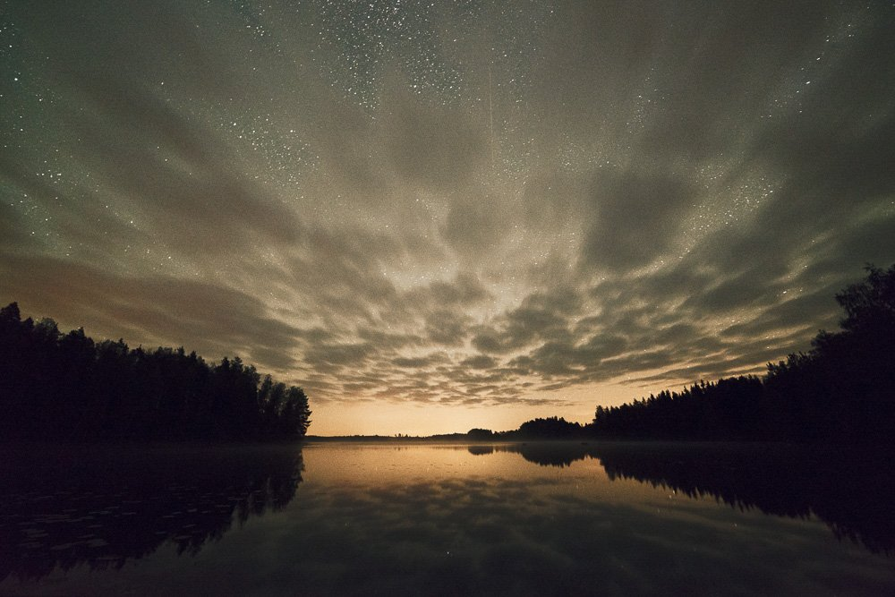
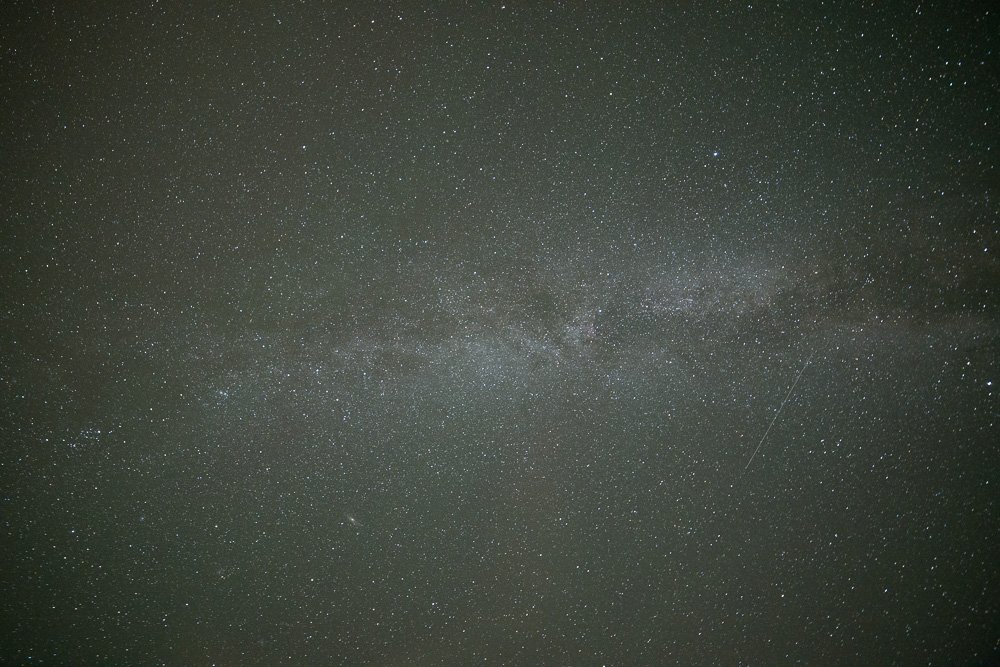
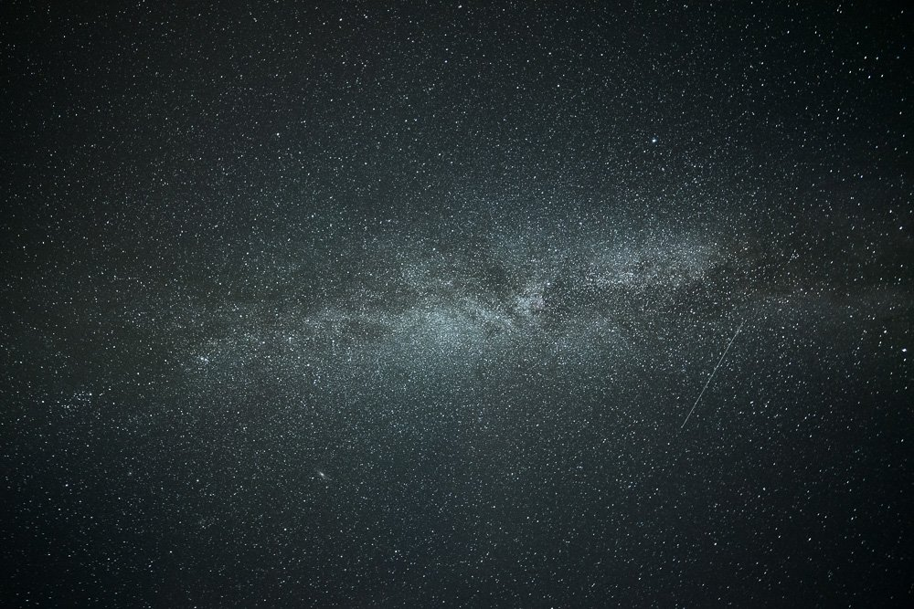
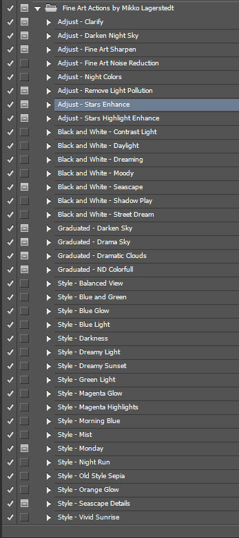

[← Back to Learn](/learn)

## FINE ART PHOTOGRAPHY ACTIONS

### Fine ART Action Collection

37 Unique Actions

+ 18 style actions
+ 8 adjustment actions
+ 7 black and white actions

Easy installation
  

One-click editing
  

Instant download

## 27€

[Buy Now](https://transactions.sendowl.com/products/73239/E53FC6F3/purchase)

Transform your night, landscape, and seascape photographs with our versatile Fine Art Action Collection. This comprehensive set includes 37 distinctive actions tailored for various image types, designed to work seamlessly with our Lightroom Presets or as standalone adjustments.

Our collection offers four types of actions: Styling actions to enhance colors, contrast, and atmosphere; Graduated actions to balance images and add drama to the sky; Adjustment actions to fine-tune details in stars, and the Milky Way and sharpen images.

Explore the stunning transformations these actions can bring to your photos in the examples below.

---

How to install the Actions [Click Here to Download the PDF](/s/Actions-Easy-Installation.pdf)

### System Requirements

The *Fine Art Action Collection* is an operating system independent. If your operating system supports one of the versions of Adobe® Photoshop® listed below, you can use the *Fine Art Action Collection*.

Supported Adobe Photoshop Software:

* Adobe® Photoshop® CC
* Adobe® Photoshop® CS5 and older

**Licensing Policy**: Only one person per copy of the *Fine Art Action Collection by Mikko Lagerstedt* may use these actions. You may install and use *Fine Art Action Collection* on all the machines you use, but if more than one person uses these actions at a time, please purchase a separate license for each person.

**Guarantee:** Please let us know if these actions don't work for you or if you are unhappy.

*After payment, you will get a link to the presets. You can pay either with a PayPal account or with a credit card.*

*If you have any questions or want to pay with a different payment method, contact us at* [*hello@mikkolagerstedt.com*](mailto:hello@mikkolagerstedt.com)

### INSIDE THE COLLECTION

**Adjustments**  
1. Clarify  
2. Darken Night Sky  
3. Fine Art Noise Reduction  
4. Fine Art Sharpen  
5. Night Colors  
6. Remove Light Pollution  
7. Stars Enhance  
8. Stars Highlight Enhance

**Graduated**  
1. Darken Sky  
2. Drama Sky  
3. Dramatic Clouds  
4. ND Colorful

**Black and White**  
1. Contrast Light  
2. Daylight  
3. Dreaming  
4. Moody  
5. Seascape  
6. Shadow Play  
7. Street Dream

**Style**  
1. Balanced View  
2. Blue and Green  
3. Blue Glow  
4. Blue Light  
5. Darkness  
6. Dreamy Light  
7. Dreamy Sunset  
8. Green Light  
9. Magenta Glow  
10. Magenta Highlights  
11. Morning Blue  
12. Mist  
13. Monday  
14. Night Run  
15. Old Style Sepia  
16. Orange Glow  
17. Seascape Details  
18. Vivid Sunrise

**Installation Guide**

